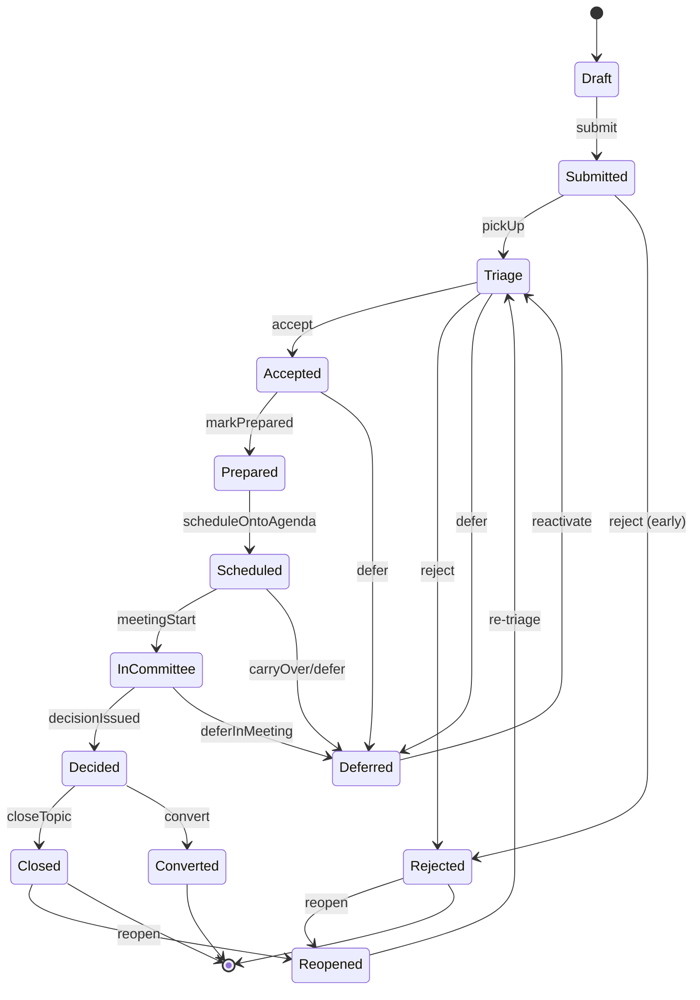
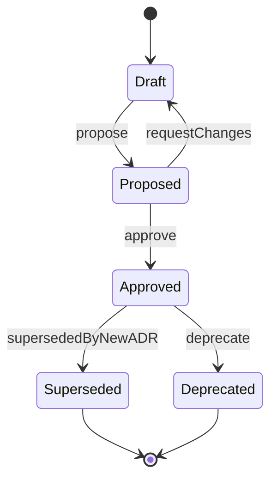

# 12 — Entity Lifecycle Models (Deliverable 15)

**Purpose:** Canonical state machines for the governed entities — state lists, transition tables (trigger · guard · allowed role · emitted event · audit), terminal/immutable rules — that the domain layer enforces.

> States are taken from `../README.md` §E verbatim. Roles/policies reference `10-permission-role-matrix.md`; entities reference `11-domain-model.md`; transitions are exercised by the workflows in `13-workflows.md` (cross-ref `[W#]`). Every transition emits a domain event and an `AuditEvent` (ADR-0009). "Allowed role" lists the role(s)/policy that may invoke the transition; ABAC scope + SoD from doc 10 §E always apply on top.

**Conventions.** `Guard` = precondition that must hold or the transition is rejected (domain error). `Event` = published domain event (drives notifications/projections). Terminal states are noted per machine. Immutable states reject all field mutation (ADR-0009).

---

## §1. Topic

**States (`README` §E):** `Draft, Submitted, Triage, Accepted, Prepared, Scheduled, InCommittee, Decided, Closed` + side `Rejected, Deferred, Reopened, Converted`.

| From → To | Trigger / Action | Guard / precondition | Allowed role | Emitted event | Audit |
|---|---|---|---|---|---|
| Draft → Submitted | `Topic.Submit` [W1] | required fields present (title, type, description, ≥1 stream) | Submitter/Member/Reviewer/Coord/Chair (`Topic.Submit`) | `TopicSubmitted` | yes |
| Submitted → Triage | pick up for triage [W2] | — | Secretary/Chairman (`Topic.Triage`) | `TopicTriaged` | yes |
| Triage → Accepted | accept into backlog [W2] | type/scope valid; not duplicate | Secretary/Chairman | `TopicAccepted` | yes |
| Submitted/Triage → Rejected | reject [W20] | rejection reason recorded | Secretary/Chairman | `TopicRejected` | yes (reason) |
| Triage/Accepted/Scheduled/InCommittee → Deferred | defer [W20] | defer reason + (optional) revisit date | Secretary/Chairman | `TopicDeferred` | yes |
| Accepted → Prepared | mark prepared [W4] | preparation checklist complete (owner, materials, affected systems) | Owner/Secretary (`Topic.Edit` AiO) | `TopicPrepared` | yes |
| Prepared → Scheduled | place on a published agenda [W5/W6] | a `Meeting` exists + AgendaItem created; urgency SLA respected | Secretary/Chairman (`Meeting.Schedule`/`Agenda.Publish`) | `TopicScheduled` | yes |
| Scheduled → InCommittee | meeting starts [W7] | parent `Meeting` `InProgress`; quorum check pending | Secretary/Chairman | `TopicEnteredCommittee` | yes |
| InCommittee → Decided | decision issued [W12] | a `Decision` reaches `Issued` for this topic | Secretary/Chairman (`Decision.Record`) | `TopicDecided` | yes |
| Decided → Closed | close topic [W23] | all blocking actions/conditions resolved (or explicitly waived) | Secretary/Chairman | `TopicClosed` | yes |
| Decided → Converted | convert to execution/research/ADR [W16/W17] | target artifact created (`Topic`/`ResearchMission`/`ADR`) | Secretary/Chairman | `TopicConverted` | yes |
| Deferred → Triage | reactivate | revisit trigger/date reached | Secretary/Chairman | `TopicReactivated` | yes |
| Rejected/Closed → Reopened | reopen [W24] | reopen justification; original not `Converted` | Secretary/Chairman | `TopicReopened` | yes (justification) |
| Reopened → Triage | re-triage [W24] | — | Secretary/Chairman | `TopicTriaged` | yes |

**Terminal/immutable.** `Converted` and (post-archival) `Closed` are terminal for normal operation; `Closed`/`Rejected` may exit to `Reopened` only via explicit justified action. `Converted` is terminal (work continues on the successor artifact). Field edits are blocked once `Decided` except via supersession of the linked `Decision`.

**TopicRequest facet.** Per `11-domain-model.md` §A.2, "TopicRequest" is the **pre-`Accepted` projection** of `Topic` — i.e. states `Draft → Submitted → Triage` (+ early `Rejected`/`Deferred`). It has **no separate state machine**; see §2 for the explicit mapping. The execution agent implements one machine (this one).

---

## §2. TopicRequest (intake facet — mapped onto early Topic states)

**Recommendation (from doc 11 §A.2): not a separate entity.** Documented here for completeness as the intake sub-lifecycle.

**States:** `Draft (drafted) → Submitted (submitted for triage) → Triage (under triage) → {Accepted ⇒ becomes governed Topic | Rejected | Deferred}`.

| From → To | Trigger | Guard | Allowed role | Emitted event | Audit |
|---|---|---|---|---|---|
| Draft → Submitted | submit request [W1] | required intake fields | Submitter/Member (`Topic.Submit`) | `TopicSubmitted` | yes |
| Submitted → Triage | secretary triage [W2] | — | Secretary/Chairman (`Topic.Triage`) | `TopicTriaged` | yes |
| Triage → Accepted (→ Topic) | accept [W2] | valid, non-duplicate | Secretary/Chairman | `TopicAccepted` | yes |
| Triage/Submitted → Rejected | reject [W20] | reason | Secretary/Chairman | `TopicRejected` | yes |
| Triage → Deferred | defer [W20] | reason | Secretary/Chairman | `TopicDeferred` | yes |

**Terminal/immutable.** None distinct from §1 — acceptance graduates the same record into the governed `Topic` lifecycle. If org later requires a low-trust external intake schema (`OQ-DM-001`), split into a discrete `TopicRequest` table with `Accepted` performing a copy-into-Topic.

---

## §3. Decision (committee outcome — immutable once issued)

**States:** `Draft → Issued → Superseded`. Decision **outcome** is a separate closed enum (`README` §E): `Approved, ConditionallyApproved, Rejected, MoreInfoRequired, FeedbackProvided, EnhancementsRequired, DesignChangesRequired, ResearchRequired, Deferred, Escalated, Converted`.

| From → To | Trigger / Action | Guard / precondition | Allowed role | Emitted event | Audit |
|---|---|---|---|---|---|
| (none) → Draft | start recording outcome [W12] | topic `InCommittee`; vote `Closed` (if a vote drives it) | Secretary/Chairman (`Decision.Record`) | `DecisionDrafted` | yes |
| Draft → Issued | finalize + chair approval [W12] | outcome set; rationale present; **chair approval/override recorded** (SoD-3); conditions captured if `ConditionallyApproved` | Chairman (`Decision.ChairApprove`) | `DecisionIssued` | yes (high) |
| Issued → Superseded | supersede by a new decision [W21] | a successor `Decision` reaches `Issued`; supersession reason recorded | Secretary/Chairman (`Decision.Record`+`ChairApprove`) | `DecisionSuperseded` | yes (high) |

**Immutability (ADR-0009).** Once `Issued`, a Decision is **immutable** — ballots, outcome, rationale, conditions cannot be edited. Corrections/changes occur **only** by issuing a **new** Decision that sets `SupersededByDecisionId` on the prior. The chair override (if any) is recorded explicitly (`ChairOverride`, `OverrideJustification`) at issuance and is itself immutable. `Superseded` is terminal for the old record; `Issued` is the active terminal state until superseded.

---

## §4. Vote (immutable after close — ADR-0010)

**States (`README` §E):** `Configured → Open → Closed → Ratified` (immutable after close).

| From → To | Trigger / Action | Guard / precondition | Allowed role | Emitted event | Audit |
|---|---|---|---|---|---|
| (none) → Configured | configure ballot [W11] | options defined; eligible-voter set set; quorum rule set; anonymity flag set | Secretary/Chairman (`Vote.Manage`) | `VoteConfigured` | yes |
| Configured → Open | open voting [W11] | meeting `InProgress`; eligible voters present ≥ quorum-present threshold; COI exclusions applied (SoD-4) | Secretary/Chairman (`Vote.Manage`) | `VoteOpened` | yes |
| Open → (Open) | cast ballot [W11] | voter ∈ eligible set; not already cast (one ballot/voter); within open window | Member/Chairman (`Vote.Cast`) | `BallotCast` (always attributed in v1; anonymity out of scope) | yes (append-only) |
| Open → Closed | close voting [W11] | quorum of cast met (or timeout); tally computed; **counter ≠ sole chair-overrider** (SoD-3) | Secretary/Chairman (`Vote.Manage`) | `VoteClosed` | yes (high, tally frozen) |
| Closed → Ratified | ratification / chair sign-off [W11/W12] | tally accepted into the linked `Decision`; chair approval recorded | Chairman (`Decision.ChairApprove`) | `VoteRatified` | yes |

**Immutability (ADR-0009/0010).** **After `Closed`, ballots and tally are frozen and immutable** — no role (incl. Chairman/Administrator) may alter, add, or remove ballots. A mistaken/contested vote is handled by **configuring and running a new Vote** (recorded as such, linked to the same topic), never by editing the closed one. **Voting is always attributed in v1** (anonymity is out of scope for v1; ADR-0010). All ballot↔voter links are retained in full for audit. `Ratified` and `Closed` are terminal; `Closed→Ratified` is the only post-close transition and adds no mutation to ballots.

---

## §5. Meeting

**States:** `Scheduled → InProgress → Held`; side `Cancelled`.

| From → To | Trigger / Action | Guard / precondition | Allowed role | Emitted event | Audit |
|---|---|---|---|---|---|
| (none) → Scheduled | schedule meeting [W5] | date/time set; committee + chair assigned; agenda draft exists | Secretary/Chairman (`Meeting.Schedule`) | `MeetingScheduled` | yes |
| Scheduled → InProgress | start meeting [W7] | scheduled time reached (or manual start); agenda `Published`/`Locked` | Secretary/Chairman | `MeetingStarted` | yes |
| InProgress → Held | conclude meeting [W7] | agenda items resolved/deferred; attendance recorded | Secretary/Chairman | `MeetingHeld` | yes |
| Scheduled → Cancelled | cancel [W5] | cancellation reason; notify participants | Secretary/Chairman | `MeetingCancelled` | yes |

**Terminal/immutable.** `Held` and `Cancelled` are terminal. A `Held` meeting's factual record (attendance, votes, decisions) is immutable; its **MoM** (§6) carries the editable→approved narrative under its own versioning. Reopening a meeting is not supported — corrections go through MoM versioning or a new meeting.

---

## §6. MinutesOfMeeting (MoM)

**States:** `Draft → InReview → Approved → Published`; `Superseded` (by a new version).

| From → To | Trigger / Action | Guard / precondition | Allowed role | Emitted event | Audit |
|---|---|---|---|---|---|
| (none) → Draft | start MoM [W10] | parent meeting `InProgress`/`Held` | Secretary (`Minutes.Capture`) | `MoMDrafted` | yes |
| Draft → InReview | submit for review [W10] | required sections complete (attendance, decisions, actions, summary); candidate transcript items human-reviewed (principle 5) | Secretary (`Minutes.Capture`) | `MoMInReview` | yes |
| InReview → Approved | approve MoM [W10] | reviewer/approver ≠ sole author where staffing allows (SoD-2, soft); content validated | Chairman/Secretary (`Minutes.Approve`) | `MoMApproved` | yes (high) |
| Approved → Published | publish MoM [W10] | approved; recipients resolved | Secretary/Chairman (`Minutes.Approve`) | `MoMPublished` | yes |
| Approved/Published → Superseded | issue a corrected version [W10] | new `Version` created; reason recorded | Secretary/Chairman | `MoMSuperseded` | yes (high) |

**Terminal/immutable.** Once `Published`, a MoM version is **immutable**; corrections create a **new version** that supersedes it (`Version++`, `Superseded` on the prior). Approval is a legal/governance event — fully audited. `Published` is the active terminal; `Superseded` is terminal for the old version.

---

## §7. Action

**States:** `Open → InProgress → Blocked → Completed → Verified`; side `Cancelled`; derived `Overdue`.

| From → To | Trigger / Action | Guard / precondition | Allowed role | Emitted event | Audit |
|---|---|---|---|---|---|
| (none) → Open | create action [W13] | owner + (optional) due date; source set | Secretary/Chairman/Owner (`Action.Create` AiO) | `ActionCreated` | yes |
| Open → InProgress | start work [W14] | assignee acknowledges | Owner/Assignee (AiO) | `ActionStarted` | yes |
| InProgress → Blocked | mark blocked [W14] | blocking reason / linked `Dependency` | Owner/Assignee (AiO) | `ActionBlocked` | yes |
| Blocked → InProgress | unblock [W14] | blocker resolved | Owner/Assignee (AiO) | `ActionUnblocked` | yes |
| InProgress → Completed | mark complete [W14] | progress = 100%; deliverable/evidence noted | Owner/Assignee (AiO) | `ActionCompleted` | yes |
| Completed → Verified | verify completion [W14] | **verifier ≠ owner/assignee who completed it (SoD-1)**; acceptance criteria met | Secretary/Chairman/Member-verifier (`Action.Verify`, SoD-1) | `ActionVerified` | yes (high) |
| any (non-terminal) → Cancelled | cancel [W14] | cancellation reason | Secretary/Chairman/Owner | `ActionCancelled` | yes |
| (derived) → Overdue | due date passed, not Completed/Verified [W22] | `DueDate < now` and status ∈ {Open,InProgress,Blocked} | system (Hangfire) | `ActionOverdue` | yes |

**Terminal/immutable.** `Verified` and `Cancelled` are terminal. `Overdue` is a **derived/decoration state**, not a stored status transition — it overlays Open/InProgress/Blocked and clears when the action progresses to Completed/Verified or its due date is revised. **SoD-1** is the load-bearing guard: self-verification is rejected.

---

## §8. ADR (in-app `AIV`-distinct Architecture Decision Record — immutable once approved)

**States (`README` §E):** `Draft → Proposed → Approved → (Superseded | Deprecated)`.

| From → To | Trigger / Action | Guard / precondition | Allowed role | Emitted event | Audit |
|---|---|---|---|---|---|
| (none) → Draft | create ADR [W17] | template populated (context/decision/consequences/options) | Owner/Secretary (`Adr.Create` AiO) | `AdrDrafted` | yes |
| Draft → Proposed | propose for approval [W17/W18] | required MADR-lite sections complete | Owner/Secretary (`Adr.Create`) | `AdrProposed` | yes |
| Proposed → Approved | approve ADR [W17] | committee/chair approval; linked `Decision` (if converted) issued | Chairman/Secretary (`Adr.Approve`) | `AdrApproved` | yes (high) |
| Proposed → Draft | request changes | review feedback | Reviewer/Secretary | `AdrChangesRequested` | yes |
| Approved → Superseded | supersede [W21] | a successor `ADR` reaches `Approved`; `SupersededByAdrId` set; reason recorded | Chairman/Secretary (`Adr.Supersede`) | `AdrSuperseded` | yes (high) |
| Approved → Deprecated | deprecate [W21] | deprecation rationale | Chairman/Secretary (`Adr.Supersede`) | `AdrDeprecated` | yes |

**Immutability.** Once `Approved`, an ADR is **immutable**: its decision text/consequences are frozen. Change = create a **new ADR** that **supersedes** the old (the old → `Superseded`, never edited) — same supersede-not-edit rule as Decisions (ADR-0009). `Superseded`/`Deprecated` are terminal; `Approved` is the active terminal until superseded/deprecated.

---

## §9. Invariant (Architecture Invariant `AIV`)

**States (`README` §E):** `Draft → Proposed → Active → (Retired | Superseded)`. Violations tracked separately (as `Risk`/`Action`/`AuditEvent`), not as states.

| From → To | Trigger / Action | Guard / precondition | Allowed role | Emitted event | Audit |
|---|---|---|---|---|---|
| (none) → Draft | create invariant [W18] | statement + category | Owner/Secretary (`Invariant.Create` AiO) | `InvariantDrafted` | yes |
| Draft → Proposed | propose [W18] | scope + rationale present | Owner/Secretary (`Invariant.Create`) | `InvariantProposed` | yes |
| Proposed → Active | approve/activate [W18] | committee/chair approval; scope validated | Chairman/Secretary (`Invariant.Approve`) | `InvariantActivated` | yes (high) |
| Active → Retired | retire [W21] | retirement rationale | Chairman/Secretary (`Invariant.Approve`) | `InvariantRetired` | yes (high) |
| Active → Superseded | supersede [W21] | successor `Invariant` `Active`; `SupersededByInvariantId` set | Chairman/Secretary (`Invariant.Approve`) | `InvariantSuperseded` | yes (high) |

**Terminal/immutable.** `Active` is the operative state (the rule is in force). `Retired`/`Superseded` are terminal. An `Active` invariant's statement is treated as immutable; material change = supersede with a new version. Violations are recorded separately and do **not** change the invariant's state.

---

## §10. Risk

**States (`README` §E):** `Open → Mitigating → Closed`; side `Accepted`, `Escalated`.

| From → To | Trigger / Action | Guard / precondition | Allowed role | Emitted event | Audit |
|---|---|---|---|---|---|
| (none) → Open | raise risk [W15] | title/description + subject + likelihood/impact | Owner/Member/Reviewer/Coord (`Risk.Manage` AiO) | `RiskRaised` | yes |
| Open → Mitigating | begin mitigation [W15] | ≥1 `Mitigation` planned | Owner/Secretary (`Risk.Manage`) | `RiskMitigating` | yes |
| Mitigating → Closed | close risk [W15] | mitigations `Done` or risk no longer applicable; closure note | Owner/Secretary (`Risk.Manage`) | `RiskClosed` | yes |
| Open/Mitigating → Accepted | accept risk [W15] | acceptance rationale + accepting authority | Chairman/Secretary (`Risk.Manage`) | `RiskAccepted` | yes (high) |
| Open/Mitigating → Escalated | escalate [W15] | escalation reason + target | Owner/Secretary/Chairman (`Risk.Manage`) | `RiskEscalated` | yes (high) |

**Terminal/immutable.** `Closed` and `Accepted` are terminal (Accepted = consciously not mitigated; retains audit of who accepted). `Escalated` is a side state that typically returns to `Mitigating`/`Closed` after handling. Acceptance and escalation are high-importance audited governance acts.

---

## §11. ResearchMission

**States:** `Proposed → Active → Completed`; side `Cancelled`. (Keystone companion package, ADR-0007.)

| From → To | Trigger / Action | Guard / precondition | Allowed role | Emitted event | Audit |
|---|---|---|---|---|---|
| (none) → Proposed | create mission [W16] | research question + owner; usually from a `ResearchDiscovery` topic or `ResearchRequired` decision | Owner/Secretary (`Research.Manage` AiO) | `ResearchProposed` | yes |
| Proposed → Active | start research [W16] | mission accepted; Keystone package referenced/initiated | Owner/Secretary (`Research.Manage`) | `ResearchActivated` | yes |
| Active → Completed | complete + import [W16] | findings/recommendations imported + human-verified (principle 5) | Owner/Secretary (`Research.Manage`) | `ResearchCompleted` | yes |
| Proposed/Active → Cancelled | cancel [W16] | cancellation reason | Owner/Secretary/Chairman | `ResearchCancelled` | yes |

**Terminal/immutable.** `Completed` and `Cancelled` are terminal. On `Completed`, the mission may feed a **conversion to an execution `Topic`** [W16] — the mission record itself stays immutable thereafter; downstream work continues on the successor topic. Imported Keystone artifacts are stored as `Finding`/`Recommendation`; their `IsVerified` flips only via human review.

---

## §12. Cross-cutting lifecycle rules

| Rule | Statement | Source |
|---|---|---|
| **Immutability** | `Vote` (after `Closed`), `Decision` (after `Issued`), `ADR` (after `Approved`), `MoM` (after `Published`), `AuditEvent` (always) are immutable; changes are made by **supersession/new version**, never edit. | ADR-0009/0010 |
| **Supersede-not-edit** | Superseding sets a `SupersededBy*` pointer + reason; the prior record's state becomes `Superseded` and is read-only. | README §A, §E |
| **Audit on every transition** | Every state change emits a domain event **and** an `AuditEvent` (actor, before/after, correlation id). Denied transitions also audited. | ADR-0009 |
| **ABAC + SoD always apply** | The "Allowed role" column is necessary but not sufficient; stream scope, confidentiality, delegation window, and SoD guards (doc 10 §E) are evaluated on top of every transition. | doc 10 §E |
| **Derived states** | `Action.Overdue` (and `Risk.Severity`) are computed, not stored as transitions; recalculated by jobs/read models. | doc 11 |
| **Human-reviewed candidates** | AI-extracted transcript content (`Discussion`/candidate `Action`/`Finding`) is `candidate` until a human approves it; promotion is an audited transition. | README principle 5 |

---

## Traceability
Implements **Deliverable 15**. States from `../README.md` §E; roles/policies/SoD from `10-permission-role-matrix.md` §C/§E; entities/attributes from `11-domain-model.md`; transitions driven by workflows in `13-workflows.md` (`[W#]`). Settled decisions: ADR-0009 (immutability/audit), ADR-0010 (voting). TopicRequest-merge recommendation per `11-domain-model.md` §A.2 (OQ-DM-001). Recording/transcript optionality per `18-webex-feasibility.md`.
