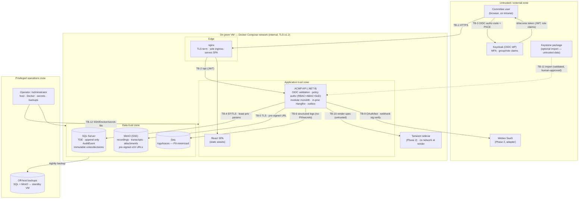

# 24 — Security Threat Model (Deliverable 32)

**Purpose:** A risk-driven threat model for ACMP — ranked assets, trust boundaries and data-flows, attacker personas, STRIDE-per-boundary analysis, and abuse/misuse cases — with **insider risk as the primary concern**, mapping each top threat to a control in `25-security-controls.md` and an OWASP ASVS 5.0 chapter.

> Scope context (`../README.md` §A, `.context/brief-digest.md` §5.5): sensitive internal **government** system; **on-prem VM + Docker Compose**, ≤20 total users, low traffic; Keycloak OIDC (roles via claims); SQL Server; self-hosted MinIO; self-hosted Seq; app-owned Hangfire; in-app notifications (Webex = Phase 2). Target **OWASP ASVS 5.0 Level 2** (NFR-018). Because the user population is tiny, trusted, and privileged, the dominant risk is **not** the anonymous internet attacker but the **authorized insider** (member, secretary, chairman, administrator) acting maliciously or negligently. The model is weighted accordingly: every high-impact threat is an integrity/confidentiality threat against votes, decisions, records, and recordings — not a scalability or DoS concern. Controls are deliberately proportional to ≤20 users on-prem; where ASVS L3 (e.g. full anti-automation, HSM-backed keys) would be overkill, that is noted in `25`.

> ASVS chapter references use the OWASP ASVS 5.0 (May 2025) 17-chapter structure (V1–V17). Exact chapter-title bindings are `[unverified]` against a live re-fetch in this environment but follow the published 5.0 table of contents; requirement-level IDs are cited only where stable, otherwise the chapter is cited. Canonical source: https://owasp.org/www-project-application-security-verification-standard/ and https://github.com/OWASP/ASVS.

---

## 1. Assets (ranked by sensitivity)

Sensitivity drives the protection priority. "C/I/A" = the dominant security property at risk (Confidentiality / Integrity / Availability). The top of this list is where insider-risk and immutability controls concentrate.

| # | Asset | Entities (`11-domain-model.md`) | Dominant property | Why it ranks here |
|---|---|---|---|---|
| A1 | **Votes / ballots** | `Vote`, `VoteEligibleVoter`, `Ballots`/`Tally` JSON | **Integrity** > Confidentiality | The committee's authority rests on vote authenticity. Always attributed in v1 (ADR-0010) → ballots are also PII-grade (who voted how). Tampering or back-fill forges the will of the committee. Immutable after close (ADR-0009). |
| A2 | **Issued decisions** (`DECN-…`) | `Decision`, `DecisionCondition` | **Integrity** | The legal/governance output. Forgery, back-dating, or silent edit corrupts the record of record. Immutable once issued; superseded, never edited. |
| A3 | **Audit log** | `AuditEvent` (append-only) | **Integrity** (+ Confidentiality) | The evidence layer that makes A1/A2 trustworthy. If the audit log can be altered or deleted, every other integrity claim collapses. Highest retention class; insiders must not be able to delete it. |
| A4 | **ADRs & architecture invariants** | `ADR`, `Invariant` | **Integrity** | Durable architecture governance; immutable once approved. Forged/altered ADRs misdirect the estate. |
| A5 | **Published minutes (MoM)** | `MinutesOfMeeting` | **Integrity** | Official meeting record; immutable once published, corrected only by new version. |
| A6 | **Confidential architecture information** | `Topic`(Confidentiality=`Restricted`), `Document`, `Diagram`, `Dependency`, `System`/`Service` catalog | **Confidentiality** | Security findings, partner/integration topology, cross-stream weak points. Aggregated, this is a map of the org's attack surface — high value to an internal or supply-chain adversary. |
| A7 | **Recordings & transcripts** | `Recording`, `Transcript`, `Attachment` (media) | **Confidentiality** | Verbatim deliberations: candid risk discussion, named positions, possibly sensitive partner/security content. Stored in MinIO; access must be pre-signed, time-limited, role-gated, and every read audited (NFR-025/027). |
| A8 | **PII of members** | `User` (`DisplayName`, `Email`, `ExternalSubjectId`), `Attendance`, attributed `Ballots` | **Confidentiality** | Small, identifiable population. Attendance + attributed votes = sensitive behavioural record. Minimize in logs/traces (NFR-028). |
| A9 | **Credentials / tokens / secrets** | Keycloak client secret, OIDC tokens/JWT, SQL conn string, MinIO keys, Webex bot token (Phase 2), Tarseem sidecar token (Phase 2) | **Confidentiality** | Compromise of any of these collapses one or more boundaries below. Never in source/images (NFR-024). |
| A10 | **Traceability graph & supporting records** | `Relationship`, `Dependency`, `Risk`, `Action`, `ResearchMission`, `Finding`, `Comment` | **Integrity** + Confidentiality | The connective tissue; corruption degrades impact analysis and accountability. Lower individual sensitivity but high aggregate value. |
| A11 | **Availability of the platform** | whole system | **Availability** | 24×7 / 99.9% (NFR-014) via simple redundancy + nightly backups. Deliberately *lowest* priority threat-wise: ≤20 internal users, on-prem, no internet exposure → DoS is not a primary attacker goal. Backup/recovery (not anti-DDoS) is the proportional control. |

---

## 2. Trust boundaries & data-flow

### 2.1 Boundary inventory

| ID | Boundary (crossing) | Trust delta | Primary enforcement |
|---|---|---|---|
| **TB-1** | Internet/intranet **browser → nginx** (TLS ingress) | Unauth → edge | TLS ≥1.2 termination (NFR-019); single exposed ingress (`15-architecture.md` §9). No public self-registration (ADR-0004). |
| **TB-2** | **nginx → ACMP API** (reverse proxy) | Edge → app | OIDC JWT validation on every request (NFR-020); deny-by-default policy authz (`10-permission-role-matrix.md`). |
| **TB-3** | **Browser/SPA → Keycloak** (OIDC authz-code + PKCE) | User → IdP | ACMP self-hosts Keycloak (ACMP-owned realm, ADR-0015); MFA enforced at ACMP's own Keycloak realm; roles via group/realm-role claims (ADR-0004). ACMP consumes identity, never stores passwords. Owning the IdP adds a Keycloak-admin attack surface (insider/admin-credential risk). |
| **TB-4** | **ACMP API → SQL Server** | App → datastore | TLS (NFR-019); least-privilege DB account; parameterized/EF-only (NFR-021); append-only audit at app layer (NFR-040). |
| **TB-5** | **ACMP API → MinIO** | App → object store | TLS; pre-signed ≤1h URLs for sensitive media (NFR-027); SSE at rest; bucket creds as secrets. |
| **TB-6** | **ACMP API → Seq** | App → log sink | App-owned, on the Compose network; PII-minimized log payloads (NFR-028); no secrets/URLs in logs (NFR-027). |
| **TB-7** | **ACMP API ↔ Hangfire (in-process, ACMP's own SQL)** | App ↔ app jobs | In-process; Hangfire dashboard authz-gated (Administrator only); jobs run as the app, not as a user. |
| **TB-8** | **Module ↔ Module** (in-process, logical) | App ↔ app | Modular-monolith isolation: no cross-module table reads; public contracts/MediatR only (ADR-0001, NFR-047). A logical, not network, boundary — relevant to insider-developer and supply-chain risk. |
| **TB-9 (Phase 2)** | **ACMP ↔ Webex** (SaaS) | App ↔ external SaaS | Adapter-isolated; OAuth/bot token least-scope; **inbound webhook signature verification**; rate-limit/429 handling (`18-webex-feasibility.md`). |
| **TB-10 (Phase 2)** | **ACMP → Tarseem render sidecar** | App → internal sidecar | Container-to-container on the Compose network; thin internal HTTP; **no network at render time** in Tarseem; treat diagram spec as untrusted input. |
| **TB-11 (optional)** | **Secretary + Claude Code → Keystone package import** | Human/agent → app | Imported manifest is **untrusted external data** (OWASP LLM01 posture, `.context/brief-digest.md` §5.2); validated/sanitized on import; never auto-promoted. |
| **TB-12** | **Operator/Administrator → host/Docker/backups** | Privileged ops → infra | Out-of-app boundary: OS/Docker/secret-file/backup access. Primary **insider/admin** boundary; covered by administrative-access + dual-control + offline-backup controls in `25`. |

### 2.2 Data-flow diagram (with trust boundaries)

> **Boundary reading.** The only network-exposed surface is **TB-1** (nginx). Everything else is intra-host container traffic, still TLS-protected (NFR-019, defence-in-depth on a shared Docker network). The two highest-risk boundaries are **non-network**: **TB-12** (an administrator/operator with host, Docker, secret-file, or backup access) and **TB-2/TB-8** (an authenticated insider abusing legitimate API access). The threat model's centre of gravity is there, not at TB-1.

---

## 3. Attacker personas

| ID | Persona | Trust / access | Goal | Realism here |
|---|---|---|---|---|
| **P1** | **External unauthenticated** | None; network reach to nginx only (intranet/VPN). No self-registration. | Get in (auth bypass), or hit an unauth endpoint. | **Lower** likelihood — on-prem, no public exposure, auth via ACMP's self-hosted Keycloak (ADR-0015). Still in scope for ASVS L2 baseline (auth, transport, input). |
| **P2** | **Authenticated low-privilege member / submitter / guest** | Valid OIDC session; `Member`/`Submitter`/`Guest` role; limited stream scope. | Read beyond scope (other streams, `Restricted` topics, transcripts), tamper with topics/actions they don't own, **escalate privilege**, influence a vote. | **High** likelihood, moderate-high impact. The everyday insider misuse case. Directly exercises ABAC scope, confidentiality, and SoD. |
| **P3** | **Malicious or negligent privileged insider — secretary / chairman / administrator** | Trusted operational/governance/platform power. | **Forge or back-date a decision**; alter/close a vote in their favour; suppress or alter the audit trail; exfiltrate recordings/transcripts/restricted topics; grant themselves rights; mass-export. *Negligent variant:* leaks a pre-signed URL, mishandles a secret, deletes by mistake. | **Primary threat.** Highest impact. The whole immutability + SoD + append-only-audit + dual-control + anomaly-alerting design exists for this persona. **No role — not even Administrator/Chairman — may bypass immutability** (`10-permission-role-matrix.md` §E.5). |
| **P4** | **Compromised integration / service account** | Stolen Keycloak client secret, MinIO key, Webex bot token (Phase 2), Tarseem sidecar, or a hijacked session token. | Use the integration's trust to read/write/exfiltrate as the app or as a user. | **Medium.** Blast radius scales with secret scope → least-privilege creds, rotation, scoped tokens, webhook signature verification. |
| **P5** | **Supply-chain adversary** | Poisoned NuGet/npm package, base image, or build tooling; malicious Tarseem/Keystone input; compromised CI. | Implant backdoor; exfiltrate at build/runtime; tamper via a trusted dependency or a crafted import/spec. | **Medium**, high impact (defeats in-app controls from below). → SBOM, dependency/secret/image scanning, pinned deps, non-root read-only containers, treat Tarseem spec & Keystone import as untrusted (`25`). |

---

## 4. STRIDE per boundary

Likelihood/Impact (L/I) on Low/Med/High, weighted for this context (insider-heavy, on-prem, ≤20 users). "→ ctrl" points to control IDs defined in `25-security-controls.md`. ASVS = the primary ASVS 5.0 chapter(s).

| # | Threat | Boundary | STRIDE | L / I | Mitigation → `25` control(s) | ASVS |
|---|---|---|---|---|---|---|
| T-01 | Forged/replayed token or session fixation lets an attacker act as a user | TB-2/TB-3 | **S** | M / H | C-AUTH-01 (OIDC authz-code+PKCE), C-AUTH-03 (JWT validation every request), C-SESS-01/02 (session/idle+absolute timeout, secure cookies) | V6, V7, V9, V10 |
| T-02 | Unauthenticated access to a non-public endpoint | TB-1/TB-2 | **S/E** | L / H | C-AUTH-03 (deny-by-default, 401), C-API-01 (no unauth endpoint except health/callback, NFR-020) | V4, V8 |
| T-03 | Credential/secret theft (client secret, DB, MinIO, bot token) from source/image/host | TB-4/TB-5/TB-9/TB-12 | **S/I** | M / H | C-SEC-01..03 (no secrets in source/images, Docker secrets/.env-excluded, rotation), C-SUP-02 (secret scanning) | V13, V11 |
| T-04 | **Insider tampers with a vote** (alter ballot/tally, re-open, back-fill) | TB-2/TB-4 | **T** | M / **H** | C-IMM-01 (vote immutable after close, 409), C-AUTH-05/SoD-3 (cast≠count≠override), C-AUDIT-01/02 (every ballot audited, append-only), C-IMM-04 (optional hash-chain on votes) | V8, V16, V2 |
| T-05 | **Decision forgery / back-dating / silent edit** | TB-2/TB-4 | **T/R** | M / **H** | C-IMM-02 (issued decision immutable, supersede-only), C-AUDIT-03 (server-set `IssuedAt`, actor recorded), C-AUTH-05/SoD-4 (recorder≠sole owner/presenter, COI) | V8, V16 |
| T-06 | **Audit-log tampering or deletion** (hide an action) | TB-4/TB-12 | **T/R** | M / **H** | C-AUDIT-01 (append-only, no UPDATE/DELETE path), C-AUDIT-04 (DB perms: no DELETE grant; admins can't delete audit), C-IMM-04 (hash-chain tamper-evidence), C-BAK-02 (audit in backups), C-INS-02 (anomaly alert on audit-write failure) | V16, V13 |
| T-07 | **Privilege escalation** (member→secretary/chairman; self-grant) | TB-2/TB-8 | **E** | M / **H** | C-AUTHZ-01 (policy-based RBAC+ABAC, deny-by-default), C-AUTHZ-02 (resource-based checks per instance), C-AUTH-05/SoD-5 (Administrator walled off from committee content), C-AUDIT-05 (role-grant audited) | V8 |
| T-08 | Horizontal access — read/edit another stream's or `Restricted` topic | TB-2 | **I/T** | **H** / M | C-AUTHZ-03 (stream-scope ABAC), C-AUTHZ-04 (confidentiality ABAC), C-AUDIT-06 (deny audited) | V8, V14 |
| T-09 | **Unauthorized transcript/recording access or leak** | TB-2/TB-5 | **I** | M / **H** | C-FILE-04 (pre-signed ≤1h URLs, role-gated to Chair/Coord/Auditor), C-AUDIT-07 (every transcript/recording read audited, NFR-025), C-PRIV-02 (URL never in logs/notifications), C-CRYPTO-02 (MinIO SSE) | V5, V14, V16 |
| T-10 | **Mass-export exfiltration** (bulk pull of decisions/topics/recordings) | TB-2/TB-5 | **I** | M / **H** | C-API-02 (export scoped by role; Auditor/Owner only), C-AUDIT-08 (export audited as sensitive event), C-INS-01 (dual-control/anomaly alert on bulk export), C-API-03 (rate-limit) | V8, V16 |
| T-11 | **Impersonation** in records (act/record as another member) | TB-2/TB-3 | **S** | L / H | C-AUTH-03 (actor = validated `sub`), C-AUDIT-03 (actor identity server-derived, never client-supplied), C-AUTH-05/SoD (four-eyes on record acts) | V6, V16 |
| T-12 | SQL injection via crafted input | TB-2/TB-4 | **T/I** | L / H | C-INP-02 (parameterized/EF-only, no string SQL, NFR-021), C-SAST-01 (SAST gate) | V2, V15 |
| T-13 | Stored XSS via topic/comment/MoM/diagram-label content | TB-1/TB-2 | **T/I** | M / M | C-INP-01 (server-side validation), C-INP-03 (output encoding/React default escaping), C-WEB-01 (CSP, security headers), C-FILE-05 (sanitize SVG/diagram render) | V1, V3 |
| T-14 | CSRF on a state-changing request | TB-1/TB-2 | **T** | L / M | C-WEB-02 (anti-forgery token / SameSite, NFR-022) | V3, V4 |
| T-15 | **Malware-laden file upload** (attachment, presentation, imported media) | TB-2/TB-5 | **T/E** | M / H | C-FILE-01 (content-type + size limits), C-FILE-02 (**malware scan — ClamAV sidecar**), C-FILE-03 (store outside webroot, random keys, no execute) | V5 |
| T-16 | Prompt-injection via transcript content steers AI extraction (Phase 3) | TB-2/TB-11 | **T** | M / M | C-AI-01 (treat transcript as untrusted, LLM01), C-AI-02 (AI output = candidate until human approves, NFR-026), C-AI-03 (no tool/DB authority from LLM) | V2 (business logic) |
| T-17 | Malicious/poisoned dependency, base image, or build tool | TB-8 (build) | **T/E** | M / H | C-SUP-01 (SBOM + pinned deps), C-SUP-02 (dependency/secret/image scanning, NFR-051), C-CON-01..03 (non-root, minimal base, read-only FS) | V15 |
| T-18 | Webex webhook spoofing / replay; over-scoped bot token (Phase 2) | TB-9 | **S/T** | M / M | C-WX-01 (**webhook signature verification**), C-WX-02 (least-scope bot/OAuth token), C-WX-03 (adapter isolation, no hard-dependency) | V4, V12 |
| T-19 | Sensitive content leaked via notification body | TB-2/TB-6 | **I** | M / M | C-NOTIF-01 (no sensitive content in notifications — link + minimal metadata only), C-PRIV-02 (no URLs/PII in logs) | V14 |
| T-20 | Eavesdropping/MITM on internal container traffic | TB-4/TB-5/TB-6/TB-10 | **I/T** | L / M | C-CRYPTO-01 (TLS ≥1.2 everywhere incl. internal, NFR-019) | V12 |
| T-21 | Repudiation — actor denies a governance action | all app | **R** | M / M | C-AUDIT-01/03 (append-only, attributed, correlated), C-IMM-04 (hash-chain for votes/decisions) | V16 |
| T-22 | DoS / resource exhaustion against the app | TB-1 | **D** | L / L | C-API-03 (basic rate-limit), C-BAK-01 (recovery via backup/restore). *Proportional: no anti-DDoS tier — on-prem, ≤20 users (NFR-014).* | V2 (anti-automation, L2-light) |
| T-23 | Lateral movement after host/Docker compromise | TB-12 | **E/I** | L / H | C-CON-01..03 (non-root, read-only FS, minimal base), C-ADM-01..03 (admin access controls), C-CRYPTO-02/03 (at-rest encryption so stolen volumes/backups aren't plaintext) | V13, V15 |

**STRIDE coverage note.** Every STRIDE category is represented and tied to a real asset: **S** (T-01/02/11/18), **T** (T-04/05/06/12/13/14/15/16/17/20/21), **R** (T-05/06/21), **I** (T-03/08/09/10/19/20/23), **D** (T-22), **E** (T-07/15/17/23). The integrity/repudiation cluster (insider tampering with votes, decisions, audit) carries the highest impact and the densest controls — intentional, given the primary persona P3.

---

## 5. Abuse / misuse cases

Each case: actor → goal → attack path → mitigation (control IDs in `25`). These are the scenarios the design must defeat, expressed as adversary intent rather than feature requirements.

| ID | Abuse case | Actor | Attack path | Mitigation (→ `25`) |
|---|---|---|---|---|
| **AB-1** | **Vote tampering** — change a closed vote's ballots/tally, re-open to flip the outcome, or stuff ineligible ballots | P3 (secretary/chairman), P2 (member) | API mutation on a `Closed` vote; direct SQL UPDATE on `Ballots`/`Tally`; add self to `VoteEligibleVoter` post-hoc | C-IMM-01 (immutable after close → 409, no mutation endpoint), C-AUTH-05/SoD-3 (cast ≠ count ≠ override; co-attested tally), C-AUDIT-01/02 (every ballot + open/close appended), C-IMM-04 (hash-chain votes), C-AUDIT-04 (no DB DELETE/UPDATE grant on audit/vote) |
| **AB-2** | **Decision forgery / back-dating** — create or alter an issued decision, set a false `IssuedAt`, or edit rationale after issue | P3, P2-owner | POST a decision with client-supplied timestamp; PATCH an `Issued` decision; record a decision for a topic with an undeclared conflict | C-IMM-02 (issued = immutable, supersede-only), C-AUDIT-03 (server-set timestamps, server-derived actor), C-AUTH-05/SoD-4 (recorder ≠ sole owner/presenter; COI exclusion from eligible voters) |
| **AB-3** | **Privilege escalation** — gain secretary/chairman authority or self-grant a role | P2, P4 | Tamper a role claim; call an admin endpoint without the role; use `Admin.Users` to elevate self then act on content in the same session | C-AUTHZ-01 (deny-by-default policy authz; roles only from validated Keycloak claims), C-AUTHZ-02 (resource-based per-instance checks), C-AUTH-05/SoD-5 (Administrator cannot exercise committee-content authority), C-AUDIT-05 (every grant audited + alertable) |
| **AB-4** | **Unauthorized transcript / recording access or leak** — read or exfiltrate a meeting recording/transcript without authority, or leak a working URL | P2, P3-negligent, P4 | Call the media endpoint without role; reuse/forward a pre-signed URL; pull bytes straight from MinIO with a stolen key; find a URL in logs | C-FILE-04 (role-gated, pre-signed ≤1h), C-AUDIT-07 (every read audited, NFR-025), C-PRIV-02 (URL never logged/notified), C-CRYPTO-02 (SSE — stolen volume ≠ plaintext), C-SEC-01 (MinIO key as secret) |
| **AB-5** | **Audit-log tampering** — delete/alter audit rows to hide a malicious action | P3 (admin), P4 | Direct SQL DELETE/UPDATE; ORM path; truncate table; alter row then continue | C-AUDIT-01 (append-only, no UPDATE/DELETE path, NFR-040), C-AUDIT-04 (DB account lacks DELETE/UPDATE on `audit.*`; **admins cannot delete audit**), C-IMM-04 (hash-chain → tamper detectable), C-BAK-02 (off-host audit backup → reconstruct), C-INS-02 (alert on any audit-write failure/gap) |
| **AB-6** | **Mass-export exfiltration** — bulk-download decisions, topics, restricted content, or all recordings | P3, P2, P4 | Enumerate list/export endpoints; script pre-signed URL generation; export reports beyond scope | C-API-02 (export scoped by role — Auditor/Owner), C-AUDIT-08 (export = audited sensitive event), C-INS-01 (anomaly alert / optional dual-control on bulk/atypical export volume), C-API-03 (rate-limit), C-AUTHZ-03/04 (scope + confidentiality still apply to exports) |
| **AB-7** | **Impersonation** — record an action, vote, or comment as another member | P2, P3 | Supply a different actor id in the request body; spoof identity downstream of auth | C-AUTH-03 (actor = validated OIDC `sub`, never client-supplied), C-AUDIT-03 (actor server-derived), C-AUTH-05/SoD (four-eyes on record-level acts) |
| **AB-8** | **Negligent insider data spill** — accidental over-share: wrong recipient, leaked URL, secret pasted into a comment/log | P3-negligent, P2 | Mis-scoped share; copy a pre-signed URL into chat; commit a secret; verbose error leaks data | C-PRIV-01/02 (PII/URL minimization), C-NOTIF-01 (no sensitive content in notifications), C-SEC-02 (secret scanning blocks commits), C-WEB-03 (safe error handling — no stack/data leakage), C-AUTHZ-04 (confidentiality default-restrict) |
| **AB-9** | **Malware delivery via upload** — attach a weaponized file that later compromises a viewer or the host | P2, P4 | Upload mislabeled executable/macro/SVG-with-script as a presentation/attachment | C-FILE-01 (content-type+size), C-FILE-02 (**ClamAV malware scan before availability**), C-FILE-03 (no-execute store, random key, outside webroot), C-FILE-05 (sanitize rendered SVG) |
| **AB-10** | **Tampering via supply chain** — backdoor through a dependency, image, or crafted Tarseem/Keystone input | P5 | Poisoned package/base image; malicious diagram spec or imported manifest exploiting a parser | C-SUP-01/02 (SBOM, pinned deps, dependency/secret/image scan), C-CON-01..03 (non-root, read-only FS, minimal base), C-AI-01/C-FILE-05 (untrusted-input treatment for spec/import), C-IMM-04 (post-hoc tamper still detectable on critical records) |

---

## 6. Insider risk, segregation of duties, and immutability (design emphasis)

The three pillars that make this system trustworthy for a **government, insider-sensitive** context — each realized as concrete controls in `25` and policy in `10-permission-role-matrix.md` §E:

1. **Segregation of duties (SoD-1…SoD-5).** No single actor can both *do* and *bless* a consequential act. Action verifier ≠ owner (SoD-1); MoM approver ≠ sole author (SoD-2); vote **cast ≠ count ≠ chairman override** (SoD-3); decision recorder ≠ sole owner/presenter, with COI exclusion (SoD-4); **Administrator is structurally excluded from all committee-content authority** (SoD-5). This is the principal defence against the malicious **secretary/chairman/admin** persona (P3). → `25` C-AUTH-05.
2. **Immutability where it matters (ADR-0009).** Votes (after close), issued decisions, approved ADRs, published minutes are **append-and-supersede, never edit/delete** — and **no role, including Administrator and Chairman, can bypass this** (`10` §E.5). Corrections are new, attributed records. → `25` C-IMM-01..04.
3. **Immutable, complete, attributed audit (NFR-040/042).** Every state change, every auth event, and every read of a sensitive item (transcripts/recordings) appends one `AuditEvent` in the same transaction, with a server-derived actor; the log has **no UPDATE/DELETE path** and the DB account holds no DELETE/UPDATE grant on it; optional **hash-chaining** makes tampering detectable. → `25` C-AUDIT-01..08, `26-audit-and-records-management.md`.

Beyond prevention, **detection** matters for insiders who hold legitimate power: Seq-based **anomaly alerting** (C-INS-01/02) on bulk export, atypical access to restricted topics/recordings, role grants, repeated authz denials, and any audit-write failure gives the committee a tripwire that no preventive control can replace.

---

## 7. Top-threat → ASVS chapter map (summary)

| Top threat (asset) | Primary ASVS 5.0 chapter(s) `[unverified bindings]` | `25` controls |
|---|---|---|
| Vote tampering (A1) | V8 Authorization · V16 Security Logging · V2 Validation/Business-Logic | C-IMM-01, C-AUTH-05, C-AUDIT-01/02, C-IMM-04 |
| Decision forgery/back-dating (A2) | V8 · V16 | C-IMM-02, C-AUDIT-03, C-AUTH-05 |
| Audit-log tampering (A3) | V16 · V13 Configuration | C-AUDIT-01/04, C-IMM-04, C-BAK-02, C-INS-02 |
| Transcript/recording leak (A7) | V5 File Handling · V14 Data Protection · V16 | C-FILE-04, C-AUDIT-07, C-PRIV-02, C-CRYPTO-02 |
| Privilege escalation (A1–A7) | V8 | C-AUTHZ-01/02, C-AUTH-05 |
| Confidential-info disclosure (A6) | V8 · V14 | C-AUTHZ-03/04, C-AUDIT-06 |
| Credential/secret theft (A9) | V13 · V11 Cryptography | C-SEC-01..03, C-SUP-02 |
| Authn/session (A8, all) | V6 Authentication · V7 Session · V9 Tokens · V10 OAuth/OIDC | C-AUTH-01/03, C-SESS-01/02 |
| Injection/XSS (A10, integrity) | V1 Encoding · V2 · V3 Web Frontend | C-INP-01/02/03, C-WEB-01 |
| Malware upload (A6/A7/host) | V5 | C-FILE-01/02/03/05 |
| Transport (all) | V12 Secure Communication | C-CRYPTO-01 |
| Supply-chain/container (P5) | V15 Secure Coding & Architecture | C-SUP-01/02, C-CON-01..03 |
| Webex (Phase 2) | V4 API · V12 | C-WX-01/02/03 |
| AI extraction (Phase 3) | V2 · OWASP LLM01 | C-AI-01/02/03 |

---

## 8. New open-question / risk candidates raised here

| ID | Item | Note |
|---|---|---|
| **OQ-SEC-001** | Confirm the org's mandated minimum TLS version, cipher suite policy, and whether an internal CA / mTLS is required for container-to-container traffic, or whether TLS ≥1.2 on a private Compose network suffices for L2. | Default: TLS ≥1.2 everywhere (NFR-019); mTLS likely overkill at ≤20 users on one host — confirm with org security. |
| **OQ-SEC-002** | Confirm MFA enforcement and session/idle-timeout policy **at Keycloak** (ACMP defers authN strength to the IdP). NFR-023 idle ≤8h is `[unverified]`. | Default: MFA on at IdP; idle ≤8h / absolute ≤24h. |
| **OQ-SEC-003** | Decide whether **dual-control (true four-eyes approval)** is required for the most sensitive ops (bulk export, restricted-topic bulk read, chairman override), or whether **anomaly alerting** is sufficient given ≤20 trusted users. | Default: anomaly alerting in v1; dual-control as a configurable enhancement (ties to `25` C-INS-01). |
| **OQ-SEC-004** | Confirm malware-scanning approach: **ClamAV sidecar** vs org-provided AV; scan-on-upload (block until clean) vs scan-async (quarantine). | Default: ClamAV sidecar, scan-on-upload, quarantine-until-clean (`25` C-FILE-02). |
| **RISK-SEC-001** | **Primary residual risk: a colluding privileged insider (chairman + secretary) could still co-attest a fraudulent vote/decision** despite SoD. Immutability + hash-chain + audit make it *detectable and non-repudiable*, not impossible. | Accept with detection (hash-chain + audit export to Auditor); revisit if collusion risk rises. Cross-ref `26` OQ-DATA-002. |
| **RISK-SEC-002** | At-rest encryption (SQL TDE, MinIO SSE) protects stolen media/backups but **keys live on the same on-prem host**; a full host compromise (P5/TB-12) defeats it. No HSM at this scale. | Accept (proportional to ≤20-user on-prem); mitigate via admin-access controls + offline backup. |

---

## Traceability
Implements **Deliverable 32**. Assets/entities from `11-domain-model.md`; boundaries/topology from `15-architecture.md` §9; roles/SoD/immutability policy from `10-permission-role-matrix.md` §E; data-protection specifics from `16-data-architecture-and-model.md` §1.6/§1.8/§1.10. NFRs: NFR-018 (ASVS L2), NFR-019 (TLS), NFR-020 (authN/Z), NFR-021 (injection), NFR-022 (CSRF), NFR-024 (secrets), NFR-025/027 (recordings/transcripts), NFR-026 (LLM01), NFR-028/029 (privacy/attributed voting), NFR-040/041/042 (audit/immutability), NFR-051 (dependency CVEs). Settled decisions: ADR-0004 (Keycloak/OIDC, no self-reg), ADR-0009 (audit/immutability), ADR-0010 (attributed voting), ADR-0005 (notifications — in-app v1, Webex Phase 2). Every threat maps to a control in `25-security-controls.md`; audit/records mechanics in `26-audit-and-records-management.md`. Standards context: `22-standards-and-best-practices.md` (OWASP ASVS 5.0 L2, OWASP Top 10, LLM01). Webex constraints: `18-webex-feasibility.md`. New: OQ-SEC-001..004, RISK-SEC-001..002 (for `41-raid.md` / `42-open-decisions.md`).
