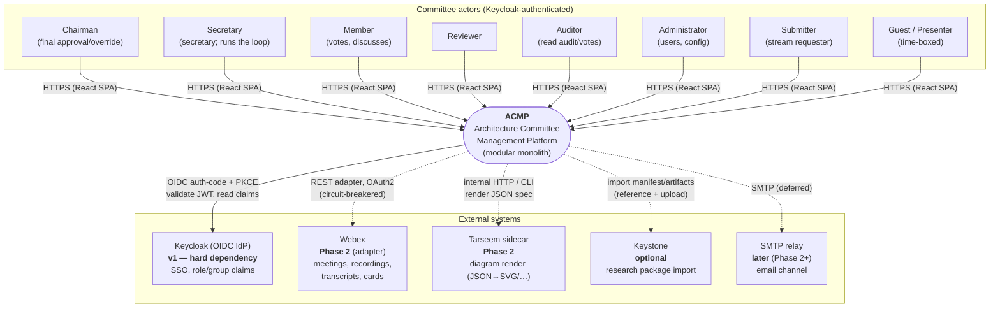
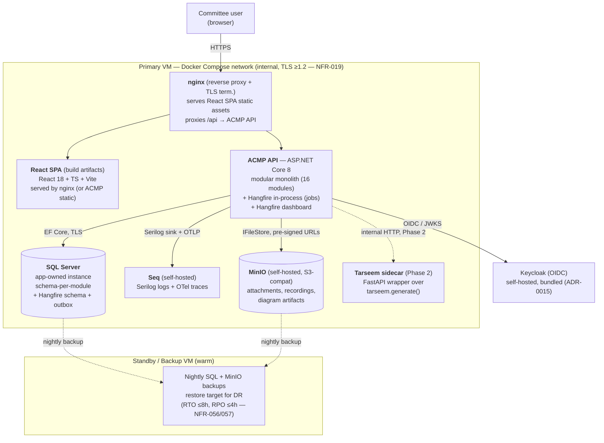
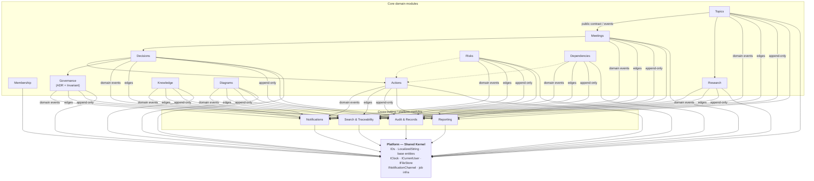
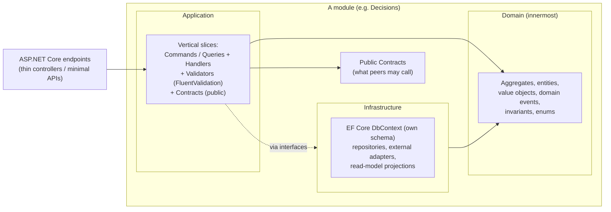
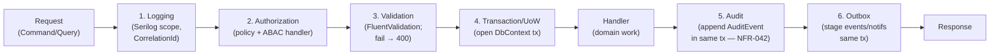

# 15 — Architecture (Deliverables 20, 21, 22)

**Purpose:** The architecture core of ACMP — system context, container topology, the confirmed macro-architecture (modular monolith), module boundaries, backend/frontend/cross-cutting architecture, integration summary, and a phasing table — structured along **arc42** and using **C4** levels for diagrams.

> Structure follows arc42 (§5.5 standards). Settled technology decisions are in `../README.md` §A and are **binding**; this document explains and applies them, it does not re-open them. Entities/modules/IDs from `../README.md` §B/§F and `docs/domain/domain-model.md`. NFR IDs from `docs/requirements/non-functional.md`. External facts are cited to the digest §6 and marked `[unverified]` where not from a cited source. Diagrams are authored as Mermaid (renderable in Markdown); per ADR-0006 the C4/sequence diagrams **may also be authored as Tarseem JSON specs** and rendered as versioned artifacts.

---

## 1. Introduction and Goals (arc42 §1)

ACMP is the single, auditable, bilingual (EN/AR) system of record for one Architecture Committee — intake → backlog → agenda → meeting → minutes → vote → decision → ADR → action → risk → dependency → traceability. It replaces a text-file process. It is **architecture governance, not generic project management** (`../README.md` guiding principle 1).

**Top quality goals** (driving the architecture; full set in `docs/requirements/non-functional.md`):

| # | Quality goal | Architectural driver | Key NFRs |
|---|---|---|---|
| Q1 | **Auditability & immutability** | append-only `AuditEvent`; votes/decisions frozen after issue | NFR-040..042 |
| Q2 | **Bilingual + RTL as first-class** | `LocalizedString` everywhere; logical CSS; HarfBuzz-shaped diagrams | NFR-035..039 |
| Q3 | **Maintainability via strict module isolation** | modular monolith; no cross-module DB; public contracts only | NFR-047 |
| Q4 | **Right-sized operability** (≤20 users, on-prem) | single VM + Compose; vertical scale only; 99.9% via redundancy + backups | NFR-008, NFR-014, NFR-055 |
| Q5 | **Security (sensitive gov data)** | OWASP ASVS L2; Keycloak OIDC; ABAC; pre-signed URLs | NFR-018..029 |
| Q6 | **Traceability** | typed `Relationship` edge graph; SQL traversal | (ADR-0008) |

**Stakeholders:** see `docs/domain/stakeholders.md`. The architecture-relevant actors are enumerated in §3.

---

## 2. Constraints (arc42 §2)

Hard constraints from `../README.md` §A and CON-001 (self-contained). These are not trade-offs to revisit; they bound every decision below.

| ID | Constraint | Source |
|---|---|---|
| CON-001 | **Self-contained**: no org Hangfire / ELK / Seq / notification platform. ACMP bundles its own — all runtime dependencies bundled (incl. self-hosted Keycloak + SQL Server) per ADR-0015; the only external dependency is Webex (Phase 2, via pluggable adapter). | README CON-001 |
| C-ARCH | Modular monolith, single deployable. Microservices rejected for v1. | ADR-0001 |
| C-STACK | .NET 8 (LTS) / ASP.NET Core / REST / Clean Architecture + vertical slices (MediatR) / EF Core. | ADR-0002 |
| C-DB | **SQL Server only** (transactional + reporting via columnstore + FTS). No second datastore in v1. | ADR-0003 |
| C-IDP | Keycloak OIDC (auth-code + PKCE); roles from group/realm-role claims; no self-registration. | ADR-0004 |
| C-NOTIF | `INotificationChannel` abstraction; **in-app only in v1** (no email); Webex = Phase 2. | ADR-0005 |
| C-DIAG | Tarseem render sidecar (Phase 2); JSON spec is source of truth. | ADR-0006 |
| C-FE | React 18 + TS + Vite; `react-i18next` EN/AR; RTL via logical CSS + `dir`; light/dark; `@dnd-kit`. | ADR-0012 |
| C-DEPLOY | On-prem VM(s) + Docker Compose. **No Kubernetes, no service mesh, no message broker.** | README §A, NFR-055 |
| C-SCALE | On-prem, low traffic, **≤20 users**, ≤~15 concurrent. Right-size; no HA cluster, no horizontal scaling. | README §A, NFR-008 |
| C-DATE | Gregorian only (localized formatting); no Hijri in v1. | README §A |

---

## 3. System Context — C4 Level 1 (arc42 §3)

ACMP sits between committee **actors** (canonical roles, `../README.md` §C) and a small set of **external systems**. Per ADR-0015, all runtime dependencies are bundled — **self-hosted Keycloak (ACMP-owned realm)**, SQL, Seq, and MinIO are app-owned, so v1 has **zero external runtime services**; the only external dependency is a deferred/pluggable integration (Webex Phase 2; Tarseem, Keystone, SMTP later).



Solid arrows = v1 runtime dependencies. Dashed = deferred/optional/pluggable (never hard-coded; always behind an adapter — ADR-0005/0006/0007).

**Actor → primary intent** (architecture-relevant; full matrix in `docs/domain/permission-role-matrix.md`):

| Actor | Primary interaction with ACMP |
|---|---|
| Chairman | Approve/override decisions (recorded by name), cast deciding vote, read everything. |
| Secretary | Drives the loop: triage, prioritize, schedule, build agenda, capture MoM, manage actions. |
| Member | Reads all streams, discusses, votes (always attributed). |
| Reviewer | Reviews topics/ADRs; comments. |
| Auditor | Reads audit log, votes, decisions (read-only, gated — NFR-025). |
| Administrator | User provisioning, role mapping, system config, Hangfire monitor. |
| Submitter | Raises topics (stream requests); no committee-internal rights. |
| Guest/Presenter | Time-boxed: presents one topic, attaches diagrams to it. |

---

## 4. Container Architecture — C4 Level 2 (arc42 §5 building-block, §7 deployment)

One deployable application (the modular monolith) plus its **app-owned** supporting containers, all on **one VM via Docker Compose**, with a **warm standby/backup VM** for the 99.9% target. No Kubernetes (C-DEPLOY, NFR-055).



**Container responsibilities & rationale:**

| Container | Tech | Responsibility | Notes |
|---|---|---|---|
| **nginx** | nginx | TLS termination, serve SPA static assets, reverse-proxy `/api`. | Recommended over serving the SPA from Kestrel: clean static caching, TLS, and a single ingress. The SPA *can* be served by ACMP static files if a separate container is unwanted — keep it a deploy-time toggle, not an architectural fork. |
| **ACMP API** | ASP.NET Core 8 | The modular monolith; all domain modules; REST API; **Hangfire in-process** (jobs + dashboard); OTel + Serilog. | Single deployable (ADR-0001/0002). Hangfire runs in-process backed by ACMP's own SQL (ADR-0004 jobs note). |
| **SQL Server** | MS SQL Server | Transactional store (schema-per-module), reporting (columnstore), FTS, Hangfire schema, outbox table. | App-owned instance (ADR-0003). The only datastore in v1. |
| **Seq** | Seq | Log + trace backend (Serilog structured logs, OTel traces/metrics), alerting. | Self-hosted, app-owned (CON-001). **Not** the org's ELK/Seq. |
| **MinIO** | MinIO | S3-compatible object storage behind `IFileStore`; pre-signed time-limited URLs for sensitive media. | Self-hosted, app-owned (CON-001). Metadata stays in SQL. |
| **Tarseem sidecar** | Python (FastAPI over `tarseem.generate`) | Render diagram JSON specs → SVG/PNG/PDF/drawio/pptx. **Phase 2.** | Sidecar exposing a thin internal HTTP endpoint, OR invoked as CLI from a Hangfire worker. No network at render time; deterministic (digest §5.1). |

**Topology notes.** All containers share one Compose network; only nginx is exposed. Internal traffic uses TLS ≥1.2 (NFR-019). Secrets are externalized via env/secret files (NFR-024). The **standby VM** holds nightly SQL + MinIO backups and is the documented DR restore target; this — not an HA cluster — is how 99.9% is met for ≤20 users (C-SCALE, NFR-014/016). Process crash recovery is automatic on container restart ≤2 min (NFR-016).

---

## 5. Architecture Recommendation — Modular Monolith (the big call)

This **confirms** ADR-0001 with a rigorous decision-pattern treatment and devil's-advocate challenge.

**Problem.** Choose the macro-architecture style for a governance platform serving one committee, ≤20 users, on-prem, single team, high sensitivity, with a moderately rich domain (16 modules, strong cross-entity traceability).

**Constraints.** C-SCALE (≤20 users), C-DEPLOY (one VM + Compose, no K8s), single delivery team, CON-001 (self-contained), strong consistency for votes/decisions/audit (ADR-0009), heavy intra-domain traceability (ADR-0008, cross-module graph traversal).

**Options.**
1. **Microservices** — modules as independently deployed services with their own datastores, network APIs, a broker.
2. **Simple layered monolith** — one deployable, classic horizontal layers (Controllers → Services → Repositories), no internal module boundaries.
3. **Modular monolith** — one deployable; internally partitioned into bounded-context modules with enforced isolation (no cross-module DB; public contracts / MediatR / domain events).

**Trade-offs.**

| Dimension | Microservices | Layered monolith | **Modular monolith** |
|---|---|---|---|
| Operational footprint | High (N services, broker, mesh, K8s) — violates C-DEPLOY/C-SCALE | Lowest | **Low (1 deployable + support containers)** ✓ |
| Cross-module consistency (votes/decisions/audit) | Hard (distributed tx / sagas) | Trivial | **Trivial (single DB tx)** ✓ |
| Traceability graph traversal (ADR-0008) | Cross-service joins → API fan-out | In-process SQL | **In-process SQL** ✓ |
| Boundary discipline / maintainability | Enforced by network | **Weak — erodes into a big ball of mud** | **Enforced by build rules (NFR-047)** ✓ |
| Team fit (single team) | Mismatch (per-service ownership) | Fits | **Fits** ✓ |
| Independent scaling/deploy | Yes (unneeded at ≤20 users) | No | No (acceptable — not required) |
| Path to extract a service later | n/a | Costly (no seams) | **Cheap (seams already exist)** ✓ |

**Recommendation.** **Modular monolith.** Microservices and a simple layered monolith are both rejected.

**Why here.** At ≤20 users on one VM, microservices buy nothing we need and cost everything we're constrained against: they demand a broker, service discovery, distributed tracing across processes, and orchestration (K8s) that C-DEPLOY forbids, and they turn the platform's core strength — single-transaction immutability for votes/decisions/audit and in-SQL traceability traversal — into a distributed-systems problem (sagas, eventual consistency, cross-service joins). The simple layered monolith avoids that overhead but discards the one thing this domain genuinely benefits from: **enforced bounded-context boundaries**. With 16 modules and rich cross-entity links, a layered monolith predictably decays into tangled cross-table reads. The modular monolith keeps the operational simplicity the constraints demand **and** the boundary discipline the domain demands, with module isolation enforced at build time (NFR-047: ArchUnit/NDepend rule, no cross-module internal references). It also preserves cheap future optionality: because modules already communicate only through public contracts, any one can be extracted into a service later *if measured need ever appears* — without a rewrite (guiding principle 2).

**Devil's-advocate challenge.**
- *"A modular monolith is just a layered monolith with extra ceremony; the discipline always erodes."* — It erodes **only if unenforced**. The mitigation is mechanical, not cultural: NFR-047 makes a cross-module internal reference a **build failure**, and the schema-per-module DbContext boundary (§6) makes a cross-module table read impossible by construction (each module's DbContext only maps its own schema). Discipline is enforced by the compiler and CI, not by reviewer goodwill.
- *"You'll regret the monolith when you need to scale."* — Scale to what? The hard ceiling is ≤20 users / ~15 concurrent / ~500 topics/yr (NFR-008/009). Vertical scaling on one VM covers this with large headroom (NFR-001..004 targets are met by a single process + indexed SQL). Horizontal scaling is a solution to a problem this system does not have; building for it now is the exact over-engineering the brief forbids.
- *"Single deployable = single point of failure → can't hit 99.9%."* — 99.9% (~44 min/month) is met by **simple redundancy + nightly backups + fast restart** (warm standby VM, automatic container restart ≤2 min, RTO ≤8h), not by clustering (NFR-014/016/057). An HA cluster would be disproportionate for this footprint.

**Risks & validation.**
| Risk | Mitigation | Validation |
|---|---|---|
| Boundary erosion over time | Build-time arch rules; schema-per-module DbContext; PR review gate | CI ArchUnit rule green (NFR-047) |
| In-process Hangfire competes with API for CPU under a render burst | Bounded worker count; render is Phase 2 and off the hot path | NFR-005 (render ≤30s), NFR-001 (page P95 ≤2s) under load test |
| Future genuine need to scale one module | Public-contract seams already isolate modules → extract-to-service is incremental | Architecture review revisits **only** with measured evidence (principle 2) |

**Reference:** ADR-0001 (macro-architecture), ADR-0002 (backend stack). Pattern support: Microsoft On-.NET "Clean Architecture, Vertical Slices and Modular Monoliths" and milanjovanovic.tech vertical-slice guidance (digest §5.5, §6).

---

## 6. Major Modules & Boundaries — C4 Level 3 (arc42 §5 building blocks)

### 6.1 Canonical modules

The 16 modules (`../README.md` §B), grouped. Each is a bounded context = a project/folder boundary (NFR-047) with its own SQL schema.

**Core domain (11):** Membership · Topics · Meetings · Decisions · Actions · Risks · Dependencies · Governance (ADRs + Invariants) · Research · Knowledge · Diagrams
**Cross-cutting / platform (5):** Notifications · Reporting · Search & Traceability · Audit & Records · **Platform (Shared Kernel)**

| Module | Aggregate roots (from `docs/domain/domain-model.md`) | SQL schema | Owns |
|---|---|---|---|
| Membership | `User`, `Committee` | `membership` | Role, Permission, CommitteeMembership, Stream, System, Service |
| Topics | `Topic`, `TopicType` | `topics` | Backlog (view), topic-level ProgressUpdate |
| Meetings | `Meeting`, `Agenda` | `meetings` | AgendaItem, Attendance, Recording, Transcript, MinutesOfMeeting, Discussion |
| Decisions | `Decision`, `Vote` | `decisions` | DecisionCondition |
| Actions | `Action` | `actions` | ProgressUpdate |
| Risks | `Risk` | `risks` | Mitigation |
| Dependencies | `Dependency` | `dependencies` | (typed status-bearing edges) |
| Governance | `ADR`, `Invariant` | `governance` | — |
| Research | `ResearchMission` | `research` | Finding, Recommendation |
| Knowledge | `Document`, `Template` | `knowledge` | Comment (shared host) |
| Diagrams | `Diagram` | `diagrams` | Tarseem spec + artifact refs |
| Notifications | `Notification` | `notifications` | outbox rows |
| Reporting | (read models only) | `reporting` | columnstore read models / views |
| Search & Traceability | `Relationship` | `trace` | typed directed edges |
| Audit & Records | `AuditEvent` | `audit` | append-only log |
| **Platform (Shared Kernel)** | — | `platform` | `Attachment`, IDs, `LocalizedString`, base entities, IFileStore, job infra |

### 6.2 The dependency rule (enforced)

**A module may not read another module's tables.** Modules communicate only via in-process **public contracts** (interfaces / MediatR commands & queries) or **domain events** (ADR-0001, `docs/domain/domain-model.md` §B). Cross-aggregate references are **by id only** — never EF navigation across a module boundary. Polymorphic hosts (`Comment`, `Attachment`, `Relationship`, `AuditEvent`) use a soft `(SubjectType, SubjectId)` reference precisely so they create **no FK coupling** that would violate isolation.

**Shared Kernel** is the one module every other module may depend on (downward only). It holds: ID generation (Guid + human-readable keys, `../README.md` §F), `LocalizedString`, base entity/audit scaffolding, `IClock`, `ICurrentUser`, `IFileStore`, `INotificationChannel` (interface; impls live in Notifications), and Hangfire job infrastructure. **No module may depend "up" or "sideways" into a peer's internals.**

### 6.3 Module map



All arrows are **in-process public contracts, MediatR messages, or domain events** — never cross-module table access. The only legal compile-time dependency direction into another module is **downward into the Shared Kernel**.

### 6.4 Internal dependency rules (summary)

1. Domain → Application → Infrastructure **within** a module (Clean Architecture, §7); Domain depends on nothing outward.
2. A module references another module **only** through its published contract project (e.g. `Decisions.Contracts`), never its `Infrastructure`/`Domain` internals.
3. Cross-module side effects (notify, link, audit) are raised as **domain events** handled by the platform modules — the emitting module does not call Notifications/Audit directly by reference.
4. Every module may depend on **Shared Kernel**; Shared Kernel depends on no domain module.
5. Enforcement: ArchUnit/NDepend CI rule (NFR-047) + schema-per-module DbContext (no module's DbContext maps another's schema).

---

## 7. Backend Architecture (arc42 §5/§8)

### 7.1 Clean Architecture per module + vertical slices

Each module is internally a Clean Architecture stack, with feature behaviour organized as **vertical slices** (one folder per use case: command/query + handler + validator + DTOs), wired with **MediatR** (ADR-0002).



- **Domain** has no outward dependencies; it owns aggregate invariants (votes/decisions immutability, status machines per `docs/domain/entity-lifecycles.md`).
- **Application** = the vertical slices; orchestrates the domain via MediatR; depends on Domain + abstractions only.
- **Infrastructure** implements persistence (EF Core, schema-per-module) and external adapters; depends inward.
- **Controllers are thin**: validate auth policy, send a MediatR request, map the result. No business logic in controllers.

### 7.2 MediatR pipeline (cross-cutting behaviors)

Every command/query flows through an ordered pipeline of behaviors (`IPipelineBehavior`), so cross-cutting concerns are uniform and testable, not scattered:



| # | Behavior | Responsibility | Tie |
|---|---|---|---|
| 1 | Logging | Serilog scope, `CorrelationId`, `Module`/`Operation`/`ElapsedMs`. | NFR-044 |
| 2 | Authorization | Resolve ASP.NET policy + run ABAC handler (role + topic/stream scope). Deny → 403. | §9.1, NFR-020 |
| 3 | Validation | FluentValidation per slice; fail → 400, no handler run. | NFR-021 |
| 4 | Transaction / UoW | Wrap the handler + audit + outbox staging in one DB transaction. | NFR-042 |
| 5 | Audit | Append `AuditEvent` **in the same transaction** as the state change — no transition without an audit row. | ADR-0009, NFR-040/042 |
| 6 | Outbox | Stage domain events / notifications to a SQL outbox in the same tx; a Hangfire dispatcher delivers them. | §10.7, ADR-0005 |

### 7.3 EF Core: schema-per-module (Recommendation)

**Problem.** How to physically isolate module data in one SQL Server while keeping module boundaries enforceable and migrations manageable.

**Options.** (a) one shared `DbContext`; (b) **DbContext-per-module, schema-per-module** (each module owns a SQL schema, e.g. `decisions.*`, and a `DbContext` mapping only that schema); (c) separate databases per module.

**Recommendation: (b) DbContext-per-module + schema-per-module.** One physical SQL Server database; each module maps **only its own schema**; each module owns its EF migrations.

**Why here.** (b) makes the dependency rule (§6.2) **physically true**: a module's `DbContext` cannot read another schema's tables because it does not map them — boundary violation becomes a compile/runtime impossibility, not a guideline. It keeps cross-module queries in-process and trivial (same database, so the traceability graph traversal and reporting read models still work in plain SQL — ADR-0008, digest §5.6) while avoiding the distributed-tx pain of (c). (a) is rejected: a shared context invites exactly the cross-module reads NFR-047 forbids. (c) is rejected: separate databases break single-transaction immutability (votes + decision + audit must commit atomically) and add operational weight disproportionate to ≤20 users.

**Risks.** Cross-module reporting needs read models, not cross-schema joins in handlers — addressed by the Reporting module's projections (§10.5). Migrations across many contexts need ordering — addressed by forward-only EF migrations run at deploy (see `docs/domain/data-architecture.md` §migration). Devil's-advocate: *"schema-per-module is needless ceremony in one DB"* — it is the cheapest mechanism that makes isolation **enforced rather than aspirational**, and it costs only a schema prefix.

### 7.4 REST API conventions

- **Resource-oriented**, plural nouns: `/api/topics`, `/api/topics/{key}`, `/api/meetings/{key}/agenda`. Human-readable keys in URLs (`TOP-2026-042`) per `../README.md` §F / `docs/domain/information-architecture.md`.
- **Verbs** map to lifecycle transitions as sub-resources or actions where REST CRUD is a poor fit, e.g. `POST /api/votes/{key}/close`, `POST /api/decisions/{key}/issue`, `POST /api/topics/{key}/submit` — transitions are explicit, not implicit field edits (immutability — ADR-0009).
- **Status codes:** 400 validation, 401 no/invalid token, 403 policy/ABAC denied, 404, **409 on illegal transition / mutation of frozen vote/decision** (NFR-041), 422 where semantically richer.
- **Pagination/filtering/sorting** on all list endpoints (backlog, search, audit) — query params; server-side; P95 targets NFR-002/004.
- **OpenAPI** generated (Swashbuckle); every endpoint authenticated except health + OIDC callback (NFR-020).
- **Optimistic concurrency** via `rowversion`/ETag → 409 on stale write (see `16` §concurrency).
- **Problem Details** (RFC 7807) for error bodies; localized messages (EN/AR).

### 7.5 Cross-cutting services (Shared Kernel abstractions)

Injected interfaces, implemented in Infrastructure; keep the domain pure and the integrations swappable (CON-001 self-containment depends on these seams).

| Interface | Purpose | v1 implementation |
|---|---|---|
| `ICurrentUser` | Resolved principal: subject, mapped roles, assigned streams (for ABAC). | From Keycloak JWT claims (ADR-0004). |
| `IClock` | Testable time (`DateTimeOffset` UTC). | System clock; Gregorian (C-DATE). |
| `IFileStore` | Blob put/get/pre-signed URL. | **MinIO** (ADR-0003 storage note); pre-signed ≤1h for media (NFR-027). |
| `INotificationChannel` | Send a notification via a channel. | **In-app** only in v1; Webex Phase 2; Email later (ADR-0005). |
| `IDiagramRenderer` | Render a Tarseem JSON spec → artifacts. | **Phase 2** Tarseem sidecar/CLI (ADR-0006); no-op/queued before. |
| Auth services | Policy + ABAC handlers, role mapping. | ASP.NET authorization (§9.1). |
| Audit service | Append-only recorder (no update/delete API). | `AuditEvent` writer in the MediatR pipeline (NFR-040). |
| Localization | `LocalizedString` resolution, resource access. | EN/AR; `react-i18next` on the front end (§8). |

---

## 8. Frontend Architecture (arc42 §5)

React 18 + TypeScript + Vite (ADR-0012). The SPA is a thin, accessible, bilingual client over the REST API; all authority lives server-side (the SPA hides unauthorized actions but never enforces — enforcement is the API's job, NFR-020).

### 8.1 Structure — feature folders

Mirror the backend modules so navigation and ownership line up with `docs/domain/information-architecture.md`:

```
src/
  app/            # bootstrap, providers, router, query client, i18n init, theme
  shared/         # design-system components, hooks, api client, auth, utils, types
  features/
    backlog/      # components, routes, queries, hooks for Topics/Backlog
    meetings/     # agenda, live-meeting, MoM
    decisions/    # decisions + ADRs
    governance/   # invariants
    actions/  risks/  dependencies/  research/  knowledge/  diagrams/
    reports/  admin/
  locales/        # en.json, ar.json (react-i18next resources)
```

Each feature folder owns its routes, TanStack Query hooks, and components; cross-feature reuse goes through `shared/` (design system + API client), never feature→feature imports — the front-end analogue of the backend dependency rule.

### 8.2 Routing & state

- **Routing:** React Router; deep-linkable canonical artifact routes (`/topics/TOP-2026-042`) valid regardless of entry path (`docs/domain/information-architecture.md` §1.2). Role-filtered nav rendered from the user's mapped roles; unauthorized routes 404/redirect, never a permission wall.
- **Server state:** **TanStack Query** is the source of truth for server data (caching, invalidation, optimistic updates for DnD reorder). This is the bulk of app state.
- **Client state:** minimal — only genuine UI state (modals, theme, language, live-meeting local buffer). A light store (Zustand or Context) `[unverified — exact lib at build time]`; **no Redux** unless a measured need appears (right-sizing).
- **Unsaved-work protection:** route-leave guards + autosave (meeting notes debounce, NFR-006) to prevent lost edits (brief UX requirement).

### 8.3 API client & auth (OIDC PKCE)

- **Auth:** OIDC **authorization-code + PKCE** against Keycloak (ADR-0004) using a maintained library (e.g. `oidc-client-ts`/`react-oidc-context`) `[unverified — exact lib at build]`. Access token attached to API calls; silent refresh; absolute session caps per NFR-023.
- **API client:** typed wrapper (generated from OpenAPI where practical) injecting the bearer token and `CorrelationId`, surfacing Problem Details errors localized.
- The SPA reads roles from the ID/access token for **nav rendering only**; the API independently validates every request (NFR-020) — the client is never the authorization boundary.

### 8.4 i18n, RTL, theming, DnD

| Concern | Approach | Tie |
|---|---|---|
| i18n | `react-i18next`, EN/AR resource files; **no hardcoded strings** (lint-enforced). | NFR-035, ADR-0012 |
| RTL | `dir="rtl"` on `<html>` for AR; **CSS logical properties only** (no `left`/`right`) — lint-enforced. | NFR-036 |
| Dates/numbers | Locale formatting, **Gregorian only** in v1; no raw ISO visible. | NFR-037, C-DATE |
| Theming | Light/dark via **design tokens** (CSS custom properties); contrast AA in both themes × both directions. | NFR-033, ADR-0012 |
| Accessible DnD | **`@dnd-kit`** for backlog/agenda reorder, with **keyboard-accessible move up/down** alternative. | NFR-031, ADR-0012 |
| a11y baseline | WCAG 2.2 AA; axe-core in CI; status never color-only. | NFR-030/034 |

---

## 9. Cross-cutting Architecture (arc42 §8 concepts)

### 9.1 Authentication & authorization

- **AuthN:** Keycloak OIDC; API validates the JWT (signature via JWKS, issuer, audience, expiry) on **every** request (NFR-020). No self-registration (ADR-0004).
- **AuthZ — two layers:**
  1. **RBAC via ASP.NET policies.** Canonical roles (`../README.md` §C) are **sourced from Keycloak group/realm-role claims** and mapped to ACMP roles; each fine-grained `Permission` maps 1:1 to a named policy (e.g. `Vote.Cast`, `Decision.ChairApprove`) — `docs/domain/permission-role-matrix.md`.
  2. **ABAC handlers** add **topic/stream scope** and **separation-of-duties** (e.g. verifier ≠ owner; chair-approve ≠ recorder): an `IAuthorizationHandler` evaluates the resource (topic stream, ownership, voting eligibility) against the principal. **Default stream visibility: all committee members may READ all streams**; create/edit gated by role + ownership (ADR/README §C).
- Enforced uniformly in the MediatR Authorization behavior (§7.2) so no handler is reachable unchecked. Denials are audited (`Auth.Denied`).

### 9.2 File / document storage

`IFileStore` over **MinIO** (ADR-0003 storage note). Bytes in MinIO, metadata (`Attachment`) in SQL. Sensitive media (recordings/transcripts) served only via **pre-signed, time-limited URLs (≤1h)** that never appear in logs or notifications (NFR-027); access is role-gated and audited (NFR-025).

### 9.3 Search (SQL FTS)

**SQL Server Full-Text Search** in v1 (ADR-0011), adequate for topics/docs/decisions/transcripts at this scale (digest §5.6). FTS catalogs over selected text columns (titles, descriptions, rationale, document/transcript bodies — enumerated in `16` §FTS). If search outgrows FTS, stand up an **app-owned** OpenSearch container — **never** the org's ELK (ADR-0011). Not built now (phasing §11).

### 9.4 Reporting (read models + columnstore)

Dashboards/reports run off **read models** in a `reporting` schema with **columnstore indexes** for aggregation (digest §5.6, NFR-013) — no separate analytics DB in v1 (ADR-0003). Read models are projected from domain events (the Reporting module subscribes), keeping reporting queries off the transactional hot tables. Detail in `docs/domain/reporting-dashboards.md`.

### 9.5 Notifications (channel abstraction, in-app v1, outbox)

`INotificationChannel` abstraction (ADR-0005). **v1 = in-app notification center only** (no email). **Webex adapter = Phase 2**; email when an SMTP relay exists. Delivery is durable via the **SQL outbox**: the triggering transaction stages a `Notification`/outbox row; a Hangfire job dispatches it; failures retry. Webex is **never hard-coded** and sits behind a **circuit breaker** (§9.10). Strategy in `docs/domain/notification-strategy.md`.

### 9.6 Background jobs (Hangfire on SQL)

**App-owned Hangfire**, **in-process** inside ACMP, backed by **ACMP's own SQL Server** (own schema) — not the org's Hangfire (ADR-0004 jobs note, CON-001). Provides dashboard, retries (3× exponential backoff — NFR-017), and history. Jobs: reminders, escalations, digests, outbox dispatch, and **diagram-render** (Phase 2). Right-sized: bounded worker count so jobs don't starve the API.

### 9.7 Audit (append-only + immutability)

`AuditEvent` is **append-only**: no UPDATE/DELETE triggers, constraints, or ORM paths target it (NFR-040). Every state transition writes an audit row **in the same transaction** (NFR-042, §7.2). **Votes and issued decisions are immutable** after their freeze event — mutation attempts return 409 (NFR-041, ADR-0009). Optional hash-chaining for tamper-evidence is a `[unverified]` design option deferred to `docs/domain/audit-and-records.md`.

### 9.8 Observability

**Serilog** structured logs (required fields per NFR-044) + **OpenTelemetry** traces/metrics, both shipped to the **app-owned self-hosted Seq** (CON-001). 100% trace sampling at this volume (NFR-043). **Health checks** (`/health`) cover DB, Hangfire, Seq, MinIO, and Tarseem (Phase 2) sub-checks (NFR-045). Seq alert rules for error rate, failed jobs, health failures, and **audit-write failure** (NFR-046). No PII beyond pseudonymous user id in logs/traces (NFR-028).

### 9.9 Localization & configuration

- **Localization:** `LocalizedString { En, Ar }` value object server-side; `react-i18next` client-side; one canonical glossary (`../README.md` §G); Gregorian dates (C-DATE).
- **Configuration:** fully externalized (env vars / secret files); switching environments = config only, no rebuild (NFR-053). Secrets never in source/images (NFR-024). Single-command local stack via `docker compose up` (NFR-052).

### 9.10 Failure handling

- **Retries:** Hangfire 3× exponential backoff (NFR-017); idempotent handlers where retried.
- **Outbox:** guarantees notification/render durability across crashes (§9.5, §10.7).
- **Circuit breaker** (Polly) around **Webex and Tarseem** calls so an external outage degrades gracefully (notifications queue; renders retry) and never blocks the core loop — the platform must run with these integrations down (CON-001, ADR-0005/0006).
- **Process crash:** automatic container restart, no data loss for committed tx, ≤2 min (NFR-016).

### 9.11 Security boundaries (summary)

Single ingress (nginx, TLS termination); internal container traffic TLS ≥1.2 (NFR-019); secrets externalized (NFR-024); OWASP ASVS L2 target (NFR-018); CSRF/anti-forgery (NFR-022); parameterized queries / EF only (NFR-021); LLM inputs (transcripts) treated as untrusted, AI output never auto-committed (NFR-026). Full treatment in `docs/domain/security-threat-model.md` / `docs/domain/security-controls.md`.

### 9.12 Backup / recovery & scalability

- **Backup:** nightly SQL + MinIO backups to the **standby VM** / separate storage; RPO ≤4h, RTO ≤8h; quarterly restore test (NFR-056/057/058). Keep-all retention, no auto-purge v1 (NFR-059/060).
- **Scalability:** **right-sized — vertical only.** No horizontal scaling, no HA cluster, no broker (C-SCALE, NFR-055). 99.9% via redundancy + backups + fast restart (NFR-014).

---

## 10. Core-loop sequence (arc42 §6 runtime)

The committee loop **intake → decision → action** (workflows W1, W11, W12, W13 in `docs/domain/workflows.md`), showing the modular monolith's in-process module collaboration, the same-transaction audit, and the outbox-backed notification.

```mermaid
sequenceDiagram
    autonumber
    actor SU as Submitter
    actor CO as Secretary
    actor ME as Members
    actor CH as Chairman
    participant API as ACMP API (controllers)
    participant TP as Topics module
    participant DC as Decisions module
    participant AC as Actions module
    participant AUD as Audit & Records
    participant OBX as Outbox + Hangfire
    participant NT as Notifications (in-app)

    SU->>API: POST /api/topics/{k}/submit  (W1)
    API->>TP: SubmitTopicCommand (MediatR)
    Note over API,TP: pipeline: log → authz → validate → tx
    TP->>TP: Topic Draft→Submitted
    TP->>AUD: append AuditEvent (same tx) [NFR-042]
    TP->>OBX: stage "TopicSubmitted" (same tx)
    OBX-->>NT: dispatch → Secretary in-app notice

    CO->>API: triage→accept→prepare→schedule (W2–W5)
    Note over CO,API: agenda built & published (W6); meeting held (W7)

    ME->>API: POST /api/votes/{k}/cast  (W11, attributed)
    API->>DC: CastBallotCommand
    DC->>DC: record ballot (always attributed) [ADR-0010]
    CH->>API: POST /api/votes/{k}/close + decision
    API->>DC: CloseVote + IssueDecisionCommand
    DC->>DC: Vote→Closed (frozen); Decision→Issued (immutable) [ADR-0009]
    DC->>AUD: append AuditEvents (same tx)
    DC->>OBX: stage "DecisionIssued"
    OBX-->>NT: dispatch → owner/members in-app

    CO->>API: POST /api/actions  (W13)
    API->>AC: CreateActionCommand (Source=Decision)
    AC->>AC: Action Open; reminders scheduled (Hangfire)
    AC->>AUD: append AuditEvent (same tx)
    AC-->>OBX: schedule due-soon / overdue jobs [NFR-007]
```

Note: all module-to-module interactions are **in-process** (MediatR / domain events); the only durability boundary is the **SQL outbox** that turns committed domain events into delivered notifications. Per ADR-0006 this sequence (and the C4/module diagrams above) **may also be authored as Tarseem JSON specs** and rendered to SVG/PDF as versioned artifacts.

---

## 11. Phasing table (what to build when)

Explicit disposition per capability. Columns: **Initial release** (v1) · **Postpone** (later phase) · **Manual initially** · **Design for later extensibility** · **Do NOT build**.

| Capability / component | Initial release (v1) | Postpone | Manual initially | Design for extensibility | Do NOT build |
|---|---|---|---|---|---|
| Modular monolith (.NET 8) | ✅ | | | seams to extract a service later | microservices |
| SQL Server (single store) | ✅ transactional + reporting + FTS | | | second store only on evidence | second DB / distributed DB in v1 |
| Keycloak OIDC + RBAC/ABAC | ✅ | | | additional IdPs via OIDC | own IdP / self-registration |
| In-app notification center | ✅ (only channel) | | | `INotificationChannel` for more channels | email in v1 |
| **Webex** integration | | ✅ **Phase 2** (adapter) | meeting links/recordings entered manually v1 | behind adapter + circuit breaker | hard-coded Webex |
| Email/SMTP channel | | ✅ later (when relay exists) | n/a | channel impl ready | SMTP in v1 |
| **Tarseem** diagram render | | ✅ **Phase 2** sidecar | diagrams attached as files v1; spec authored manually | `IDiagramRenderer` seam | rebuilding a diagram engine |
| **AI extraction** (decisions/actions/MoM from transcript) | | ✅ **Phase 3** | ✅ MoM/decisions/actions captured manually | candidate→human-approve pipeline (NFR-026) | auto-commit of AI output |
| Recordings / transcripts | ✅ reference + manual upload | auto-fetch from Webex (Phase 2/3) | ✅ manual upload | `Recording`/`Transcript` model ready | programmatic transcript assumption (Webex Assistant gated — digest §5.3) |
| Search | ✅ **SQL FTS** | OpenSearch **only if outgrown** | | app-owned search seam (never org ELK) | OpenSearch in v1 |
| Reporting / dashboards | ✅ read models + columnstore | | | more read models as needed | separate analytics DB |
| Background jobs | ✅ app-owned Hangfire on SQL | | | more job types | org Hangfire; external broker |
| Observability | ✅ Serilog + OTel → self-hosted Seq | | | more dashboards/alerts | org ELK/Seq |
| Object storage | ✅ self-hosted MinIO | | | other S3 providers via `IFileStore` | org storage infra |
| Voting | ✅ simple, **always attributed**, chair override by name | | | — | anonymous voting in v1 |
| Keystone (research import) | optional capability; Research works standalone | richer import later | ✅ manual research entry | import seam + ID-scheme adoption | hard dependency / embedded service |
| Multi-committee | | | | single-committee `Committee` entity exists | generalize to many committees in v1 |
| Deployment | ✅ Docker Compose on VM + warm standby | | | — | Kubernetes / service mesh |
| Hijri calendar | | possible future | | localized formatting layer | Hijri in v1 |
| Message broker (Rabbit/Kafka) | | | | in-process events + outbox instead | broker in v1 |

---

## 12. Integration architecture summary (pointers)

Kept brief to avoid duplication — full treatment in the integration docs:

- **Integration architecture (overall, adapter pattern, contracts):** `docs/domain/integration-architecture.md`.
- **Webex feasibility** (rate limits ~300 req/min; 429+Retry-After; webhooks incl. meetingTranscripts; **transcripts gated by Webex Assistant, not programmatically enableable**; Adaptive Cards v1.3 ≤80 KB; OAuth2/bot): `docs/domain/webex-feasibility.md` (digest §5.3).
- **Tarseem analysis + integration** (schema-driven Python engine, Apache-2.0 v1.0.0; sidecar/CLI; JSON spec = source of truth; deterministic, no network at render; 11 families incl. C4/ER/sequence/deployment): `docs/domain/tarseem-analysis.md` (digest §5.1).
- **Keystone analysis + integration** (optional Claude Code authoring workflow, MIT; import manifest/requirements/decisions/risks/acceptance/traceability; adopt ID scheme + gates; never embedded): `docs/domain/keystone-analysis.md` (digest §5.2).

All three sit behind ACMP abstractions (`INotificationChannel`, `IDiagramRenderer`, Research import) so none is a hard runtime dependency (CON-001).

---

## Traceability

Implements **Deliverables 20 (architecture recommendation), 21 (architecture diagrams), 22 (module definitions)**. Confirms **ADR-0001** (modular monolith) with devil's-advocate; applies **ADR-0002** (.NET 8/Clean+slices/MediatR/EF), **ADR-0003** (SQL Server, MinIO, columnstore), **ADR-0004** (Keycloak OIDC, Hangfire-on-SQL note), **ADR-0005** (notifications channel, in-app v1, Webex Phase 2), **ADR-0006** (Tarseem/diagrams), **ADR-0007** (Keystone optional), **ADR-0008** (Relationship/traceability), **ADR-0009** (audit immutability), **ADR-0010** (attributed voting), **ADR-0011** (SQL FTS), **ADR-0012** (frontend). Modules/entities/IDs from `../README.md` §B/§F and `docs/domain/domain-model.md`. NFRs referenced throughout from `docs/requirements/non-functional.md` (esp. NFR-001..016 perf/availability, NFR-019/024 security boundaries, NFR-040..046 audit/observability, NFR-047 module isolation, NFR-052..055 deployment). Workflows in `10`/`13`; data architecture in `docs/domain/data-architecture.md`; reporting `27`; notifications `29`; search/traceability `30`; integration `17`–`20`; security `24`/`25`; containerization/deployment `33`. Standards: arc42, C4, ISO/IEC/IEEE 42010 (digest §5.5). Open-question candidates raised in this doc: see final report.
