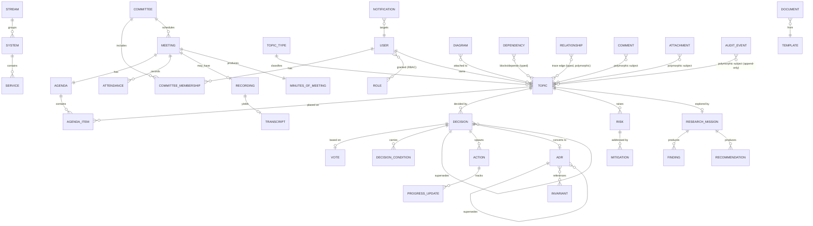

# 16 — Data Architecture & Logical Data Model (Deliverables 23, 24)

**Purpose:** The ACMP data architecture (single SQL Server, schema-per-module, keys, integrity, concurrency, audit/history, FTS, reporting, JSON, migrations, backup) and the **initial logical data model** — a table catalog for every core entity plus an ER overview and reference/seed data.

> Entity names, modules, IDs and status models are from `../README.md` §B/§E/§F and `docs/domain/domain-model.md` **verbatim** — this document is the physical/logical realization, not a re-derivation. Settled decisions (`../README.md` §A) are binding. Architecture context in `docs/domain/architecture-detail.md`. External facts cited to digest §6; `[unverified]` where not from a cited source.

---

## 1. Data Architecture

### 1.1 Single store: SQL Server only (justification)

**Problem.** Choose the datastore topology for transactional governance data + reporting + search + a traceability graph, at ≤20 users on-prem.

**Constraints.** ADR-0003 (SQL Server only, app-owned instance, no second DB in v1); CON-001 (self-contained); strong consistency for votes/decisions/audit (ADR-0009); cross-entity traceability traversal (ADR-0008); right-sizing (≤20 users — `docs/requirements/non-functional.md`).

**Recommendation: a single SQL Server database** serving transactional, reporting, search, and traceability workloads. **SQL-only is sufficient for v1**, justified by digest §5.6:
- **Full-text search:** SQL Server FTS is adequate for topics/docs/decisions/transcripts at this scale (weaker than Elasticsearch on fuzzy/typo, but sufficient; if outgrown, stand up an **app-owned** OpenSearch container — never the org ELK, ADR-0011).
- **Reporting/analytics:** **columnstore indexes** handle dashboard aggregation well; SSAS/SSRS exist if ever needed — **no separate analytics DB** in v1.
- **JSON:** SQL Server has native JSON support — good for Tarseem specs and flexible metadata without a document DB.
- **Right-sizing:** ≤20 users / ~500 topics/yr / low thousands of artifacts by year 3 (NFR-008/009) is comfortably within one instance; a second datastore would add operational weight for no measured benefit.

**Why here / devil's-advocate.** *"A graph database would model traceability better."* — The traceability graph (ADR-0008) is small and traversed by **recursive SQL CTEs** over the `Relationship`/`Dependency` edge tables; at this artifact count that is fast and keeps everything in one transaction and one backup. A graph DB would split the system of record, break single-transaction immutability (vote + decision + audit must commit atomically), and violate CON-001 right-sizing. *"FTS will be too weak."* — Accepted as a **measured** future trigger (ADR-0011), not a v1 problem. Revisit the single-store decision **only with evidence**, per guiding principle 3.

### 1.2 Schema-per-module

One physical database; **each module owns a SQL schema** (`docs/domain/architecture-detail.md` §6.3): `membership`, `topics`, `meetings`, `decisions`, `actions`, `risks`, `dependencies`, `governance`, `research`, `knowledge`, `diagrams`, `notifications`, `reporting`, `trace`, `audit`, `platform`. Each module's EF Core `DbContext` maps **only its own schema**, which makes the "no cross-module table read" rule (ADR-0001, NFR-047) **physically enforced**. Cross-module data needs flow through public contracts or read models (`reporting`), never cross-schema joins in handlers.

### 1.3 Keys: GUID surrogate PK + human-readable business key

- **Surrogate PK:** `Id UNIQUEIDENTIFIER` (Guid) on **every** table — stable, mergeable, decoupled from business meaning, safe for polymorphic soft references.
  - To avoid GUID index fragmentation as the clustered key, use **sequential GUIDs** (`NEWSEQUENTIALID()` / app-side sequential Guid) or a clustered `BIGINT IDENTITY` with a unique non-clustered index on `Id` `[unverified — pick at build per table hotness]`. Most ACMP tables are low-write, so a sequential-GUID clustered key is acceptable.
- **Business key:** human-readable, **year-scoped**, per `../README.md` §F — `TOP-YYYY-###`, `MTG-YYYY-###`, `AGN-YYYY-###`, `MIN-YYYY-###`, `DECN-YYYY-###`, `VOTE-…`, `ACT-…`, `RSK-…`, `DPN-…`, `ADR-…` (in-app), `AIV-…`, `DOC-…`, `TPL-…`, `DGM-…`, `RMS-…`, `FND-…`, `REC-…`. Stored as `Key NVARCHAR`, **UNIQUE**, generated atomically per type per year (a `platform.KeySequence` counter table, allocated inside the creating transaction).

### 1.4 Referential integrity rules

- **Within a module / aggregate:** real FK constraints (e.g. `decisions.DecisionCondition.DecisionId → decisions.Decision.Id`); cascade is **deliberate, not default** — child rows of an aggregate may cascade; references across aggregates do **not** cascade.
- **Across modules:** **no cross-schema FK constraints.** Cross-module references are by **id only** (e.g. `topics.Topic.OwnerUserId` references a `membership.User` logically, enforced in application logic/contracts, not by a DB FK) — preserves module isolation and avoids cross-schema coupling (ADR-0001).
- **Polymorphic references** (`(SubjectType, SubjectId)` on `Comment`/`Attachment`/`Relationship`/`Dependency`/`AuditEvent`): **no FK** by design — soft references so they attach to any aggregate and survive subject changes (`docs/domain/domain-model.md` §A.3). Integrity is application-enforced + audited.

### 1.5 Concurrency (optimistic)

Every mutable aggregate root carries `RowVersion ROWVERSION` (SQL `rowversion`/`timestamp`). EF Core optimistic concurrency → stale write throws → API returns **409** (ETag-mapped, `docs/domain/architecture-detail.md` §7.4). Chosen over pessimistic locking: contention is near-zero at ≤20 users; optimistic concurrency is cheaper and avoids lock holding. Append-only tables (`AuditEvent`, `ProgressUpdate`) need no rowversion (never updated).

### 1.6 Soft-delete vs hard-delete & retention

- **Retention = keep everything; configurable; no automatic purge in v1** (`../README.md` §A, NFR-059/060). No background deletion job exists in v1.
- **Soft-delete** (`IsDeleted`/`Status` archival) for user-discardable content (`Comment`, `Document` archive, `Attachment`) — preserved for audit; filtered by a global query filter.
- **Hard-delete is prohibited** for governance records (Topic, Decision, Vote, MoM, ADR, Invariant, AuditEvent, Relationship): they are archived/superseded, never deleted.
- **Immutable** (never updated after a freeze event): issued `Decision`, closed `Vote` ballots/tally, published `MinutesOfMeeting`, approved `ADR`, `AuditEvent` (ADR-0009, NFR-040/041). Corrections happen via **supersession / new version**, not edit.

### 1.7 Status-history pattern

Status machines are defined in `docs/domain/entity-lifecycles.md`. Two complementary records:
1. **Current status** as an `enum`/`tinyint` column on the entity (`Status`).
2. **History** is reconstructed from the **append-only `AuditEvent`** (every transition writes an audit row in the same tx — NFR-042), so a dedicated per-entity `StatusHistory` table is **not** created (avoids duplication; the audit log *is* the history). `ProgressUpdate` separately captures action/topic progress narrative as append-only entries.

### 1.8 Append-only AuditEvent

`audit.AuditEvent` is **insert-only**: no UPDATE/DELETE triggers/constraints/ORM paths (NFR-040). It is the immutable system of record for governance/compliance and the source of status history (§1.7). Tamper-evidence via optional **hash-chaining** (each row stores a hash over prior-row-hash + payload) is a `[unverified]` design option deferred to `docs/domain/audit-and-records.md`. Append throughput ≥100 events/s (NFR-012).

### 1.9 Polymorphic shared tables

`Comment`, `Attachment`, `Relationship`, `AuditEvent` (and `Dependency` as a governed edge) use a **soft polymorphic reference** `(SubjectType:enum, SubjectId:Guid)` — one table each, attachable to any aggregate (`docs/domain/domain-model.md` §A.3), no per-entity variants, no FK coupling. `SubjectType`/`FromType`/`ToType` are the closed `ArtifactType` enum. Indexed on `(SubjectType, SubjectId)` for retrieval.

### 1.10 Transcript & recording storage

- **Recording:** metadata row in `meetings.Recording`; **bytes in MinIO** via `IFileStore` (`FileStoreKey`); sensitive — pre-signed ≤1h URLs only (NFR-027).
- **Transcript:** speaker-attributed **text stored as JSON** (`Segments` = `[{speaker, ts, text}]`) in `meetings.Transcript` for in-DB FTS/search, **plus** an optional source-file reference in MinIO. Source of **candidate** extractions, human-reviewed before promotion (NFR-026). Webex transcript requires Webex Assistant ON (not programmatically enableable — digest §5.3) → treat as optional.

### 1.11 Full-text search catalogs

SQL Server FTS catalog(s) over the text columns that users search (ADR-0011). Initial indexed set:

| Schema.Table | Columns indexed (FTS) |
|---|---|
| `topics.Topic` | `Title`, `Description` (En+Ar) |
| `decisions.Decision` | `Rationale`, `Alternatives` |
| `governance.ADR` | `Title`, `Context`, `DecisionText`, `Consequences` |
| `governance.Invariant` | `Title`, `Statement`, `Rationale` |
| `knowledge.Document` | `Title`, `Body` |
| `meetings.MinutesOfMeeting` | `Summary`, `Content` (extracted text) |
| `meetings.Transcript` | `Segments` (extracted text) |
| `actions.Action` | `Title`, `Description` |
| `risks.Risk` | `Title`, `Description` |

Bilingual text lives in the same row (En/Ar columns or a `LocalizedString` owned type); FTS over both. Search returns grouped results across types (`docs/domain/information-architecture.md` §global search). Query P95 ≤800 ms at 10k rows (NFR-004).

### 1.12 Reporting read models + columnstore

A `reporting` schema holds **denormalized read models / indexed views** projected from domain events (the Reporting module subscribes), with **clustered/nonclustered columnstore indexes** for dashboard aggregation (NFR-013, digest §5.6). Keeps reporting queries off transactional tables. Examples: `reporting.TopicThroughput`, `reporting.ActionAging`, `reporting.DecisionOutcomes`, `reporting.RiskExposure`. Detail in `docs/domain/reporting-dashboards.md`.

### 1.13 JSON columns

Native SQL Server JSON (`NVARCHAR(MAX)` + `ISJSON`/`JSON_VALUE`) for genuinely variable structures only:

| Use | Table.Column |
|---|---|
| Tarseem diagram spec (source of truth) | `diagrams.Diagram.Spec`, `RenderedArtifacts` |
| Transcript segments | `meetings.Transcript.Segments` |
| Vote options / ballots / tally | `decisions.Vote.Options`, `Ballots`, `Tally` |
| MoM structured content | `meetings.MinutesOfMeeting.Content` |
| Saved backlog view filter/sort | `topics.Backlog.FilterSpec`, `SortSpec` |
| Invariant/ADR scope & options | `governance.Invariant.Scope`, `governance.ADR.OptionsConsidered` |
| Keystone imported manifest | `research.ResearchMission.ImportedManifest` |
| Audit before/after snapshots | `audit.AuditEvent.Before`, `After` |
| Notification payload | `notifications.Notification.Payload` |

Structured/queried-by-the-app fields remain real columns; JSON is for variable/opaque payloads, not a schema-avoidance crutch.

### 1.14 Migration strategy

**EF Core migrations, forward-only** (`docs/domain/architecture-detail.md` §7.3): each module owns its migrations against its schema; applied at deploy (ordered: `platform`/`membership` reference data first). **Expand-contract** so no migration drops a column/table the running version still reads (NFR-050). **Seed/reference data** (§4) applied idempotently via migrations or a seeding step. No down-migrations in production; roll forward.

### 1.15 Backup / restore & archival

Nightly **SQL backup** + **MinIO backup** to the **standby VM** / separate storage (`docs/domain/architecture-detail.md` §9.12); RPO ≤4h, RTO ≤8h; quarterly restore test (NFR-056/057/058). **Archival = keep-all in v1** (NFR-059/060): closed/archived records stay queryable; no purge job exists. Configurable retention for legal to set later (`docs/domain/audit-and-records.md`).

---

## 2. Logical Data Model — table catalog

Conventions for all tables below: PK = `Id UNIQUEIDENTIFIER` (Guid surrogate) unless noted; mutable roots carry `RowVersion ROWVERSION` (concurrency, §1.5); bilingual text = `LocalizedString` owned type (`{En, Ar}`) or `*_En`/`*_Ar` columns; timestamps `DATETIMEOFFSET` (UTC, Gregorian). Cross-module FKs are **logical** (id-only, no DB constraint — §1.4); intra-aggregate FKs are real. "Hist/Audit" notes reference §1.7/§1.8; "FTS" flags §1.11.

### 2.1 Schema `membership`

| Table | Purpose | Key columns (typed) | PK | Important FKs | Notes |
|---|---|---|---|---|---|
| `User` | Provisioned human principal (no self-reg). | `ExternalSubjectId NVARCHAR` (OIDC sub, UNIQUE) · `DisplayName LocalizedString` · `Email NVARCHAR` · `Status TINYINT{Invited,Active,Suspended,Deactivated}` · `PreferredLanguage TINYINT{En,Ar}` · `AssignedStreamIds` (via join, see note) · `CreatedAt`/`DeactivatedAt DATETIMEOFFSET?` | Guid | logical: stream assignments | Audit: full mutation incl. role grants. Stream scope via `UserStream` join (avoid array col). |
| `UserStream` | User↔Stream assignment (ABAC scope). | `UserId Guid` · `StreamId Guid` | Guid | `UserId→User`, logical `StreamId→Stream` | Composite UNIQUE `(UserId,StreamId)`. |
| `Role` | Canonical RBAC role (reference). | `Code TINYINT{Chairman,Secretary,Member,Reviewer,Auditor,Administrator,Submitter,Guest}` · `Name LocalizedString` · `IsAssignable BIT` | Guid | — | Seeded reference (§4); grants audited, not the catalog row. |
| `UserRole` | Role grant to a user. | `UserId Guid` · `RoleId Guid` · `GrantedAt DATETIMEOFFSET` | Guid | `UserId→User`, `RoleId→Role` | Roles sourced from Keycloak claims (ADR-0004); grant/revoke audited. |
| `Permission` | Fine-grained capability = ASP.NET policy name. | `Key NVARCHAR` (policy, UNIQUE) · `Description LocalizedString` · `Module TINYINT` | Guid | — | Reference; role↔permission map audited. |
| `RolePermission` | Role→Permission map. | `RoleId Guid` · `PermissionId Guid` | Guid | `RoleId→Role`, `PermissionId→Permission` | — |
| `Committee` | The Architecture Committee (single instance v1). | `Name LocalizedString` · `Cadence TINYINT{Weekly,BiWeekly}` · `QuorumPolicyDefault NVARCHAR(JSON)` · `ChairmanUserId Guid` · `Status TINYINT{Active,Archived}` | Guid | logical `ChairmanUserId→User` | Single-committee scope; chair change/archival high-importance audit. |
| `CommitteeMembership` | User↔Committee with voting eligibility. | `CommitteeId Guid` · `UserId Guid` · `MembershipRole TINYINT{Chair,Member,Reviewer,Secretary,Observer}` · `IsVotingEligibleDefault BIT` · `ValidFrom`/`ValidTo DATETIMEOFFSET?` | Guid | `CommitteeId→Committee`, logical `UserId→User` | Affects historical quorum validity → permanent. |
| `Stream` | Business/technical domain (5). | `Code NVARCHAR` · `Name LocalizedString` · `Status TINYINT{Active,Retired}` | Guid | — | `DirectorUserIds` via join or JSON; reference-ish, seeded (§4). |
| `System` | Lightweight governed-system catalog (not CMDB). | `Name LocalizedString` · `StreamId Guid?` · `Kind TINYINT{Native,Backend,Platform,Integration,Infra}` · `Status TINYINT{Active,Retired}` | Guid | logical `StreamId→Stream` | Tagged by `Topic.AffectedSystems`, `Dependency`, `Diagram`. |
| `Service` | Service within a System. | `SystemId Guid` · `Name LocalizedString` · `Kind TINYINT{Api,Worker,Db,MobileModule,EmbeddedService,Integration}` · `Status TINYINT` | Guid | `SystemId→System` | Finer-grained tagging. |

### 2.2 Schema `topics`

| Table | Purpose | Key columns (typed) | PK | Important FKs | Notes |
|---|---|---|---|---|---|
| `Topic` | Central governed work item (subsumes request facet). | `Key NVARCHAR` (`TOP-YYYY-###`, UNIQUE) · `Title LocalizedString` · `Description LocalizedString` · `TopicTypeId Guid` · `Source TINYINT{Member,StreamBusiness,StreamTechnical,UrgentOrgNeed,Incident,SecurityFinding,Modernization,Innovation,CrossStream,Regulatory}` · `Status TINYINT` (README §E) · `Urgency TINYINT{Normal,Urgent,Critical}` · `Confidentiality TINYINT{Normal,Restricted}` · `Priority INT` · `OwnerUserId Guid?` · `CreatedAt`/`TargetDate`/`ScheduledDate`/`DecidedAt`/`ClosedAt DATETIMEOFFSET?` · `ConvertedToType TINYINT?{Execution,Research,ADR}` · `RejectionReason`/`DeferReason LocalizedString?` · `RowVersion` | Guid | `TopicTypeId→TopicType`; logical `OwnerUserId→User` | **FTS** (Title, Description). Audit full; state/owner/priority high-importance. Permanent. Assignees/streams/systems via joins below. |
| `TopicAssignee` | Topic↔assignee users. | `TopicId Guid` · `UserId Guid` | Guid | `TopicId→Topic`, logical `UserId→User` | Replaces `AssigneeUserIds[]`. |
| `TopicStream` | Topic↔affected streams. | `TopicId Guid` · `StreamId Guid` | Guid | `TopicId→Topic`, logical `StreamId→Stream` | Drives cross-stream impact. |
| `TopicSystem` | Topic↔affected systems. | `TopicId Guid` · `SystemId Guid` | Guid | `TopicId→Topic`, logical `SystemId→System` | — |
| `TopicType` | The 4 canonical types (reference). | `Code TINYINT{ResearchDiscovery,ArchitectureDecision,EnhancementInnovation,GovernanceStandardization}` · `Name LocalizedString` · `DefaultSlaByUrgency NVARCHAR(JSON)` · `IsActive BIT` | Guid | — | Seeded (§4); urgency is a Topic attribute, not a type. |
| `Backlog` | Saved view/filter over Topic (**not** a stored aggregate of topics). | `Name LocalizedString` · `OwnerUserId Guid` · `FilterSpec NVARCHAR(JSON)` · `SortSpec NVARCHAR(JSON)` · `IsShared BIT` | Guid | logical `OwnerUserId→User` | Holds no topic rows; ordering = `Topic.Priority`. User-scoped/ephemeral. |

### 2.3 Schema `meetings`

| Table | Purpose | Key columns (typed) | PK | Important FKs | Notes |
|---|---|---|---|---|---|
| `Meeting` | Scheduled committee session. | `Key NVARCHAR` (`MTG-YYYY-###`) · `CommitteeId Guid` · `ScheduledStart`/`ScheduledEnd DATETIMEOFFSET` · `Status TINYINT{Scheduled,InProgress,Held,Cancelled}` · `Location`/`JoinUrl NVARCHAR?` · `ExternalConferenceId NVARCHAR?` (Webex, via adapter) · `ChairUserId Guid` · `RowVersion` | Guid | logical `CommitteeId→Committee`, `ChairUserId→User` | Audit schedule/cancel/start/end. Permanent. |
| `Agenda` | Ordered topic set for a meeting. | `Key NVARCHAR` (`AGN-YYYY-###`) · `MeetingId Guid` · `Status TINYINT{Draft,Published,Locked,Closed}` · `PublishedAt DATETIMEOFFSET?` · `Version INT` · `RowVersion` | Guid | `MeetingId→Meeting` | Publish + reorder audited. |
| `AgendaItem` | One Topic placed on an Agenda. | `AgendaId Guid` · `TopicId Guid` · `Order INT` · `TimeboxMinutes INT` · `PresenterUserId Guid?` · `Outcome TINYINT{Pending,Discussed,Deferred,CarriedOver}` · `CarryOverFromAgendaId Guid?` | Guid | `AgendaId→Agenda`; logical `TopicId→Topic`, `PresenterUserId→User` | — |
| `Attendance` | Per-meeting presence (drives quorum). | `MeetingId Guid` · `UserId Guid` · `Role TINYINT{Chair,Member,Reviewer,Presenter,Guest,Secretary}` · `Status TINYINT{Invited,Present,Absent,Excused,Late}` · `JoinedAt`/`LeftAt DATETIMEOFFSET?` · `IsVotingEligible BIT` | Guid | `MeetingId→Meeting`; logical `UserId→User` | Quorum-relevant → full audit. |
| `Recording` | Recording metadata + MinIO ref. | `MeetingId Guid` · `Source TINYINT{Webex,Manual}` · `FileStoreKey NVARCHAR` · `DownloadUrl NVARCHAR?` · `DurationSec INT?` · `Status TINYINT{Pending,Available,Failed}` · `CapturedAt DATETIMEOFFSET` | Guid | `MeetingId→Meeting` | Bytes in MinIO; pre-signed ≤1h (NFR-027). Configurable retention; no purge v1. |
| `Transcript` | Speaker-attributed text (candidate source). | `MeetingId Guid` · `RecordingId Guid?` · `Source TINYINT{Webex,Manual,Imported}` · `Language TINYINT{En,Ar,Mixed}` · `Status TINYINT{Pending,Available,Failed}` · `Segments NVARCHAR(JSON)` (speaker,ts,text) · `IsSearchIndexed BIT` | Guid | `MeetingId→Meeting`, `RecordingId→Recording` | **FTS** (Segments text). Webex needs Assistant ON (not programmatic — digest §5.3). PII-sensitive. |
| `MinutesOfMeeting` | Versioned, approved official record. | `Key NVARCHAR` (`MIN-YYYY-###`) · `MeetingId Guid` · `Status TINYINT{Draft,InReview,Approved,Published,Superseded}` · `Version INT` · `Summary LocalizedString` · `ApprovedByUserId Guid?` · `ApprovedAt DATETIMEOFFSET?` · `Content NVARCHAR(JSON)` · `RowVersion` | Guid | `MeetingId→Meeting`; logical `ApprovedByUserId→User` | **FTS** (Summary, Content). **Immutable once published**; corrections via new version. SoD-2. |
| `Discussion` | Captured discussion notes for an agenda topic. | `MeetingId Guid` · `TopicId Guid` · `AuthorUserId Guid` · `Body LocalizedString` · `Origin TINYINT{Human,CandidateFromTranscript}` · `IsApproved BIT` · `CreatedAt DATETIMEOFFSET` | Guid | `MeetingId→Meeting`; logical `TopicId→Topic`, `AuthorUserId→User` | Candidate→approved (human review, NFR-026). Feeds MoM. |

### 2.4 Schema `decisions`

| Table | Purpose | Key columns (typed) | PK | Important FKs | Notes |
|---|---|---|---|---|---|
| `Decision` | Committee outcome on a topic. **Immutable once issued.** | `Key NVARCHAR` (`DECN-YYYY-###`) · `TopicId Guid` · `MeetingId Guid?` · `Outcome TINYINT` (README §E outcomes) · `Status TINYINT{Draft,Issued,Superseded}` · `Rationale LocalizedString` · `Alternatives LocalizedString?` · `VoteId Guid?` · `ChairApprovedByUserId Guid?` · `ChairOverride BIT` · `OverrideJustification LocalizedString?` · `IssuedAt DATETIMEOFFSET?` · `SupersededByDecisionId Guid?` · `RowVersion` | Guid | logical `TopicId→Topic`, `MeetingId→Meeting`; `VoteId→Vote`; self `SupersededByDecisionId→Decision` | **FTS** (Rationale, Alternatives). **Never edited after Issued** (NFR-041 → 409). Issuance/override/supersession high-importance audit. |
| `DecisionCondition` | Condition on a conditional decision. | `DecisionId Guid` · `Text LocalizedString` · `Status TINYINT{Open,Met,Waived}` · `DueDate DATETIMEOFFSET?` · `LinkedActionId Guid?` | Guid | `DecisionId→Decision`; logical `LinkedActionId→Action` | Tracked to closure. |
| `Vote` | Configurable ballot. **Immutable after close.** | `Key NVARCHAR` (`VOTE-…`) · `TopicId Guid` · `MeetingId Guid?` · `Status TINYINT{Configured,Open,Closed,Ratified}` · `Options NVARCHAR(JSON)` · `EligibleVoterUserIds` (via join) · `QuorumRule NVARCHAR(JSON)` · `AllowAbstain BIT` · `Ballots NVARCHAR(JSON)` (**always attributed v1**) · `Tally NVARCHAR(JSON)` · `ResultSummary NVARCHAR?` · `OpenedAt`/`ClosedAt DATETIMEOFFSET?` · `CounterUserId Guid?` · `RowVersion` | Guid | logical `TopicId→Topic`, `MeetingId→Meeting` | Ballots/tally **frozen after Closed** (NFR-041). Each ballot audited, attributed (ADR-0010, NFR-029). |
| `VoteEligibleVoter` | Eligible voter per vote. | `VoteId Guid` · `UserId Guid` | Guid | `VoteId→Vote`; logical `UserId→User` | Replaces `EligibleVoterUserIds[]`; ballots may stay JSON for immutable snapshot. |

### 2.5 Schema `actions`

| Table | Purpose | Key columns (typed) | PK | Important FKs | Notes |
|---|---|---|---|---|---|
| `Action` | Follow-up task with owner/due/progress/verify. | `Key NVARCHAR` (`ACT-…`) · `Title LocalizedString` · `Description LocalizedString?` · `Status TINYINT{Open,InProgress,Blocked,Completed,Verified}` (+derived Overdue, side Cancelled) · `OwnerUserId Guid` · `DueDate DATETIMEOFFSET?` · `ProgressPct INT` · `Priority TINYINT{Low,Normal,High}` · `SourceType TINYINT{Decision,Condition,Meeting,Topic,Risk}` · `SourceId Guid` · `VerifiedByUserId Guid?` · `VerifiedAt DATETIMEOFFSET?` · `BlockedReason LocalizedString?` · `RowVersion` | Guid | logical `OwnerUserId→User`; polymorphic `SourceType/SourceId` | **FTS** (Title, Description). SoD-1: verifier ≠ owner. Reminders/escalation via Hangfire (NFR-007). Assignees via join. |
| `ActionAssignee` | Action↔assignee users. | `ActionId Guid` · `UserId Guid` | Guid | `ActionId→Action`; logical `UserId→User` | Replaces `AssigneeUserIds[]`. |
| `ProgressUpdate` | Append-only progress note (action or topic). | `ActionId Guid?` · `TopicId Guid?` · `AuthorUserId Guid` · `ProgressPct INT?` · `Note LocalizedString` · `StatusAtUpdate TINYINT?` · `CreatedAt DATETIMEOFFSET` | Guid | `ActionId→Action`; logical `TopicId→Topic`, `AuthorUserId→User` | **Append-only**, never edited (§1.7). One model for both hosts. |

### 2.6 Schema `risks`

| Table | Purpose | Key columns (typed) | PK | Important FKs | Notes |
|---|---|---|---|---|---|
| `Risk` | Tracked architecture/delivery risk. | `Key NVARCHAR` (`RSK-…`) · `Title LocalizedString` · `Description LocalizedString` · `Status TINYINT{Open,Mitigating,Closed}` (+side Accepted,Escalated) · `Likelihood TINYINT{Low,Medium,High}` · `Impact TINYINT{Low,Medium,High}` · `Severity INT` (derived) · `OwnerUserId Guid` · `SubjectType TINYINT{Topic,Decision,System,ADR}` · `SubjectId Guid` · `RaisedAt`/`ClosedAt DATETIMEOFFSET?` · `RowVersion` | Guid | logical `OwnerUserId→User`; polymorphic `SubjectType/SubjectId` | **FTS** (Title, Description). Acceptance/escalation/closure high-importance audit. |
| `Mitigation` | Response reducing a risk. | `RiskId Guid` · `Description LocalizedString` · `Type TINYINT{Avoid,Reduce,Transfer,Accept}` · `Status TINYINT{Planned,InProgress,Done}` · `OwnerUserId Guid?` · `LinkedActionId Guid?` · `DueDate DATETIMEOFFSET?` | Guid | `RiskId→Risk`; logical `OwnerUserId→User`, `LinkedActionId→Action` | — |

### 2.7 Schema `dependencies`

| Table | Purpose | Key columns (typed) | PK | Important FKs | Notes |
|---|---|---|---|---|---|
| `Dependency` | Typed, **status-bearing** directed edge (governed). | `Key NVARCHAR` (`DPN-…`) · `FromType TINYINT(ArtifactType)` · `FromId Guid` · `ToType TINYINT(ArtifactType)` · `ToId Guid` · `Kind TINYINT{BlockedBy,DependsOn,Impacts,RelatesTo}` · `Status TINYINT{Open,Resolved,Removed}` · `IsCrossStream BIT` (derived) · `Note LocalizedString?` · `CreatedByUserId Guid` | Guid | polymorphic `(FromType,FromId)`/`(ToType,ToId)`; logical `CreatedByUserId→User` | Indexed both directions for impact traversal (recursive CTE, ADR-0008). Permanent (graph integrity). The governed specialization of `Relationship`. |

### 2.8 Schema `governance`

| Table | Purpose | Key columns (typed) | PK | Important FKs | Notes |
|---|---|---|---|---|---|
| `ADR` | In-app Architecture Decision Record (MADR-lite). **Immutable once approved.** | `Key NVARCHAR` (`ADR-…` in-app) · `Title LocalizedString` · `Status TINYINT{Draft,Proposed,Approved,Superseded,Deprecated}` · `Context LocalizedString` · `DecisionText LocalizedString` · `Consequences LocalizedString` · `OptionsConsidered NVARCHAR(JSON)` · `SourceDecisionId Guid?` · `SupersededByAdrId Guid?` · `ApprovedByUserId Guid?` · `ApprovedAt DATETIMEOFFSET?` · `RowVersion` | Guid | logical `SourceDecisionId→Decision`; self `SupersededByAdrId→ADR`; logical `ApprovedByUserId→User` | **FTS** (Title, Context, DecisionText, Consequences). Superseded, never edited. Distinct from planning-package `ADR-####`. |
| `Invariant` | Architecture invariant (`AIV-`); facets via Kind. | `Key NVARCHAR` (`AIV-…`) · `Title LocalizedString` · `Kind TINYINT{Principle,Standard,Policy,Constraint}` · `Category TINYINT{Security,Data,Integration,Mobile,Platform,Process,…}` · `Status TINYINT{Draft,Proposed,Active,Retired,Superseded}` · `Statement LocalizedString` · `Rationale LocalizedString?` · `Scope NVARCHAR(JSON)` (streams/systems) · `ExceptionsPolicy LocalizedString?` · `SupersededByInvariantId Guid?` · `RowVersion` | Guid | self `SupersededByInvariantId→Invariant` | **FTS** (Title, Statement, Rationale). One entity for principle/standard/policy/constraint (§A.4 of doc 11). Violations tracked as Risk/Action/AuditEvent. |

### 2.9 Schema `research`

| Table | Purpose | Key columns (typed) | PK | Important FKs | Notes |
|---|---|---|---|---|---|
| `ResearchMission` | Research/discovery effort (Keystone companion; standalone-capable). | `Key NVARCHAR` (`RMS-…`) · `Title LocalizedString` · `Status TINYINT{Proposed,Active,Completed,Cancelled}` · `Question LocalizedString` · `OwnerUserId Guid` · `KeystonePackageRef NVARCHAR?` · `ImportedManifest NVARCHAR(JSON)?` · `SourceTopicId Guid?` · `CompletedAt DATETIMEOFFSET?` · `RowVersion` | Guid | logical `OwnerUserId→User`, `SourceTopicId→Topic` | Reference to external Keystone package + imported artifacts (ADR-0007). Import/conversion audited. |
| `Finding` | Discrete factual result. | `Key NVARCHAR` (`FND-…`) · `ResearchMissionId Guid` · `Statement LocalizedString` · `Evidence LocalizedString?` · `Confidence TINYINT{Low,Medium,High}` · `IsVerified BIT` · `SourceRef NVARCHAR?` | Guid | `ResearchMissionId→ResearchMission` | Candidate→verified (human review, NFR-026). |
| `Recommendation` | Proposed direction from findings. | `Key NVARCHAR` (`REC-…`) · `ResearchMissionId Guid` · `Text LocalizedString` · `Priority TINYINT{Low,Medium,High}` · `Status TINYINT{Proposed,Accepted,Rejected,Converted}` · `LinkedTopicId Guid?` | Guid | `ResearchMissionId→ResearchMission`; logical `LinkedTopicId→Topic` | May convert to a Topic/Decision. |

### 2.10 Schema `knowledge`

| Table | Purpose | Key columns (typed) | PK | Important FKs | Notes |
|---|---|---|---|---|---|
| `Document` | Wiki/Markdown doc (docs-as-code), versioned. | `Key NVARCHAR` (`DOC-…`) · `Title LocalizedString` · `Body LocalizedString` (Markdown) · `Status TINYINT{Draft,Published,Archived}` · `Version INT` · `OwnerUserId Guid` · `Tags NVARCHAR(JSON)` · `RowVersion` | Guid | logical `OwnerUserId→User` | **FTS** (Title, Body). Archived, not deleted. Created from Template. |
| `Template` | Reusable template (topic/ADR/MoM/doc/action). | `Key NVARCHAR` (`TPL-…`) · `Name LocalizedString` · `TargetType TINYINT{Topic,ADR,MoM,Document,Action}` · `Body NVARCHAR(JSON/Markdown)` · `Status TINYINT{Active,Deprecated}` · `Version INT` | Guid | — | Seeded set (§4); versioned. |
| `Comment` | Polymorphic user comment (shared host). | `SubjectType TINYINT(ArtifactType)` · `SubjectId Guid` · `AuthorUserId Guid` · `Body LocalizedString` · `ParentCommentId Guid?` · `CreatedAt`/`EditedAt DATETIMEOFFSET?` · `IsDeleted BIT` | Guid | self `ParentCommentId→Comment`; logical `AuthorUserId→User`; polymorphic subject | Indexed `(SubjectType,SubjectId)`. Soft-delete preserved for audit. One model (§1.9). |

### 2.11 Schema `diagrams`

| Table | Purpose | Key columns (typed) | PK | Important FKs | Notes |
|---|---|---|---|---|---|
| `Diagram` | Diagram with **JSON spec = source of truth** (Tarseem). | `Key NVARCHAR` (`DGM-…`) · `Title LocalizedString` · `Family TINYINT{Flowchart,C4,Dependency,Swimlane,Sequence,ER,State,Deployment,UmlClass,Mindmap,Activity}` · `Spec NVARCHAR(JSON)` (canonical) · `SpecHash NVARCHAR` · `Status TINYINT{Draft,Rendered,Failed}` · `RenderedArtifacts NVARCHAR(JSON)` (artifact refs + capability report) · `Version INT` · `RowVersion` | Guid | attached via `trace.Relationship`/`Attachment` | Spec versioned (diff/hash); artifacts in MinIO, regenerable. Render = Phase 2 (ADR-0006). |

### 2.12 Schema `notifications`

| Table | Purpose | Key columns (typed) | PK | Important FKs | Notes |
|---|---|---|---|---|---|
| `Notification` | Notification via channel abstraction. | `RecipientUserId Guid` · `Type TINYINT{TopicSubmitted,AgendaPublished,MeetingScheduled,VoteOpened,DecisionIssued,ActionAssigned,ActionDueSoon,ActionOverdue,MoMApproved,RiskEscalated,…}` · `Channel TINYINT{InApp,Webex,Email}` (**v1: InApp**) · `Status TINYINT{Pending,Sent,Failed,Read}` · `SubjectType TINYINT` · `SubjectId Guid` · `Payload NVARCHAR(JSON)` · `CreatedAt`/`SentAt`/`ReadAt DATETIMEOFFSET?` | Guid | logical `RecipientUserId→User`; polymorphic subject | Dispatched by Hangfire from outbox. Webex=Phase 2, Email=later (ADR-0005). Configurable retention, no purge v1. |
| `Outbox` | Durable outbox for events/notifications. | `Id Guid` · `OccurredAt DATETIMEOFFSET` · `Type NVARCHAR` · `Payload NVARCHAR(JSON)` · `Status TINYINT{Pending,Processed,Failed}` · `Attempts INT` · `ProcessedAt DATETIMEOFFSET?` | Guid | — | Staged in the same tx as the state change (§1.7, `15` §7.2/§9.5); dispatched + retried by Hangfire. |

### 2.13 Schema `trace`

| Table | Purpose | Key columns (typed) | PK | Important FKs | Notes |
|---|---|---|---|---|---|
| `Relationship` | Typed directed trace edge (polymorphic), backbone of traceability. | `FromType TINYINT(ArtifactType)` · `FromId Guid` · `ToType TINYINT(ArtifactType)` · `ToId Guid` · `RelationKind TINYINT{DerivesFrom,Implements,Supersedes,RelatesTo,DependsOn,Blocks,Decides,ConvertsTo,Attaches,Mitigates,Verifies}` · `CreatedByUserId Guid` · `CreatedAt DATETIMEOFFSET` · `IsActive BIT` | Guid | polymorphic `(FromType,FromId)`/`(ToType,ToId)`; logical `CreatedByUserId→User` | Indexed both directions. **Append-then-deactivate** (not hard-deleted) for trace integrity. Traversed by recursive CTE for impact analysis (ADR-0008). `Dependency` = its status-bearing specialization. |

### 2.14 Schema `audit`

| Table | Purpose | Key columns (typed) | PK | Important FKs | Notes |
|---|---|---|---|---|---|
| `AuditEvent` | **Append-only** record of every consequential action. | `OccurredAt DATETIMEOFFSET` · `ActorUserId Guid?` · `ActorRole TINYINT?` · `Action NVARCHAR` (e.g. `Decision.Issued`,`Vote.Closed`,`Auth.Denied`) · `SubjectType TINYINT(ArtifactType)` · `SubjectId Guid` · `Outcome TINYINT{Success,Denied,Failure}` · `Before NVARCHAR(JSON)?` · `After NVARCHAR(JSON)?` · `CorrelationId NVARCHAR` · `IpOrSource NVARCHAR?` · `PrevHash`/`RowHash NVARCHAR?` (optional chain) | Guid (or monotonic BIGINT) | polymorphic subject (no FK) | **Insert-only** — no UPDATE/DELETE (NFR-040). Source of status history (§1.7). Longest retention; never purged in policy window. Append ≥100/s (NFR-012). |

### 2.15 Schema `platform` (Shared Kernel)

| Table | Purpose | Key columns (typed) | PK | Important FKs | Notes |
|---|---|---|---|---|---|
| `Attachment` | Polymorphic file attachment (metadata; bytes in MinIO). | `SubjectType TINYINT(ArtifactType)` · `SubjectId Guid` · `FileName NVARCHAR` · `ContentType NVARCHAR` · `SizeBytes BIGINT` · `FileStoreKey NVARCHAR` · `UploadedByUserId Guid` · `UploadedAt DATETIMEOFFSET` · `Checksum NVARCHAR` · `IsDeleted BIT` | Guid | logical `UploadedByUserId→User`; polymorphic subject | One model (§1.9). MinIO via `IFileStore`; pre-signed URLs for sensitive media (NFR-027). ≤100 MB/file (NFR-011). |
| `KeySequence` | Atomic human-readable key allocation. | `EntityType NVARCHAR` · `Year INT` · `NextValue INT` | Guid | — | UNIQUE `(EntityType,Year)`; allocated in the creating tx (§1.3). |
| `Configuration` | Externalized app/runtime config (non-secret) + retention settings. | `Key NVARCHAR` (UNIQUE) · `Value NVARCHAR(JSON)` · `Scope NVARCHAR` | Guid | — | Retention is configurable here (no purge v1, NFR-059). Secrets stay in env/secret store, **not** here (NFR-024). |

> Hangfire owns its **own schema** (e.g. `hangfire.*`) created by Hangfire's SQL storage — app-owned, on ACMP's SQL (ADR-0004 jobs note). Not modeled here (managed by the library).

---

## 3. ER overview (core aggregates)

Core ~20 tables and key relationships (readability over completeness; joins and polymorphic hosts shown representatively against `TOPIC`). Mirrors `docs/domain/domain-model.md` §D.

> Polymorphic hosts (`RELATIONSHIP`, `DEPENDENCY`, `COMMENT`, `ATTACHMENT`, `AUDIT_EVENT`) attach to **any** aggregate; `TOPIC` is the representative subject for legibility. `RELATIONSHIP` = general trace edge; `DEPENDENCY` = status-bearing governed specialization. Cross-module edges in the diagram are **logical** (id-only), not DB FKs (§1.4).

---

## 4. Reference / seed data

Seeded idempotently via EF migrations (§1.14). Bilingual `Name` (EN/AR finalized in design handoff, `../README.md` §G).

| Set | Values (Code) | Source |
|---|---|---|
| **Roles** (global RBAC) | `Chairman`, `Secretary`, `Member`, `Reviewer`, `Auditor`, `Administrator`, `Submitter`, `Guest` | README §C |
| **Topic types** (4) | `ResearchDiscovery`, `ArchitectureDecision`, `EnhancementInnovation`, `GovernanceStandardization` | README §D |
| **Urgency levels** | `Normal`, `Urgent`, `Critical` (attribute, drives SLA) | README §D |
| **Streams** (5) | `Stream-1 … Stream-5` (org's 5 streams; configurable, no hard limit — NFR-010) | digest §2 |
| **Decision outcomes** | `Approved`, `ConditionallyApproved`, `Rejected`, `MoreInfoRequired`, `FeedbackProvided`, `EnhancementsRequired`, `DesignChangesRequired`, `ResearchRequired`, `Deferred`, `Escalated`, `Converted` | README §E |
| **Topic statuses** | `Draft, Submitted, Triage, Accepted, Prepared, Scheduled, InCommittee, Decided, Closed` + `Rejected, Deferred, Reopened, Converted` | README §E |
| **Action statuses** | `Open, InProgress, Blocked, Completed, Verified` + `Cancelled, Overdue(derived)` | README §E |
| **ADR statuses** | `Draft, Proposed, Approved, Superseded, Deprecated` | README §E |
| **Invariant statuses / kinds** | status `Draft, Proposed, Active, Retired, Superseded`; kind `Principle, Standard, Policy, Constraint` | README §E, doc 11 §A.4 |
| **Risk statuses** | `Open, Mitigating, Closed` + `Accepted, Escalated` | README §E |
| **Vote statuses** | `Configured, Open, Closed, Ratified` | README §E |
| **Permissions / policies** | one per matrix row (e.g. `Topic.Submit`, `Vote.Cast`, `Decision.ChairApprove`, `Audit.Read`) | `docs/domain/permission-role-matrix.md` |
| **Templates** | starter MADR-lite ADR template, MoM template, topic template, action template | doc 11 (Template), digest §5.5 |
| **Committee** | the single Architecture Committee instance (chairman, cadence) | README §A |
| **ArtifactType enum** | Topic, Meeting, Agenda, Minutes, Decision, Vote, Action, Risk, Dependency, ADR, Invariant, ResearchMission, Finding, Recommendation, Document, Diagram, Notification, Comment, Attachment, User, Stream, System | doc 11 (polymorphic hosts) |

---

## Traceability

Implements **Deliverables 23 (data architecture), 24 (initial logical data model)**. Realizes the domain model in `docs/domain/domain-model.md` (entities/modules/IDs/status models from `../README.md` §B/§E/§F **verbatim**). Architecture context in `docs/domain/architecture-detail.md` (esp. §6.3 schema-per-module, §7.3 EF Core, §9 cross-cutting). Settled decisions: **ADR-0003** (SQL Server only, MinIO, columnstore), **ADR-0008** (Relationship/traceability graph), **ADR-0009** (audit append-only, vote/decision immutability), **ADR-0010** (attributed voting), **ADR-0011** (SQL FTS), **ADR-0006** (Tarseem spec/JSON), **ADR-0007** (Keystone import). SQL-only sufficiency cites digest §5.6 (FTS adequate; columnstore reporting; native JSON) and right-sizing (≤20 users — `docs/requirements/non-functional.md` NFR-008/009/013). NFRs: NFR-011 (file size), NFR-012 (audit throughput), NFR-040/041 (immutability), NFR-050 (expand-contract migrations), NFR-056..060 (backup/retention). Lifecycles `docs/domain/entity-lifecycles.md`; workflows `docs/domain/workflows.md`; reporting detail `docs/domain/reporting-dashboards.md`; audit/records `docs/domain/audit-and-records.md`; search/traceability `docs/domain/search-and-traceability.md`. Open-question candidates: see final report.
