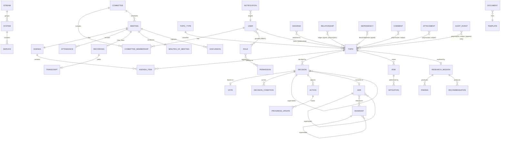

# 11 — Domain Model (Deliverable 14)

**Purpose:** The complete ACMP domain model — every entity (brief §12), typed, related, assigned to a canonical module, with lifecycle / permission / audit / retention references — and the aggregate boundaries the execution agent must honor.

> This is the domain contract. Entity names, modules, IDs and status models are from `../README.md` §B/§E/§F verbatim. Lifecycles referenced as `[→ doc 12 §X]`; permissions as policy names from `docs/domain/permission-role-matrix.md`. Concept disambiguation (principle/standard/policy/constraint vs invariant/ADR) lives in `docs/domain/standards-and-best-practices.md` and is **not** duplicated here.

---

## A. Modelling principles & explicit simplifications

Per the brief's mandated simplifications (avoid over-engineering, explicit domain concepts over generic abstractions):

1. **Backlog is a view, not a heavy entity.** `Backlog` is a **query/filter projection over `Topic`** (status ∈ {Submitted, Triage, Accepted, Prepared, Scheduled} + priority + stream + aging), not a stored aggregate. It owns no rows beyond optional saved-view/filter definitions and the priority ordering field that lives **on `Topic`**. No `Backlog`↔`Topic` join table. (See §C.Topics.)
2. **TopicRequest vs Topic — recommend a single entity with status.** Intake (`TopicRequest`) and the governed work item (`Topic`) are the **same aggregate at different lifecycle stages**. **Recommendation: model one `Topic` aggregate** whose early states (`Draft`, `Submitted`, `Triage`) *are* "the request", graduating to `Accepted` on triage. A separate `TopicRequest` table adds a hand-off seam, dual identity, and copy logic for no governance benefit. `TopicRequest` is retained in this document **only as a logical/named lifecycle facet** (the pre-acceptance projection) — `[→ doc 12 §2]` documents its transitions as the early Topic states. The execution agent implements **one table**. (Splitting is reconsidered only if intake must accept anonymous/low-trust external submissions with a different schema — currently out of scope, `OQ-DM-001`.)
3. **Comment / Attachment / Relationship / AuditEvent are shared & polymorphic.** Each is **one model attached by reference** (`(SubjectType, SubjectId)` soft reference across aggregates), not duplicated per entity. They live in shared modules (Knowledge / Platform / Search&Traceability / Audit&Records) and any aggregate may be their subject. No `TopicComment`, `DecisionComment`, etc.
4. **Principle / Standard / Policy / Constraint are facets of Invariant/ADR — no separate heavy entities.** They are expressed as an `Invariant` (with a `Category`/`Kind` facet) or captured in an `ADR`. The platform does **not** create `Principle`, `Standard`, `Policy`, `Constraint` tables. (Disambiguation: `docs/domain/standards-and-best-practices.md`.)
5. **System & Service are lightweight catalog references** (the *governed* estate), not a full CMDB. They exist to tag `AffectedSystems` and traceability, deliberately thin.
6. **Aggregate roots own their invariants and child entities.** A module may not read another module's tables (`README` §B / ADR-0001); cross-aggregate links use the typed `Relationship` edge or in-process contracts, never FK reach-across.

**Typing conventions.** `Guid` surrogate PK on every entity; human-readable year-scoped business key per `README` §F (e.g. `TOP-YYYY-###`). `enum` = closed C# enum (status/type). Timestamps `DateTimeOffset` (UTC). `string?` nullable. Soft-reference polymorphic FK = `(SubjectType:enum, SubjectId:Guid)`. Localized text = `LocalizedString { En, Ar }` (value object, `README` bilingual mandate).

---

## B. Module map (aggregate roots)

| Module (bounded context) | Aggregate roots | Shared/owned value & child entities |
|---|---|---|
| **Membership** | `User`, `Committee` | `Role`, `Permission`, `CommitteeMembership`, `Stream`, `System`, `Service` |
| **Topics** | `Topic` (incl. request facet), `TopicType` | `Backlog` (view), `ProgressUpdate` (when topic-level) |
| **Meetings** | `Meeting`, `Agenda` | `AgendaItem`, `Attendance`, `Recording`, `Transcript`, `MinutesOfMeeting`, `Discussion` |
| **Decisions** | `Decision`, `Vote` | `DecisionCondition` |
| **Actions** | `Action` | `ProgressUpdate` |
| **Risks** | `Risk` | `Mitigation` |
| **Dependencies** | `Dependency` | — (edges; overlaps Search&Traceability `Relationship`) |
| **Governance** | `ADR`, `Invariant` | — |
| **Research** | `ResearchMission` | `Finding`, `Recommendation` |
| **Knowledge** | `Document`, `Template` | `Comment` (shared subject host) |
| **Diagrams** | `Diagram` | — (Tarseem JSON spec + artifacts) |
| **Notifications** (platform) | `Notification` | — |
| **Search & Traceability** (platform) | `Relationship` | — (typed directed edges over Artifact identity) |
| **Audit & Records** (platform) | `AuditEvent` | — (append-only) |
| **Platform / Shared Kernel** | — | `Attachment`, IDs, `LocalizedString`, base entities, `IFileStore` |

---

## C. Entities by module

> Each subsection: **Purpose · Key attributes (typed) · Relationships · Owning module · Lifecycle · Permissions · Audit · Retention.** "Audit: full mutation" = create/update/delete/state-change recorded to `AuditEvent`. Retention defaults defer to `docs/domain/audit-and-records.md`; values below are the domain-recommended baseline.

### Module: Membership

#### User
- **Purpose:** A provisioned human principal (no self-registration, ADR-0004). Carries identity, roles, stream assignments.
- **Key attributes:** `Id:Guid` · `ExternalSubjectId:string` (OIDC `sub`) · `DisplayName:LocalizedString` · `Email:string` · `Status:enum{Invited,Active,Suspended,Deactivated}` · `PreferredLanguage:enum{En,Ar}` · `AssignedStreamIds:Guid[]` · `CreatedAt`/`DeactivatedAt:DateTimeOffset?`.
- **Relationships:** holds many `Role` (via assignment); member of many `Committee` (via `CommitteeMembership`); subject of `Delegation`; actor on most aggregates (Owner/Assignee/voter/author).
- **Owning module:** Membership.
- **Lifecycle:** `Invited → Active → (Suspended ↔ Active) → Deactivated` `[→ doc 12: not a core state machine; simple status]`.
- **Permissions:** managed via `Admin.Users` (Administrator only, row 27).
- **Audit:** full mutation incl. role grants, suspensions, stream-scope changes.
- **Retention:** retain while active + per records policy after deactivation (identity references in audit are immutable; PII minimization per `25/26`).

#### Role
- **Purpose:** Canonical global RBAC role (`README` §C). Reference/enum-like entity binding a principal to a capability set.
- **Key attributes:** `Id:Guid` · `Code:enum{Chairman,Secretary,Member,Reviewer,Auditor,Administrator,Submitter,Guest}` · `Name:LocalizedString` · `IsAssignable:bool` · `DefaultPolicies:string[]`.
- **Relationships:** granted to many `User`; aggregates many `Permission`.
- **Owning module:** Membership.
- **Lifecycle:** static catalog (seeded); no runtime state machine.
- **Permissions:** `Admin.Users`/`Admin.Config`.
- **Audit:** assignment/revocation to users is audited (the grant, not the catalog row).
- **Retention:** permanent (reference data).

#### Permission
- **Purpose:** A named, fine-grained capability (maps 1:1 to an ASP.NET policy name, e.g. `Vote.Cast`). Bridges `Role`→policy.
- **Key attributes:** `Id:Guid` · `Key:string` (policy name) · `Description:LocalizedString` · `Module:enum`.
- **Relationships:** belongs to many `Role`; referenced by authorization handlers.
- **Owning module:** Membership (definition); enforced in owning module.
- **Lifecycle:** static catalog.
- **Permissions:** `Admin.Config`.
- **Audit:** changes to role↔permission mapping audited.
- **Retention:** permanent.

#### Committee
- **Purpose:** The Architecture Committee instance. **Single-committee scope in v1** (the Committee entity exists but is single-instance; multi-committee generalization is out of scope for v1). Scopes membership, meetings, cadence.
- **Key attributes:** `Id:Guid` · `Name:LocalizedString` · `Cadence:enum{Weekly,BiWeekly}` · `QuorumPolicyDefault:object` · `ChairmanUserId:Guid` · `Status:enum{Active,Archived}`.
- **Relationships:** has many `CommitteeMembership`; has many `Meeting`/`Agenda`; owns backlog scope; one current `Chairman` (a `User`).
- **Owning module:** Membership.
- **Lifecycle:** `Active → Archived` (archival workflow `[→ doc 13 W25]`).
- **Permissions:** config via `Admin.Config`; cadence/chair changes `Chairman`/`Administrator`.
- **Audit:** full mutation; chair changes and archival high-importance.
- **Retention:** permanent (governance records).

#### CommitteeMembership
- **Purpose:** Associates a `User` to a `Committee` with a committee-scoped role/voting eligibility.
- **Key attributes:** `Id:Guid` · `CommitteeId:Guid` · `UserId:Guid` · `MembershipRole:enum{Chair,Member,Reviewer,Secretary,Observer}` · `IsVotingEligibleDefault:bool` · `ValidFrom`/`ValidTo:DateTimeOffset?`.
- **Relationships:** links `User`↔`Committee`; informs default eligible-voter sets on `Vote`.
- **Owning module:** Membership.
- **Lifecycle:** `Active → Ended` (by `ValidTo`).
- **Permissions:** `Admin.Users` / `Secretary` (membership admin); delegation via `Auth.Delegate`.
- **Audit:** full mutation (who joined/left, eligibility changes).
- **Retention:** permanent (affects historical quorum validity).

#### Stream
- **Purpose:** A business/technical domain (the org's 5 streams). Scope unit for ABAC stream-scope.
- **Key attributes:** `Id:Guid` · `Code:string` · `Name:LocalizedString` · `DirectorUserIds:Guid[]` · `Status:enum{Active,Retired}`.
- **Relationships:** referenced by `Topic.AffectedStreams`/origin; bounds `User.AssignedStreamIds`; tagged by `System`/`Service`.
- **Owning module:** Membership.
- **Lifecycle:** `Active → Retired`.
- **Permissions:** `Admin.Config`.
- **Audit:** mutation audited.
- **Retention:** permanent (historical scope resolution).

#### System
- **Purpose:** Lightweight catalog entry for a governed system in the estate (for `AffectedSystems` tagging + traceability). **Not a CMDB.**
- **Key attributes:** `Id:Guid` · `Name:LocalizedString` · `StreamId:Guid?` · `Kind:enum{Native,Backend,Platform,Integration,Infra}` · `Status:enum{Active,Retired}`.
- **Relationships:** referenced by `Topic.AffectedSystems`, `Dependency`, `Diagram`; contains many `Service`.
- **Owning module:** Membership (estate catalog).
- **Lifecycle:** `Active → Retired`.
- **Permissions:** `Admin.Config` / `Secretary`.
- **Audit:** mutation audited.
- **Retention:** permanent.

#### Service
- **Purpose:** A service within a `System` (APIs, workers, modules) — thin reference for finer-grained tagging.
- **Key attributes:** `Id:Guid` · `SystemId:Guid` · `Name:LocalizedString` · `Kind:enum{Api,Worker,Db,MobileModule,EmbeddedService,Integration}` · `Status:enum{Active,Retired}`.
- **Relationships:** belongs to `System`; referenced by topics/dependencies.
- **Owning module:** Membership.
- **Lifecycle:** `Active → Retired`.
- **Permissions:** `Admin.Config` / `Secretary`.
- **Audit:** mutation audited.
- **Retention:** permanent.

### Module: Topics

#### Topic *(aggregate root; subsumes the TopicRequest intake facet)*
- **Purpose:** The central governed work item — from intake through decision to closure. The single entity for §A simplifications (ii). Carries all topic fields from brief §3.
- **Key attributes:** `Id:Guid` · `Key:string` (`TOP-YYYY-###`) · `Title:LocalizedString` · `Description:LocalizedString` · `TopicTypeId` (one of 4, `README` §D) · `Source:enum{Member,StreamBusiness,StreamTechnical,UrgentOrgNeed,Incident,SecurityFinding,Modernization,Innovation,CrossStream,Regulatory}` · `Status:enum` (`README` §E Topic states) · `Urgency:enum{Normal,Urgent,Critical}` · `Confidentiality:enum{Normal,Restricted}` · `Priority:int` (backlog ordering) · `OwnerUserId:Guid?` · `AssigneeUserIds:Guid[]` · `AffectedStreamIds:Guid[]` · `AffectedSystemIds:Guid[]` · `CreatedAt`/`TargetDate`/`ScheduledDate`/`DecidedAt`/`ClosedAt:DateTimeOffset?` · `ConvertedToType:enum?{Execution,Research,ADR}` · `RejectionReason`/`DeferReason:LocalizedString?`.
- **Relationships:** owned by a `User` (Owner relationship); has many `AgendaItem` placements; has one effective `Decision` (latest, supersedable); has many `Action`, `Risk`, `Dependency`, `ResearchMission`, `Diagram`, `Document` (via `Relationship`); subject of `Comment`/`Attachment`/`AuditEvent`; references `TopicType`, `Stream`, `System`.
- **Owning module:** Topics.
- **Lifecycle:** `Draft → Submitted → Triage → Accepted → Prepared → Scheduled → InCommittee → Decided → Closed`; side `Rejected`, `Deferred`, `Reopened`, `Converted` `[→ doc 12 §1]`.
- **Permissions:** `Topic.Submit` (1), `Topic.Triage` (2), `Topic.Edit` (3, AiO=Owner), `Backlog.Prioritize` (4); see matrix.
- **Audit:** full mutation; state changes, owner/priority/scope changes high-importance.
- **Retention:** permanent (core governance record; closed topics archived, not deleted).

#### TopicType
- **Purpose:** The 4 canonical topic types (`ResearchDiscovery`, `ArchitectureDecision`, `EnhancementInnovation`, `GovernanceStandardization`, `README` §D). Reference entity.
- **Key attributes:** `Id:Guid` · `Code:enum` · `Name:LocalizedString` · `DefaultSlaByUrgency:object` · `IsActive:bool`.
- **Relationships:** classifies many `Topic`.
- **Owning module:** Topics.
- **Lifecycle:** static catalog (deliberately small; urgency is a Topic attribute, not a type).
- **Permissions:** `Admin.Config`.
- **Audit:** mutation audited.
- **Retention:** permanent.

#### Backlog *(view / filter — not a stored aggregate)*
- **Purpose:** A **projection over `Topic`** (§A.1): the prioritized list/table/kanban/calendar/timeline of pre-decision topics with aging. Holds no topic rows.
- **Key attributes (only saved-view metadata, optional):** `Id:Guid` · `Name:LocalizedString` · `OwnerUserId:Guid` · `FilterSpec:json` (status/stream/type/urgency predicates) · `SortSpec:json` · `IsShared:bool`. Topic ordering itself = `Topic.Priority`.
- **Relationships:** reads `Topic`; no ownership of topics.
- **Owning module:** Topics.
- **Lifecycle:** none (view); saved views are CRUD-only.
- **Permissions:** read per stream-scope; reorder = `Backlog.Prioritize` (4). Saved-view CRUD by owner.
- **Audit:** prioritization changes audited **on `Topic`** (priority field); saved-view CRUD low-importance.
- **Retention:** saved views ephemeral/user-scoped.

### Module: Meetings

#### Agenda *(aggregate root)*
- **Purpose:** The ordered set of topics planned for a meeting; built, time-boxed, published, carried over.
- **Key attributes:** `Id:Guid` · `Key:string` (`AGN-YYYY-###`) · `MeetingId:Guid` · `Status:enum{Draft,Published,Locked,Closed}` · `PublishedAt:DateTimeOffset?` · `Version:int`.
- **Relationships:** belongs to one `Meeting`; has many `AgendaItem`; each item references a `Topic`.
- **Owning module:** Meetings.
- **Lifecycle:** `Draft → Published → Locked (at meeting start) → Closed` `[→ doc 12: minor; folded into Meeting flow]`.
- **Permissions:** `Agenda.Publish` (5).
- **Audit:** full mutation; publish + reorder audited.
- **Retention:** permanent (part of meeting record).

#### AgendaItem
- **Purpose:** Placement of one `Topic` on an `Agenda` with order, time-box, presenter.
- **Key attributes:** `Id:Guid` · `AgendaId:Guid` · `TopicId:Guid` · `Order:int` · `TimeboxMinutes:int` · `PresenterUserId:Guid?` · `Outcome:enum{Pending,Discussed,Deferred,CarriedOver}` · `CarryOverFromAgendaId:Guid?`.
- **Relationships:** belongs to `Agenda`; references `Topic` + presenter `User` (Presenter relationship).
- **Owning module:** Meetings.
- **Lifecycle:** follows Agenda; item `Outcome` set during meeting.
- **Permissions:** `Agenda.Publish` (build/reorder); presenter assignment by Secretary/Owner.
- **Audit:** mutation audited.
- **Retention:** permanent.

#### Meeting *(aggregate root)*
- **Purpose:** A scheduled committee session; anchors attendance, recording, transcript, MoM, discussions, votes.
- **Key attributes:** `Id:Guid` · `Key:string` (`MTG-YYYY-###`) · `CommitteeId:Guid` · `ScheduledStart`/`ScheduledEnd:DateTimeOffset` · `Status:enum{Scheduled,InProgress,Held,Cancelled}` · `Location/JoinUrl:string?` · `ExternalConferenceId:string?` (Webex meeting id, via adapter) · `ChairUserId:Guid`.
- **Relationships:** has one `Agenda`; has many `Attendance`; may have `Recording`/`Transcript`; produces one `MinutesOfMeeting`; hosts `Discussion`/`Vote`/`Decision` for its agenda topics.
- **Owning module:** Meetings.
- **Lifecycle:** `Scheduled → InProgress → Held`; side `Cancelled` `[→ doc 12 §5]`.
- **Permissions:** `Meeting.Schedule` (6).
- **Audit:** full mutation; schedule/cancel/start/end audited.
- **Retention:** permanent.

#### Attendance
- **Purpose:** Per-meeting presence record of a participant (drives quorum).
- **Key attributes:** `Id:Guid` · `MeetingId:Guid` · `UserId:Guid` · `Role:enum{Chair,Member,Reviewer,Presenter,Guest,Secretary}` · `Status:enum{Invited,Present,Absent,Excused,Late}` · `JoinedAt`/`LeftAt:DateTimeOffset?` · `IsVotingEligible:bool`.
- **Relationships:** belongs to `Meeting`; references `User`; consumed by `Vote` quorum.
- **Owning module:** Meetings.
- **Lifecycle:** `Invited → Present|Absent|Excused|Late`.
- **Permissions:** `Attendance.Record` (7).
- **Audit:** full mutation (quorum-relevant).
- **Retention:** permanent.

#### Recording
- **Purpose:** Metadata + storage reference to a meeting recording (artifact via `IFileStore`, e.g. imported from Webex).
- **Key attributes:** `Id:Guid` · `MeetingId:Guid` · `Source:enum{Webex,Manual}` · `FileStoreKey:string` · `DownloadUrl:string?` · `DurationSec:int?` · `Status:enum{Pending,Available,Failed}` · `CapturedAt:DateTimeOffset`.
- **Relationships:** belongs to `Meeting`; may yield a `Transcript`.
- **Owning module:** Meetings.
- **Lifecycle:** `Pending → Available|Failed`.
- **Permissions:** managed by Secretary; ingestion via integration adapter (ADR-0005).
- **Audit:** ingestion + access audited.
- **Retention:** retained; configurable retention; no automatic purge in v1. Specific media retention period to be set by legal/ops per `26`.

#### Transcript
- **Purpose:** Speaker-attributed text of a meeting (Webex snippets API, ADR-0005). Source of **candidate** extractions (human-reviewed, principle 5).
- **Key attributes:** `Id:Guid` · `MeetingId:Guid` · `RecordingId:Guid?` · `Source:enum{Webex,Manual,Imported}` · `Language:enum{En,Ar,Mixed}` · `Status:enum{Pending,Available,Failed}` · `Segments:json` (speaker, ts, text) · `IsSearchIndexed:bool`.
- **Relationships:** belongs to `Meeting`; informs `Discussion`/`MinutesOfMeeting`/candidate `Action`s.
- **Owning module:** Meetings.
- **Lifecycle:** `Pending → Available|Failed`. **Note:** Webex transcript requires Assistant ON (not programmatically enableable) — treat as optional, never assumed.
- **Permissions:** Secretary/Chair read; extraction proposals reviewed before promotion.
- **Audit:** ingestion + any AI-candidate promotion audited.
- **Retention:** per records policy; PII-sensitive.

#### MinutesOfMeeting (MoM) *(aggregate root within Meetings)*
- **Purpose:** The versioned, approved official record of a meeting (discussion summary, decisions, actions, attendance).
- **Key attributes:** `Id:Guid` · `Key:string` (`MIN-YYYY-###`) · `MeetingId:Guid` · `Status:enum{Draft,InReview,Approved,Published,Superseded}` · `Version:int` · `Summary:LocalizedString` · `ApprovedByUserId:Guid?` · `ApprovedAt:DateTimeOffset?` · `Content:json` (structured sections).
- **Relationships:** belongs to `Meeting`; aggregates references to `Decision`/`Action`/`Discussion`/`Attendance`; subject of `Comment`.
- **Owning module:** Meetings.
- **Lifecycle:** `Draft → InReview → Approved → Published`; new version `Supersedes` prior `[→ doc 12 §6]`.
- **Permissions:** `Minutes.Capture` (8), `Minutes.Approve` (9, SoD-2).
- **Audit:** full mutation incl. version + approval (legal record).
- **Retention:** permanent (immutable once published; corrections via new version).

#### Discussion
- **Purpose:** Captured discussion thread/notes for an agenda topic during a meeting (human notes + reviewed candidate excerpts).
- **Key attributes:** `Id:Guid` · `MeetingId:Guid` · `TopicId:Guid` · `AuthorUserId:Guid` · `Body:LocalizedString` · `Origin:enum{Human,CandidateFromTranscript}` · `IsApproved:bool` · `CreatedAt:DateTimeOffset`.
- **Relationships:** belongs to `Meeting` + `Topic`; feeds `MinutesOfMeeting`.
- **Owning module:** Meetings.
- **Lifecycle:** candidate `→ Approved` (human review) or discarded.
- **Permissions:** `Minutes.Capture` (8).
- **Audit:** mutation + candidate approval audited.
- **Retention:** permanent (part of meeting record).

### Module: Decisions

#### Decision *(aggregate root)*
- **Purpose:** The committee's recorded outcome on a topic — rationale, alternatives, conditions, authority, supersession. **Immutable once issued** (ADR-0009).
- **Key attributes:** `Id:Guid` · `Key:string` (`DECN-YYYY-###`) · `TopicId:Guid` · `MeetingId:Guid?` · `Outcome:enum` (`README` §E committee-decision outcomes) · `Status:enum{Draft,Issued,Superseded}` · `Rationale:LocalizedString` · `Alternatives:LocalizedString?` · `VoteId:Guid?` · `ChairApprovedByUserId:Guid?` · `ChairOverride:bool` · `OverrideJustification:LocalizedString?` · `IssuedAt:DateTimeOffset?` · `SupersededByDecisionId:Guid?`.
- **Relationships:** belongs to `Topic`; references the `Vote`; has many `DecisionCondition`; may spawn `Action`/`ADR` (via `Relationship`/conversion W17); superseded-by another `Decision`.
- **Owning module:** Decisions.
- **Lifecycle:** `Draft → Issued → (Superseded)` — **never edited after Issued** `[→ doc 12 §3]`.
- **Permissions:** `Decision.Record` (12), `Decision.ChairApprove` (13, SoD-3/4).
- **Audit:** full mutation; issuance, chair approval/override, supersession high-importance, immutable record.
- **Retention:** permanent.

#### DecisionCondition
- **Purpose:** A condition attached to a `ConditionallyApproved` (or conditional) decision that must be satisfied; tracked to closure.
- **Key attributes:** `Id:Guid` · `DecisionId:Guid` · `Text:LocalizedString` · `Status:enum{Open,Met,Waived}` · `DueDate:DateTimeOffset?` · `LinkedActionId:Guid?`.
- **Relationships:** belongs to `Decision`; may link to an `Action` that fulfills it.
- **Owning module:** Decisions.
- **Lifecycle:** `Open → Met|Waived`.
- **Permissions:** set by `Decision.Record`; closure by Secretary/Chair; waiving by Chair.
- **Audit:** full mutation audited.
- **Retention:** permanent (with parent decision).

#### Vote *(aggregate root)*
- **Purpose:** A configurable ballot on a decision: eligible voters, options, quorum, abstentions, **always attributed (no anonymity in v1)**, chairman approval recorded (ADR-0010). **Immutable after close.**
- **Key attributes:** `Id:Guid` · `Key:string` (`VOTE-…`) · `TopicId:Guid` · `MeetingId:Guid?` · `Status:enum{Configured,Open,Closed,Ratified}` · `Options:json` (e.g. Approve/Reject/Abstain or custom) · `EligibleVoterUserIds:Guid[]` · `QuorumRule:object` (min present/min cast) · `AllowAbstain:bool` · `Ballots:json` (per-voter choice; **always attributed in v1 — anonymity is out of scope**) · `Tally:json` · `ResultSummary:string?` · `OpenedAt`/`ClosedAt:DateTimeOffset?` · `CounterUserId:Guid?`.
- **Relationships:** belongs to `Topic`/`Meeting`; referenced by one `Decision`; eligible voters are `User`s; quorum reads `Attendance`.
- **Owning module:** Decisions.
- **Lifecycle:** `Configured → Open → Closed → Ratified` — **immutable after `Closed`** (ballots/tally frozen) `[→ doc 12 §4]`.
- **Permissions:** `Vote.Manage` (10, open/close, SoD-3), `Vote.Cast` (11, Members/Chair).
- **Audit:** full mutation; open/close, each ballot (always attributed in v1), tally, ratification — append-only, immutable.
- **Retention:** permanent.

### Module: Actions

#### Action *(aggregate root)*
- **Purpose:** A follow-up task from a decision/meeting/condition with owner, due date, progress, verification. Drives reminders/escalation.
- **Key attributes:** `Id:Guid` · `Key:string` (`ACT-…`) · `Title:LocalizedString` · `Description:LocalizedString?` · `Status:enum{Open,InProgress,Blocked,Completed,Verified}` + derived `Overdue`, side `Cancelled` · `OwnerUserId:Guid` · `AssigneeUserIds:Guid[]` · `DueDate:DateTimeOffset?` · `ProgressPct:int` · `Priority:enum{Low,Normal,High}` · `SourceType:enum{Decision,Condition,Meeting,Topic,Risk}` · `SourceId:Guid` · `VerifiedByUserId:Guid?` · `VerifiedAt:DateTimeOffset?` · `BlockedReason:LocalizedString?`.
- **Relationships:** sourced from `Decision`/`DecisionCondition`/`Meeting`/`Topic`/`Risk`; has many `ProgressUpdate`; may be blocked by a `Dependency`; subject of `Comment`/`Attachment`.
- **Owning module:** Actions.
- **Lifecycle:** `Open → InProgress → Blocked → Completed → Verified`; side `Cancelled`; `Overdue` derived `[→ doc 12 §7]`.
- **Permissions:** `Action.Create` (14, AiO=Owner), `Action.Verify` (15, SoD-1: verifier ≠ owner).
- **Audit:** full mutation; completion + verification high-importance.
- **Retention:** permanent (governance follow-through record).

#### ProgressUpdate
- **Purpose:** A timestamped progress note on an `Action` (or topic-level progress). Append-only history.
- **Key attributes:** `Id:Guid` · `ActionId:Guid?` · `TopicId:Guid?` · `AuthorUserId:Guid` · `ProgressPct:int?` · `Note:LocalizedString` · `StatusAtUpdate:enum?` · `CreatedAt:DateTimeOffset`.
- **Relationships:** belongs to `Action` (primary) or `Topic`.
- **Owning module:** Actions (shared with Topics for topic-level progress).
- **Lifecycle:** immutable append-only entries.
- **Permissions:** owner/assignee of the action (AiO); Secretary/Chair.
- **Audit:** create audited; never edited.
- **Retention:** permanent (with parent).

### Module: Risks

#### Risk *(aggregate root)*
- **Purpose:** A tracked architecture/delivery risk raised against a topic/decision/system, with mitigations.
- **Key attributes:** `Id:Guid` · `Key:string` (`RSK-…`) · `Title:LocalizedString` · `Description:LocalizedString` · `Status:enum{Open,Mitigating,Closed}` + side `Accepted`, `Escalated` · `Likelihood:enum{Low,Medium,High}` · `Impact:enum{Low,Medium,High}` · `Severity:int` (derived) · `OwnerUserId:Guid` · `SubjectType:enum{Topic,Decision,System,ADR}` · `SubjectId:Guid` · `RaisedAt`/`ClosedAt:DateTimeOffset?`.
- **Relationships:** raised against `Topic`/`Decision`/`System`/`ADR`; has many `Mitigation`; may spawn `Action`.
- **Owning module:** Risks.
- **Lifecycle:** `Open → Mitigating → Closed`; side `Accepted`, `Escalated` `[→ doc 12 §10]`.
- **Permissions:** `Risk.Manage` (16, AiO=Owner).
- **Audit:** full mutation; acceptance/escalation/closure high-importance.
- **Retention:** permanent.

#### Mitigation
- **Purpose:** A planned/implemented response reducing a `Risk`.
- **Key attributes:** `Id:Guid` · `RiskId:Guid` · `Description:LocalizedString` · `Type:enum{Avoid,Reduce,Transfer,Accept}` · `Status:enum{Planned,InProgress,Done}` · `OwnerUserId:Guid?` · `LinkedActionId:Guid?` · `DueDate:DateTimeOffset?`.
- **Relationships:** belongs to `Risk`; may link an `Action`.
- **Owning module:** Risks.
- **Lifecycle:** `Planned → InProgress → Done`.
- **Permissions:** `Risk.Manage` (16).
- **Audit:** full mutation audited.
- **Retention:** permanent (with parent).

### Module: Dependencies

#### Dependency *(aggregate root — directed edge)*
- **Purpose:** A typed directed dependency between artifacts (topic/action/system/decision) enabling blocked-work tracking and cross-stream impact (ADR-0008). Overlaps the generic `Relationship` but is a **first-class governed edge** with status.
- **Key attributes:** `Id:Guid` · `Key:string` (`DPN-…`) · `FromType:enum` · `FromId:Guid` · `ToType:enum` · `ToId:Guid` · `Kind:enum{DependsOn,BlockedBy,Blocks,RelatesTo}` · `Status:enum{Open,Resolved,Removed}` · `IsCrossStream:bool` (derived) · `Note:string?` · `CreatedByUserId:Guid`.
  - *P10d reconciliations (ASM-016):* `Kind` = the design register's 4 chips (`Depends on / Blocked by / Blocks / Relates to`); the earlier `Impacts` value is dropped (unused by FR-094 / the design / the §2.2 Relationship catalog) and `Blocks` added (FR-094 + design). `Note` is a plain `string?` (single free-text Notes box in the create dialog; a user annotation is not a system-localized label — mirrors `Relationship.Notes`), not a `LocalizedString`. `IsCrossStream` is `(derived)` and computed **read-time** in the P10e panel from real stream *sets* (`Topic.AffectedStreamIds` is a `Guid[]`) — it is NOT stored (FR-095 needs a stream-resolution contract spanning Topics+Membership, owned by P10e).
- **Relationships:** connects any two governed artifacts; consumed by impact analysis (graph traversal in SQL) and `Action` blocking.
- **Owning module:** Dependencies (closely paired with Search & Traceability).
- **Lifecycle:** `Open → Resolved|Removed`.
- **Permissions:** `Dependency.Create` (17, AiO=Owner of the source artifact).
- **Audit:** full mutation audited.
- **Retention:** permanent (traceability graph integrity).

### Module: Governance (ADRs + Invariants)

#### ADR *(aggregate root)*
- **Purpose:** In-app Architecture Decision Record (MADR-lite template, ADR formats per `22`). Distinct from the planning-package `ADR-####`. May be converted from a `Decision` (W17). **Immutable once approved; superseded, not edited.**
- **Key attributes:** `Id:Guid` · `Key:string` (`ADR-…` in-app, year-scoped) · `Title:LocalizedString` · `Status:enum{Draft,Proposed,Approved,Superseded,Deprecated}` · `Context:LocalizedString` · `DecisionText:LocalizedString` · `Consequences:LocalizedString` · `OptionsConsidered:json` · `SourceDecisionId:Guid?` · `SupersededByAdrId:Guid?` · `ApprovedByUserId:Guid?` · `ApprovedAt:DateTimeOffset?`.
- **Relationships:** may originate from a `Decision`; references `Invariant`/`System`/`Topic`; subject of `Comment`/`Attachment`/`Diagram`; supersedes/superseded-by another `ADR`.
- **Owning module:** Governance.
- **Lifecycle:** `Draft → Proposed → Approved → (Superseded | Deprecated)` `[→ doc 12 §8]`.
- **Permissions:** `Adr.Create` (18, AiO), `Adr.Approve` (19), `Adr.Supersede` (20).
- **Audit:** full mutation; approval/supersession immutable, high-importance.
- **Retention:** permanent.

#### Invariant (Architecture Invariant, `AIV-`)
- **Purpose:** A governing architecture rule/principle/standard the estate must uphold (facets: principle/standard/policy/constraint per §A.4 — one entity with a `Kind` facet). Violations tracked separately.
- **Key attributes:** `Id:Guid` · `Key:string` (`AIV-…`) · `Title:LocalizedString` · `Kind:enum{Principle,Standard,Policy,Constraint}` · `Category:enum{Security,Data,Integration,Mobile,Platform,Process,…}` · `Status:enum{Draft,Proposed,Active,Retired,Superseded}` · `Statement:LocalizedString` · `Rationale:LocalizedString?` · `Scope:json` (streams/systems) · `ExceptionsPolicy:LocalizedString?` · `SupersededByInvariantId:Guid?`.
- **Relationships:** referenced by `ADR`/`Decision`/`Topic`; violations recorded as `Risk`/`Action`/`AuditEvent` (tracked separately, not a sub-entity here).
- **Owning module:** Governance.
- **Lifecycle:** `Draft → Proposed → Active → (Retired | Superseded)` `[→ doc 12 §9]`.
- **Permissions:** `Invariant.Create` (21, AiO), `Invariant.Approve` (22, activate/retire).
- **Audit:** full mutation; activation/retirement/supersession high-importance.
- **Retention:** permanent.

### Module: Research

#### ResearchMission *(aggregate root)*
- **Purpose:** A research/discovery effort (a Keystone companion package, ADR-0007) producing findings/recommendations; convertible to an execution topic (W16). Stores a **reference** to the external Keystone package + imported structured artifacts.
- **Key attributes:** `Id:Guid` · `Key:string` (`RMS-…`) · `Title:LocalizedString` · `Status:enum{Proposed,Active,Completed,Cancelled}` · `Question:LocalizedString` · `OwnerUserId:Guid` · `KeystonePackageRef:string?` (link/manifest id) · `ImportedManifest:json?` · `SourceTopicId:Guid?` · `CompletedAt:DateTimeOffset?`.
- **Relationships:** spawned from a `ResearchDiscovery` `Topic`; has many `Finding`/`Recommendation`; may convert into a new execution `Topic`.
- **Owning module:** Research.
- **Lifecycle:** `Proposed → Active → Completed`; side `Cancelled` `[→ doc 12 §11]`.
- **Permissions:** `Research.Manage` (26, AiO=Owner).
- **Audit:** full mutation; import + conversion audited.
- **Retention:** permanent.

#### Finding
- **Purpose:** A discrete factual result from a `ResearchMission` (maps from imported Keystone outputs).
- **Key attributes:** `Id:Guid` · `Key:string` (`FND-…`) · `ResearchMissionId:Guid` · `Statement:LocalizedString` · `Evidence:LocalizedString?` · `Confidence:enum{Low,Medium,High}` · `IsVerified:bool` · `SourceRef:string?`.
- **Relationships:** belongs to `ResearchMission`; may support a `Recommendation`/`Decision`/`ADR`.
- **Owning module:** Research.
- **Lifecycle:** candidate `→ Verified` (human review, principle 5).
- **Permissions:** `Research.Manage` (26).
- **Audit:** create + verification audited.
- **Retention:** permanent (with mission).

#### Recommendation
- **Purpose:** A proposed action/direction derived from findings (maps from imported Keystone recommendations).
- **Key attributes:** `Id:Guid` · `Key:string` (`REC-…`) · `ResearchMissionId:Guid` · `Text:LocalizedString` · `Priority:enum{Low,Medium,High}` · `Status:enum{Proposed,Accepted,Rejected,Converted}` · `LinkedTopicId:Guid?`.
- **Relationships:** belongs to `ResearchMission`; supported by `Finding`s; may convert to a `Topic`/`Decision`.
- **Owning module:** Research.
- **Lifecycle:** `Proposed → Accepted|Rejected|Converted`.
- **Permissions:** `Research.Manage` (26); acceptance by Secretary/committee.
- **Audit:** full mutation audited.
- **Retention:** permanent.

### Module: Knowledge

#### Document
- **Purpose:** A wiki/Markdown document (docs-as-code idea from Backstage TechDocs/`21`), versioned, cross-linked.
- **Key attributes:** `Id:Guid` · `Key:string` (`DOC-…`) · `Title:LocalizedString` · `Body:Markdown(LocalizedString)` · `Status:enum{Draft,Published,Archived}` · `Version:int` · `OwnerUserId:Guid` · `Tags:string[]`.
- **Relationships:** linked to topics/decisions/ADRs via `Relationship`; subject of `Comment`/`Attachment`; created from `Template`.
- **Owning module:** Knowledge.
- **Lifecycle:** `Draft → Published → Archived` (versioned).
- **Permissions:** `Document.Manage` (24, AiO=Owner).
- **Audit:** full mutation; version history retained.
- **Retention:** permanent (archived, not deleted).

#### Template
- **Purpose:** A reusable template for topics, ADRs, MoM, documents (template management feature).
- **Key attributes:** `Id:Guid` · `Key:string` (`TPL-…`) · `Name:LocalizedString` · `TargetType:enum{Topic,ADR,MoM,Document,Action}` · `Body:json/Markdown` · `Status:enum{Active,Deprecated}` · `Version:int`.
- **Relationships:** instantiated by `Document`/`ADR`/`MinutesOfMeeting`/`Topic`.
- **Owning module:** Knowledge.
- **Lifecycle:** `Active → Deprecated` (versioned).
- **Permissions:** `Template.Manage` (23, Secretary/Chairman/Administrator).
- **Audit:** full mutation audited.
- **Retention:** permanent.

### Module: Diagrams

#### Diagram
- **Purpose:** A diagram whose **JSON spec is the version-controlled source of truth** (Tarseem, ADR-0006); rendered artifacts (SVG/PNG/PDF/drawio/pptx) are generated and attached.
- **Key attributes:** `Id:Guid` · `Key:string` (`DGM-…`) · `Title:LocalizedString` · `Family:enum{Flowchart,C4,Dependency,Swimlane,Sequence,ER,State,Deployment,UmlClass,Mindmap,Activity}` · `Spec:json` (Tarseem spec, canonical) · `SpecHash:string` · `Status:enum{Draft,Rendered,Failed}` · `RenderedArtifacts:json` (artifact refs + capability report) · `Version:int`.
- **Relationships:** attached (via `Relationship`/`Attachment`) to `Topic`/`ADR`/`Decision`/`Document`/`System`; render artifacts stored via `IFileStore`.
- **Owning module:** Diagrams.
- **Lifecycle:** edit spec → `Draft → Rendered|Failed`; versioning = spec history.
- **Permissions:** `Diagram.Attach` (25, AiO; Presenter/Submitter limited to their topic).
- **Audit:** spec changes + renders audited (spec hash for traceability).
- **Retention:** permanent (spec); artifacts regenerable.

### Module: Notifications (platform)

#### Notification
- **Purpose:** A notification delivered via the channel abstraction (`INotificationChannel`; Webex/Email adapters, ADR-0005). Webex never hard-coded.
- **Key attributes:** `Id:Guid` · `RecipientUserId:Guid` · `Type:enum{TopicSubmitted,AgendaPublished,MeetingScheduled,VoteOpened,DecisionIssued,ActionAssigned,ActionDueSoon,ActionOverdue,MoMApproved,RiskEscalated,…}` · `Channel:enum{InApp,Webex,Email}` (**v1: InApp only**; Webex = Phase 2; Email = deferred) · `Status:enum{Pending,Sent,Failed,Read}` · `SubjectType:enum` · `SubjectId:Guid` · `Payload:json` · `CreatedAt`/`SentAt`/`ReadAt:DateTimeOffset?`.
- **Relationships:** targets a `User`; references its subject artifact (polymorphic); dispatched by Hangfire jobs.
- **Owning module:** Notifications.
- **Lifecycle:** `Pending → Sent|Failed → Read`.
- **Permissions:** system-generated; user reads own; preferences per user. Strategy in `29`.
- **Audit:** send/fail recorded (delivery audit); content low-importance.
- **Retention:** retained; configurable retention; no automatic purge in v1. Periods set by legal/ops later per `26`.

### Module: Search & Traceability (platform)

#### Relationship *(shared / polymorphic, aggregate root of the trace graph)*
- **Purpose:** A **typed directed edge** between any two artifacts over a shared `Artifact` identity (ADR-0008) — the backbone of end-to-end traceability and impact analysis. Single model, not per-pair tables (§A.3).
- **Key attributes:** `Id:Guid` · `FromType:enum(ArtifactType)` · `FromId:Guid` · `ToType:enum(ArtifactType)` · `ToId:Guid` · `RelationKind:enum{DerivesFrom,Implements,Supersedes,RelatesTo,DependsOn,Blocks,Decides,ConvertsTo,Attaches,Mitigates,Verifies}` · `CreatedByUserId:Guid` · `CreatedAt:DateTimeOffset` · `IsActive:bool`.
- **Relationships:** connects Topic↔Decision↔ADR↔Action↔Risk↔Dependency↔ResearchMission↔Diagram↔Document↔Invariant. Traversed by SQL graph queries for impact analysis. `Dependency` is the *governed, status-bearing* specialization; `Relationship` covers the rest.
- **Owning module:** Search & Traceability.
- **Lifecycle:** create/deactivate (edges are append-then-deactivate, not hard-deleted, for trace integrity).
- **Permissions:** created as a side-effect of governed actions; explicit linking by Owner/Secretary.
- **Audit:** create/deactivate audited.
- **Retention:** permanent (trace graph).

### Module: Audit & Records (platform)

#### AuditEvent *(shared / polymorphic, append-only)*
- **Purpose:** An **append-only** record of every consequential action (ADR-0009). One model for all aggregates (§A.3); the immutable system of record for governance and compliance.
- **Key attributes:** `Id:Guid` (or monotonic) · `OccurredAt:DateTimeOffset` · `ActorUserId:Guid?` · `ActorRole:enum?` · `Action:string` (e.g. `Decision.Issued`, `Vote.Closed`, `Auth.Denied`) · `SubjectType:enum(ArtifactType)` · `SubjectId:Guid` · `Outcome:enum{Success,Denied,Failure}` · `Before:json?` · `After:json?` · `CorrelationId:string` · `IpOrSource:string?`.
- **Relationships:** references any subject artifact (polymorphic, by reference — never FK-coupled, so it survives subject changes).
- **Owning module:** Audit & Records.
- **Lifecycle:** **append-only — never updated or deleted.** Tamper-evidence per `26` (e.g. hash-chaining `[unverified]` design option).
- **Permissions:** `Audit.Read` (29, Auditor/Chairman/Secretary). No write API beyond the platform's internal recorder; no delete for any role.
- **Audit:** is the audit (self-evident).
- **Retention:** longest retention class (regulatory); never purged within policy window. Records-management plan `26`.

### Shared Kernel (Platform)

#### Comment *(shared / polymorphic)*
- **Purpose:** A user comment attachable to any aggregate (one model, §A.3) — threads, feedback, discussion outside formal MoM.
- **Key attributes:** `Id:Guid` · `SubjectType:enum(ArtifactType)` · `SubjectId:Guid` · `AuthorUserId:Guid` · `Body:LocalizedString` · `ParentCommentId:Guid?` (threading) · `CreatedAt`/`EditedAt:DateTimeOffset?` · `IsDeleted:bool`.
- **Relationships:** subject = any artifact (Topic/Decision/ADR/Action/Risk/Document/…).
- **Owning module:** Knowledge (model) / Shared Kernel host.
- **Lifecycle:** create → edit (own, bounded) → soft-delete.
- **Permissions:** author edits/deletes own (AiO); read per subject's scope; Secretary moderation.
- **Audit:** create/edit/delete audited (light).
- **Retention:** with subject's retention; soft-delete preserved for audit.

#### Attachment *(shared / polymorphic)*
- **Purpose:** A file attachment (via `IFileStore`) referenceable from any aggregate (one model, §A.3). Metadata in SQL, bytes in Blob/S3.
- **Key attributes:** `Id:Guid` · `SubjectType:enum(ArtifactType)` · `SubjectId:Guid` · `FileName:string` · `ContentType:string` · `SizeBytes:long` · `FileStoreKey:string` · `UploadedByUserId:Guid` · `UploadedAt:DateTimeOffset` · `Checksum:string`.
- **Relationships:** subject = any artifact; storage via `IFileStore` (provider = self-hosted MinIO, README §A; settled).
- **Owning module:** Platform / Shared Kernel.
- **Lifecycle:** uploaded → (soft-delete).
- **Permissions:** upload per subject's edit permission (e.g. `Diagram.Attach`/`Document.Manage`); read per scope.
- **Audit:** upload/delete/access audited.
- **Retention:** with subject; large media (recordings) per media policy.

---

## D. ER overview (core aggregate roots & key edges)

> The polymorphic entities (`RELATIONSHIP`, `DEPENDENCY`, `COMMENT`, `ATTACHMENT`, `AUDIT_EVENT`) attach to **any** aggregate, not only `TOPIC`; `TOPIC` is shown as the representative subject for diagram legibility. `RELATIONSHIP` is the general trace edge; `DEPENDENCY` is its status-bearing governed specialization.

### Aggregate boundaries (Clean Architecture, per module)
- **Boundaries are the aggregate roots in §B.** Each root owns its child entities and enforces their invariants in a single transaction; cross-aggregate references are by **id only** (no navigation reach-across, no cross-module table reads — ADR-0001).
- **Cross-aggregate / cross-module links** flow through the typed `Relationship`/`Dependency` edges or in-process MediatR contracts — never EF navigation between modules.
- **Polymorphic hosts** (`Comment`, `Attachment`, `Relationship`, `AuditEvent`) are deliberately decoupled (soft `(SubjectType, SubjectId)` reference) so they do not create FK coupling that would violate module isolation.
- **Backlog** holds no aggregate state (view over `Topic`).

---

## E. Entity-merge / split recommendations (summary)

| Decision | Recommendation | Rationale |
|---|---|---|
| `TopicRequest` vs `Topic` | **Merge** — one `Topic` aggregate; request = pre-`Accepted` states. | Avoids dual identity/copy logic; no governance benefit to split. `OQ-DM-001` if anonymous external intake is later required. |
| `Comment`/`Attachment`/`Relationship`/`AuditEvent` | **Single polymorphic model each** (no per-entity variants). | Brief §A.3; prevents table sprawl + keeps module isolation. |
| `Principle`/`Standard`/`Policy`/`Constraint` | **Do not create** — facets of `Invariant.Kind` / `ADR`. | Brief §A.4; concept disambiguation in `22`. |
| `Dependency` vs `Relationship` | **Keep both, distinct roles** — `Relationship` = generic trace edge; `Dependency` = governed status-bearing edge (blocked-work). | ADR-0008 graph + brief dependency mgmt (blocked work, cross-stream). |
| `Backlog` | **View, not entity.** | Brief §A.1. |
| `ProgressUpdate` | **One model**, optional `ActionId`/`TopicId`. | Avoids duplicate per-host update tables. |

---

## Traceability
Implements **Deliverable 14**. Entities, modules, IDs, status models from `../README.md` §B/§E/§F. Lifecycles detailed in `docs/domain/entity-lifecycles.md`; permissions/policies in `docs/domain/permission-role-matrix.md`; workflows that mutate these entities in `docs/domain/workflows.md`. Settled decisions referenced: ADR-0001 (modular monolith/aggregate isolation), ADR-0003 (SQL Server), ADR-0005 (notifications — in-app v1, Webex Phase 2), ADR-0006 (Tarseem/Diagram), ADR-0007 (Keystone/Research), ADR-0008 (Relationship/traceability), ADR-0009 (immutability/audit), ADR-0010 (Vote — always attributed). Object storage provider = self-hosted MinIO (settled). Concept disambiguation deferred to `docs/domain/standards-and-best-practices.md`. Data-architecture/logical model in `docs/domain/data-architecture.md`. Open questions: OQ-DM-001 (TopicRe