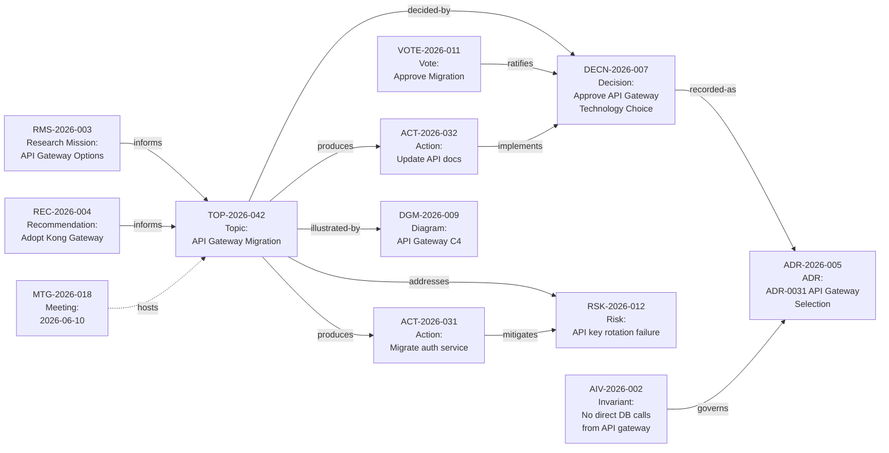

# 30 — Search & Traceability Model (Deliverable 38)

**Purpose:** Define ACMP's artifact identity model, typed directed relationship edges (ADR-0008), impact analysis traversal, bidirectional navigation, audit of relationships, search scope and ranking, and the traceability matrix gate (G-TRACE).

> Canonical decision: ADR-0008 — explicit typed relationship model (directed edges) over a shared `Artifact` identity; impact analysis by graph traversal in SQL. ADR-0011 — SQL Server Full-Text Search in v1; self-hosted search (e.g., OpenSearch) only if FTS is outgrown.

---

## 1. Artifact Identity Model

Every governed entity in ACMP is an **Artifact** — a node in the traceability graph. Artifacts are identified by a composite `(ArtifactType, ArtifactId)` pair; there is no shared numeric sequence across types (each type owns its own ID series per README §F runtime keys).

### 1.1 Artifact Types

| ArtifactType enum | Runtime key prefix | Domain entity | Module |
|---|---|---|---|
| `Topic` | `TOP-YYYY-###` | `Topic` | Topics |
| `Meeting` | `MTG-YYYY-###` | `Meeting` | Meetings |
| `Agenda` | `AGN-YYYY-###` | `Agenda` | Meetings |
| `MinutesOfMeeting` | `MIN-YYYY-###` | `MinutesOfMeeting` | Meetings |
| `Vote` | `VOTE-YYYY-###` | `Vote` | Decisions |
| `Decision` | `DECN-YYYY-###` | `Decision` | Decisions |
| `Action` | `ACT-YYYY-###` | `Action` | Actions |
| `Risk` | `RSK-YYYY-###` | `Risk` | Risks |
| `Dependency` | `DPN-YYYY-###` | `Dependency` | Dependencies |
| `ADR` | `ADR-YYYY-###` | `ADR` (in-app) | Governance |
| `Invariant` | `AIV-YYYY-###` | `Invariant` | Governance |
| `Diagram` | `DGM-YYYY-###` | `Diagram` | Diagrams |
| `ResearchMission` | `RMS-YYYY-###` | `ResearchMission` | Research |
| `Finding` | `FND-YYYY-###` | `Finding` | Research |
| `Recommendation` | `REC-YYYY-###` | `Recommendation` | Research |
| `Document` | `DOC-YYYY-###` | `Document` | Knowledge |

> Note: The `Dependency` entity in the Dependencies module is itself an edge artifact with a `DPN-` ID; it is *conceptually* a `depends-on`/`blocks` link, but it carries richer first-class attributes (business key, status lifecycle, blocked-work semantics) that the generic `Relationship` does not. **The two are distinct aggregates in distinct modules, and a `Dependency` is stored ONCE (in the Dependencies module) — it is NOT mirrored into the `Relationship` table** (OQ-046 / ASM-016, P10d): per-module DbContexts share no transaction, so a write-through mirror would risk dual-write drift for no benefit. The unified traceability graph is composed at **read-time**: the panel/impact views query BOTH modules and merge (the Dependencies module exposes an artifact-scoped query; the graph traversal in §4.1 must UNION the Dependencies table — it does not see dependency edges via `Relationship`). This keeps a single source of truth per edge while preserving the two-model boundary (docs/domain/domain-model.md §A.3 "keep both, distinct roles"; ADR-0008/ADR-0019).

---

## 2. Relationship Model (ADR-0008)

### 2.1 Relationship Edge Schema

```sql
-- Search&Traceability module
CREATE TABLE Relationship (
    Id            UNIQUEIDENTIFIER NOT NULL DEFAULT NEWSEQUENTIALID() PRIMARY KEY,
    SourceType    NVARCHAR(64)     NOT NULL,   -- ArtifactType enum value
    SourceId      UNIQUEIDENTIFIER NOT NULL,
    TargetType    NVARCHAR(64)     NOT NULL,
    TargetId      UNIQUEIDENTIFIER NOT NULL,
    RelType       NVARCHAR(64)     NOT NULL,   -- RelationshipType enum value (§2.2)
    CreatedByUserId UNIQUEIDENTIFIER NOT NULL,
    CreatedAt     DATETIMEOFFSET   NOT NULL DEFAULT SYSUTCDATETIME(),
    Notes         NVARCHAR(1000)   NULL,       -- optional human annotation
    IsActive      BIT              NOT NULL DEFAULT 1,  -- soft-delete (audit trail preserved)
    DeactivatedAt DATETIMEOFFSET   NULL,
    DeactivatedByUserId UNIQUEIDENTIFIER NULL
);

CREATE INDEX IX_Relationship_Source ON Relationship (SourceType, SourceId) WHERE IsActive=1;
CREATE INDEX IX_Relationship_Target ON Relationship (TargetType, TargetId) WHERE IsActive=1;
CREATE INDEX IX_Relationship_RelType ON Relationship (RelType, SourceType, TargetType) WHERE IsActive=1;
```

All reads go through the Search&Traceability module's public interface; no other module reads this table directly (ADR-0001 module isolation rule).

### 2.2 Relationship Type Catalog

Each type is **directed**: `Source → RelType → Target`. The inverse (navigating Target → Source) uses the listed **Inverse label**. Both directions are valid queries; no redundant inverse edge is stored — the inverse is resolved at query time by reversing the direction.

| RelType | Direction / Reading | Inverse label | Source ArtifactTypes | Target ArtifactTypes | Notes |
|---|---|---|---|---|---|
| `decided-by` | Topic **decided-by** Decision | `decides` | Topic | Decision | Created when a Decision is issued for a Topic |
| `recorded-as` | Decision **recorded-as** ADR | `records` | Decision | ADR | Created when an ADR is formally linked to a Decision |
| `produces` | Topic **produces** Action | `produced-by` | Topic | Action | Actions created from a Topic |
| `mitigates` | Action **mitigates** Risk | `mitigated-by` | Action | Risk | Action whose purpose is risk mitigation |
| `addresses` | Topic **addresses** Risk | `addressed-by` | Topic | Risk | Risk surfaced by or associated with a Topic |
| `supersedes` | ADR **supersedes** ADR | `superseded-by` | ADR, Decision | ADR, Decision | Chain of supersession; max 1 active supersession per artifact |
| `governs` | Invariant **governs** ADR | `governed-by` | Invariant | ADR | Invariant that constrains what a decision may choose |
| `violates` | Topic **violates** Invariant | `violated-by` | Topic | Invariant | Topic whose proposed change would violate an invariant |
| `depends-on` | Topic **depends-on** Topic | `dependency-of` | Topic | Topic | Cross-topic ordering dependency (mirrors Dependency module) |
| `informs` | ResearchMission/Finding/Recommendation **informs** Topic | `informed-by` | ResearchMission, Finding, Recommendation | Topic | Research output that influenced or prompted a Topic |
| `illustrated-by` | * **illustrated-by** Diagram | `illustrates` | Any ArtifactType | Diagram | Diagram that illustrates an artifact (attach to Topics, ADRs, Decisions, Invariants) |
| `references` | * **references** * | `referenced-by` | Any | Any | Generic non-semantic cross-reference (use sparingly; prefer typed) |
| `derived-from` | ADR/Decision **derived-from** Decision/ADR | `basis-for` | ADR, Decision | ADR, Decision | Formal lineage: this ADR builds on / re-examines a prior decision |
| `implements` | Action **implements** Decision | `implemented-by` | Action | Decision | Action created specifically to implement a decision's conditions |
| `blocks` | Topic/Action/Risk **blocks** Topic/Action | `blocked-by` | Topic, Action, Risk | Topic, Action | Hard blocker (one artifact prevents another from proceeding) |
| `resolves` | Decision/Action **resolves** Risk | `resolved-by` | Decision, Action | Risk | The risk was closed due to this decision or action |

#### Rules

1. `supersedes` edges form a **chain, not a DAG**: each artifact may be superseded by at most one successor. Circular supersession is an invariant violation (enforced at write time).
2. `governs` is created by Governance module owners, not automatically.
3. `depends-on` edges that form a cycle are flagged by the nightly cycle-detection Hangfire job and surfaced on DB-12 as "Circular dependency warnings."
4. The `references` type is a last-resort fallback; teams are encouraged to use a typed relationship. `[OQ-TRACE-001: Should the system warn when 'references' is used and a typed relationship would be more accurate?]`

---

## 3. Bidirectional Navigation

The `ITraceabilityService` (Search&Traceability module public interface) exposes:

```csharp
// Query all relationships FROM a given artifact (forward traversal)
Task<IReadOnlyList<RelationshipEdge>> GetOutgoingAsync(ArtifactType type, Guid id, string? relTypeFilter = null);

// Query all relationships TO a given artifact (reverse traversal)
Task<IReadOnlyList<RelationshipEdge>> GetIncomingAsync(ArtifactType type, Guid id, string? relTypeFilter = null);

// Transitive traversal: up to N hops in either direction, return the subgraph
Task<TraceabilityGraph> GetSubgraphAsync(ArtifactType type, Guid id, int maxDepth = 3, TraversalDirection direction = Both);

// Blocked-work detection: find artifacts that cannot proceed because of a 'blocks' chain
Task<IReadOnlyList<BlockedArtifact>> GetBlockedWorkAsync(ArtifactType type, Guid id);
```

`RelationshipEdge` carries: `Id, SourceType, SourceId, TargetType, TargetId, RelType, InverseLabel, CreatedAt, CreatedByUser, Notes`.

`TraceabilityGraph` carries: `Nodes: List<ArtifactRef>`, `Edges: List<RelationshipEdge>` — suitable for rendering a graph or a nested tree in the UI.

---

## 4. Impact Analysis

### 4.1 Upstream / Downstream Analysis

For any artifact, the traceability graph traversal answers:

| Question | Traversal direction | Max depth |
|---|---|---|
| "What does this topic affect?" | Outgoing from Topic | 3 hops |
| "What informed / justified this decision?" | Incoming to Decision | 3 hops |
| "What would be impacted if this ADR were superseded?" | Outgoing from ADR | All |
| "What is blocked by this risk?" | Outgoing via `blocks` from Risk | All |
| "Which topics are this action's root cause traceable to?" | Incoming to Action via `produces` | 2 hops |

Traversal uses SQL recursive CTEs for SQL Server:

```sql
WITH TraversalCTE AS (
    -- Anchor
    SELECT SourceType, SourceId, TargetType, TargetId, RelType, 0 AS Depth
    FROM Relationship
    WHERE SourceType = @StartType AND SourceId = @StartId AND IsActive = 1

    UNION ALL

    -- Recursive step
    SELECT r.SourceType, r.SourceId, r.TargetType, r.TargetId, r.RelType, t.Depth + 1
    FROM Relationship r
    INNER JOIN TraversalCTE t ON r.SourceType = t.TargetType AND r.SourceId = t.TargetId
    WHERE r.IsActive = 1 AND t.Depth < @MaxDepth
)
SELECT DISTINCT * FROM TraversalCTE;
```

For ≤20 users and expected artifact counts (hundreds to low thousands), SQL recursive CTE traversal is adequate (ADR-0003 — SQL Server is sufficient). If the graph grows beyond ~10,000 nodes, revisit with a graph-capable store `[unverified: not expected in v1 lifecycle]`.

> **P10f (implemented, ADR-0020):** the transitive impact traversal is composed at **read time across both edge stores**, NOT by the single-schema recursive CTE shown above. Because a `Dependency` is stored once and never mirrored into `Relationship` (OQ-046), a CTE over the `traceability` schema alone would miss dependency edges, and a CTE spanning both schemas would be a cross-module table join (ADR-0001 violation). Instead, `GetImpactGraph` (Traceability module) runs a breadth-first walk that, per node, UNIONs its own `Relationship` edges with the Dependencies module's edges read through the `Acmp.Shared` `IDependencyArtifactReader` port. Guards: visited-set on the type-**name** string + id (the `ArtifactType` and `DependencyEndpointType` enums overlap by name only), `MaxNodes` ceiling (OQ-018, surfaced as a `partial` flag), depth 1–3, per-node failure isolation.

### 4.2 Blocked-Work Detection

A Hangfire nightly job runs a full sweep of `blocks` edges and produces a `BlockedWorkSummary` (stored in a reporting read model table):

```
Artifact A --blocks--> Artifact B
    → B.IsBlocked = true in summary table
    → Surfaced on DB-12 and on Artifact B's detail page
```

Real-time blocking status is also computed on-demand when a Topic detail page loads (1-hop `blocks` check only, not full graph traversal, for performance).

### 4.3 Cross-Stream Impact

When traversing a topic's subgraph, any `AffectedStreams` attribute on reached artifacts is collected. The result is a de-duplicated list of impacted streams, surfaced in the traceability panel as "Streams potentially affected by this chain."

---

## 5. Audit of Relationship Changes

Every write to the `Relationship` table is recorded in the shared `AuditEvent` table:

| Operation | AuditEvent.EventType | Captured data |
|---|---|---|
| Relationship created | `Relationship.Created` | SourceType, SourceId, TargetType, TargetId, RelType, CreatedByUserId |
| Relationship deactivated (soft delete) | `Relationship.Deactivated` | Id, DeactivatedByUserId, DeactivatedAt, reason (if provided) |

Relationship audit events are immutable (append-only, ADR-0009). Deactivation preserves the historical edge with `IsActive=0`; hard deletes are not permitted. If an incorrect relationship is created, it is deactivated (not deleted) and a corrected one is created.

Audit events are queryable by Auditor role through the artifact's History tab.

---

## 6. Traceability UI

### 6.1 Relationship Panel (Phase 1 — List View)

Present on every artifact detail page, below the content section:

```
Relationships / Traceability
─────────────────────────────────────────────────────
OUTGOING (from TOP-2026-042)
  [→]  decided-by    DECN-2026-007 — Approve API Gateway Technology  [Approved]
  [→]  produces      ACT-2026-031 — Migrate auth service to PKCE     [InProgress]
  [→]  addresses     RSK-2026-012 — API key rotation failure          [Mitigating]

INCOMING (to TOP-2026-042)
  [←]  informs       REC-2026-004 — API gateway vendor recommendation [Published]
  [←]  depends-on    TOP-2026-039 — Auth service upgrade              [Scheduled]

[+ Add relationship]   [Expand impact analysis ▸]
─────────────────────────────────────────────────────
```

- Each artifact card shows: type icon, ID, title, status chip, relationship type label.
- "Go to related" deep link on each card.
- "+ Add relationship" is available to Secretary, Chairman, and topic Owner; Auditor and Member have read-only view.
- Relationships are grouped: Outgoing (this artifact links to) / Incoming (other artifacts link to this).

### 6.2 Impact Analysis Expansion (Phase 1 — Extended List)

"Expand impact analysis" triggers a lazy-loaded transitive traversal (up to depth 3) and renders a nested indented list:

```
TOP-2026-042 (root)
  └─ decided-by → DECN-2026-007
        └─ recorded-as → ADR-2026-005
  └─ produces → ACT-2026-031
        └─ implements → DECN-2026-007
  └─ addresses → RSK-2026-012
        └─ resolved-by → DECN-2026-007
```

Cycles are detected during traversal (visited-set guard) and rendered as `[cycle detected — already shown above]`.

> **Endpoint (P10f, FR-096):** `GET /api/traceability/graph/{type}/{id}?depth=1..3` → `{ focusType, focusId, depth, nodes[], edges[], partial }`. Read-all (any authenticated committee member). Each node carries `{ type, id, key, title, tier (signed: 0=focus, −=upstream, +=downstream), blocked, streams[] }`; the **focus** node has empty key/title (its identity is not on any edge — the SPA supplies it). Each edge carries `{ source (rel|dep), rel, fromType/fromId, toType/toId, isBlocker, isCrossStream }`. `blocked` = the node touches an active blocker dependency edge (`IsBlocker`); far-node lifecycle status is **not** returned (cross-module read, ADR-0001). `isCrossStream` is **Topic-scope** (FR-095 partial, OQ-047): true only when both ends are Topics with disjoint non-empty stream-code sets, read via the `ITopicStreamReader` port. `partial=true` when the node ceiling or a per-node read failure truncated the walk (never a silent truncation).

### 6.3 Graph Visualization (Phase 2)

Phase 2 introduces a visual graph view rendered using **Tarseem's `dependency` family** (JSON spec generated server-side from the `TraceabilityGraph` response). The JSON spec is posted to the Tarseem sidecar's `/generate` endpoint; the resulting SVG is displayed inline in the traceability panel.

- "Show as graph" toggle switches between list view (Phase 1) and Tarseem-rendered graph (Phase 2).
- The spec includes node labels (ID + title + status), edge labels (RelType), color coding by ArtifactType.
- The SVG is not stored as a versioned artifact (it is ephemeral / regenerated on demand); only the `TraceabilityGraph` data is the source of truth.
- Tarseem sidecar dependency (ADR-0006): Phase 2 activation of graph view is gated on the Tarseem sidecar being deployed in the Docker Compose stack.

---

## 7. Search

### 7.1 Scope

Full-text search indexes the following content:

| Artifact | Indexed fields |
|---|---|
| Topic | Title, Description, Notes, Comments |
| Decision | Title, Rationale, Alternatives |
| ADR (in-app) | Title, Context, Decision, Consequences, all sections |
| MinutesOfMeeting | Full text of MoM body |
| Document (wiki) | Title, body (Markdown source) |
| Finding | Title, body |
| Recommendation | Title, body |
| Transcript (manual uploads) | Extracted text content |

Non-indexed (not full-text, but filterable by structured field): Meeting titles, Agenda item titles, Action titles (short text, search by structured filter instead).

### 7.2 SQL Server Full-Text Search (v1 — ADR-0011)

- FTS catalog per indexed table, with a `LANGUAGE` setting supporting both English (1033) and Arabic (1025) word-breaking and stemmers `[unverified: verify Arabic FTS support depth in target SQL Server version]`.
- Indexed columns stored as `NVARCHAR(MAX)` or `NVARCHAR(4000)`; FTS enabled via `CREATE FULLTEXT INDEX`.
- Query via `CONTAINS` (exact phrase, proximity) and `FREETEXT` (semantic expansion). ACMP uses `FREETEXT` for the global search bar and `CONTAINS` for filtered advanced search.
- Results ranked by `FREETEXTTABLE` key-rank column; relevance score drives result ordering.
- All search endpoints respect RBAC — the SQL query joins FTS results with authorization predicates (the current user's accessible artifact IDs) before returning results.

### 7.3 Global Search API

`GET /api/v1/search?q={query}&types={comma-list}&streams={ids}&dateFrom=&dateTo=&page=&pageSize=`

Response:

```json
{
  "query": "API gateway",
  "totalCount": 47,
  "groups": [
    { "type": "Topic",    "count": 12, "results": [/* ArtifactSearchResult[] */] },
    { "type": "Decision", "count": 8,  "results": [...] },
    { "type": "ADR",      "count": 5,  "results": [...] },
    { "type": "Document", "count": 22, "results": [...] }
  ]
}
```

`ArtifactSearchResult`: `{ id, artifactType, businessKey, title, snippet, status, stream, relevanceScore, deepLinkUrl }`.

### 7.4 Search Features

| Feature | Phase | Notes |
|---|---|---|
| Global full-text search | Phase 1 | SQL FTS; grouped results by artifact type |
| Type filter | Phase 1 | Checkbox: Topics, Decisions, ADRs, MoMs, Documents, Findings |
| Stream filter | Phase 1 | Multi-select; applied as structured predicate alongside FTS |
| Date range filter | Phase 1 | `CreatedAt` range |
| Status filter | Phase 1 | Per-type status enum filter |
| Saved searches | Phase 2 | User can name and save a filter set; surfaced in search panel |
| Highlighted snippets | Phase 1 | SQL FTS `FREETEXTTABLE` rank + manual snippet extraction (window around match position) `[unverified]` |
| Fuzzy / typo-tolerant | Phase 3 or if FTS outgrown | If SQL FTS proves insufficient for fuzzy matching, evaluate self-hosted OpenSearch container (app-owned, CON-001 compliant, not org ELK) |
| Transcript search | Phase 2 | Manually-uploaded transcripts indexed in Phase 2 when transcript ingestion is built |

### 7.5 Scale Justification

≤20 users; expected artifact corpus: ~hundreds of topics, ~thousands of documents over multi-year lifespan. SQL FTS handles this comfortably. OpenSearch migration path is defined but is not triggered unless measured evidence shows FTS is the bottleneck (ADR-0011). Do not stand up OpenSearch speculatively.

---

## 8. Traceability Matrix (G-TRACE Gate)

The **G-TRACE gate** (from the Keystone methodology, adopted per ADR-0007) requires that every MVP functional requirement traces to:

- **≥1 planning decision** (`DEC-###` or `ADR-####`)
- **≥1 work item** (`EPIC-##` / `US-###`)
- **≥1 test** (`AC-###`)

This gate is a **planning-package quality gate** (verified by the `validate_package.py` tool from Keystone), not a runtime feature. The traceability matrix is maintained in `docs/validation/acceptance-criteria.md` and `docs/planning/work-breakdown.md`.

**The ACMP platform itself supports artifact-level traceability for the committee** through the Relationship model above. A separate but parallel question is: does the planning package for ACMP (this document set) satisfy G-TRACE for its own MVP requirements? That is verified during the verification pass (task #17).

---

## 9. Example Trace Chain

The following Mermaid diagram shows a representative end-to-end governance trace:



This chain demonstrates navigating from a research mission → topic → meeting → vote → decision → ADR → actions → risk, and cross-referencing an invariant and a diagram, all via typed Relationship edges.

---

## 10. Open Questions

| ID | Question | Impact |
|---|---|---|
| `OQ-TRACE-001` | Should the system warn when the `references` relationship type is used and a more precise typed relationship is available? (Secretary UX vs. noise) | UX decision; low risk |
| `OQ-TRACE-002` | Should `Transcript` be a full `ArtifactType` with its own relationship edges, or remain a child of `Meeting` not directly linkable? Phase 2 decision. | Traceability scope |
| `OQ-TRACE-003` | Maximum depth for interactive impact analysis expansion: depth 3 may generate large subgraphs for mature artifacts. Should there be a node-count cap before switching to "download full graph"? | UX + performance |

---

## Traceability

| Link | Reference |
|---|---|
| ADR-0008 | Explicit typed Relationship model; impact analysis by SQL traversal |
| ADR-0011 | SQL FTS v1; self-hosted OpenSearch (app-owned) if outgrown |
| ADR-0006 | Tarseem graph visualization (Phase 2) |
| ADR-0007 | Keystone G-TRACE gate adopted |
| Domain model | `docs/domain/domain-model.md` §B module map; `Relationship` aggregate in Search&Traceability module |
| IA / Navigation | `docs/domain/information-architecture.md §2.4` — "Go to Related" pattern |
| Reporting | `docs/domain/reporting-dashboards.md` DB-12 (cross-stream dependencies), DB-23 (repeated issues via invariant links) |
| Audit | `docs/domain/audit-and-records.md` — relationship changes are audit events |
| Brief §6.17 | All §6.17 search/traceability requirements fulfilled |
