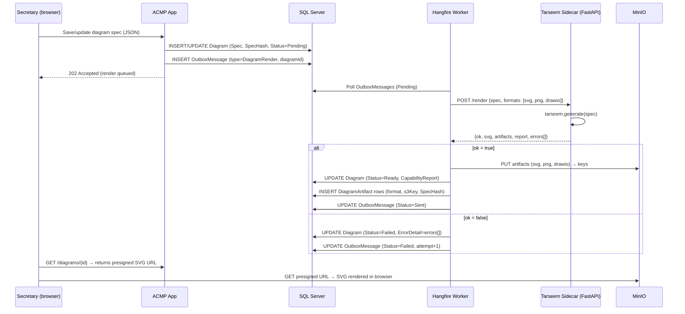

# ACMP Tarseem Analysis and Integration Plan

**Purpose:** Document the inspected facts about the Tarseem diagram engine, justify the chosen integration model (containerized sidecar), and specify exactly how ACMP's Diagrams module stores, renders, versions, and links diagrams via Tarseem.

---

## 1. Repository Analysis

**Source:** https://github.com/A-H-911/tarseem (inspected 2026-06-24)

### 1.1 Identity and Licensing

| Attribute | Value |
|---|---|
| License | **Apache-2.0** |
| Language | **Python ≥ 3.10** |
| Current version | **v1.0.0** (released 2026-06-17) |
| Schema | **Frozen at v1.0**; breaking changes require a new major version |
| Stability signal | v1.0 released, schema frozen — suitable for production integration |

### 1.2 What It Is

Tarseem is a **schema-driven diagram engine** that accepts a validated JSON specification and produces publication-quality diagrams. It is a thin orchestration layer over mature engines: ELK layout engine for graph layout, its own SVG renderer, and Chromium (headless) for raster/PDF output. It is a **CLI tool and Python library** — it is not a web service.

### 1.3 Diagram Families

Tarseem supports **11 diagram families**:

| Family | Notes |
|---|---|
| Flowchart | Standard decision/process flows |
| Architecture / C4 | C4 levels; directly maps to ACMP's architecture governance |
| Dependency | Module/service dependency graphs |
| Swimlane | Process lanes |
| Sequence | Interaction sequences |
| Entity-Relationship (ER) | Data model diagrams |
| State machine | Lifecycle / FSM |
| Deployment | Infrastructure + container topology |
| UML Class | Object model |
| Mindmap | Concept mapping |
| Activity | UML activity |

C4 architecture and dependency diagrams are directly useful for ACMP's governance domain (Architecture Invariants, ADRs, system dependency impact analysis).

### 1.4 Export Formats

| Format | Notes |
|---|---|
| **SVG** | Canonical output; vector; Chromium-free |
| **PNG** | Raster via Chromium subprocess |
| **PDF** | Raster via Chromium subprocess |
| **draw.io** (mxGraph XML) | Editable in draw.io / Diagrams.net |
| **PPTX** | Editable PowerPoint |

Every export writer emits a **capability report** — it never silently drops unsupported features. This is a first-class design constraint of Tarseem.

### 1.5 Arabic / RTL Support

Tarseem is **first-class Arabic/RTL**: HarfBuzz shaping before layout; RTL = geometry mirror (not just text direction); bundled Cairo font (OFL licensed). This directly satisfies ACMP's EN/AR bilingual requirement for diagram content.

### 1.6 Agent Surface (Integration-Critical)

The Python agent surface is the key integration point:

```python
result = tarseem.generate(spec_dict)
# Returns: {
#   "ok": bool,
#   "svg": str | None,
#   "artifacts": { "png": bytes, "pdf": bytes, "drawio": str, "pptx": bytes },
#   "report": { "capabilities": [...], "warnings": [...] },
#   "capabilities": [...],
#   "errors": [
#     { "code": str, "path": str,  # JSON Pointer into spec
#       "message": str, "hint": str }
#   ]
# }
```

Key properties:
- **Never raises on bad input** — always returns a result object; `ok: false` + `errors[]` on failure.
- **Errors include JSON Pointer** paths into the spec — enabling structured self-repair feedback to the user.
- **Deterministic** — artifacts embed the spec hash + engine versions; identical spec + engine → identical output.
- **`schema_bundle()` / `tarseem schema`** — emits the full JSON Schema (2020-12) for the spec format; ACMP stores this to validate specs before submission.
- **`tarseem doctor`** — verifies Node.js, elkjs, Chromium, and font dependencies are correctly installed.
- **No network at render time** — the sidecar has zero outbound network requirements during rendering.

### 1.7 CLI

```
tarseem validate <spec.json>   # validate only
tarseem render <spec.json>     # render SVG
tarseem export <spec.json>     # all formats
tarseem generate <spec.json>   # validate + render + export → JSON result
tarseem schema                 # emit JSON Schema
tarseem migrate <spec.json>    # migrate older spec to current schema
tarseem doctor                 # verify environment
```

### 1.8 Deploy Reality

Tarseem is installed via pip/pipx; its dependencies (Node.js + elkjs for layout, Chromium for raster, Cairo + HarfBuzz for fonts) must be present. `tarseem doctor` validates the environment. **It is not a service out of the box.** ACMP wraps it.

---

## 2. Integration Design

### 2.1 Decision: Sidecar with FastAPI Wrapper

**Problem:** ACMP is a .NET application. Tarseem is a Python library/CLI. A render job needs to call Tarseem and receive structured output.

**Constraints:** CON-001 (self-contained); Docker Compose deployment; no external network at render; diagrams are async (render triggered by secretary action, not user-synchronous); Hangfire manages background jobs.

**Options:**

| Option | Description | Trade-offs |
|---|---|---|
| **A — FastAPI sidecar** | Tarseem sidecar container runs FastAPI; exposes `POST /render` on internal Docker network; ACMP Hangfire job calls it via `HttpClient` | Clean interface; sidecar is independently restartable; logs separately; can be health-checked; no subprocess from .NET |
| **B — CLI subprocess from Hangfire** | Hangfire worker calls `tarseem generate spec.json` as a subprocess from within the ACMP container; parses stdout JSON | Simpler operationally (one container); but: cross-language subprocess from .NET is fragile; stdout parsing brittle; Chromium in ACMP container; Python runtime in .NET image |
| **C — No Tarseem; DIY SVG** | Build diagram rendering in .NET | Duplicates a solved, well-tested, Arabic-capable engine; violates "don't reinvent solved problems" |

**Recommendation: Option A — containerized FastAPI sidecar.** Justification:
- Docker Compose sidecar is a natural pattern; Tarseem's environment (Python, Node.js, Chromium, Cairo/HarfBuzz, fonts) is cleanly isolated in its own image.
- The FastAPI wrapper is thin (~50 lines): accepts `DiagramSpec` JSON, calls `tarseem.generate()`, returns the result JSON. No business logic in the sidecar.
- ACMP's Hangfire worker calls the sidecar via `HttpClient`; internal Docker network; no public exposure.
- `tarseem doctor` validates the sidecar's environment at container startup; health check endpoint (`GET /health`) returns sidecar readiness.
- Independent restartability: if Tarseem dependency updates require rebuilding the sidecar, the ACMP app container is unaffected.

**Devil's advocate:** The sidecar adds operational overhead (two containers to monitor, network hop). Counter: the FastAPI wrapper is trivial code; the Docker Compose network hop is sub-millisecond; the alternative (Python + Chromium inside a .NET container) is worse. Diagram rendering is async; latency is not user-synchronous.

**Risks:**
- Chromium in Docker requires `--no-sandbox` or specific capabilities; test in the target OS.
- PNG/PDF generation (Chromium subprocess inside the sidecar container) requires memory headroom; size containers appropriately.
- If Tarseem v2.0 breaks the schema, ACMP must re-validate stored specs; `tarseem migrate` CLI covers the upgrade path.

**Validation:** Render a set of test specs (all 11 families, with Arabic labels) in CI using the sidecar image; assert `ok: true` and spec hash round-trips.

### 2.2 JSON Spec as Version-Controlled Source of Truth

**Key design principle (ADR-0006):** The **Tarseem JSON spec is the version-controlled source of truth**. Generated artifacts (SVG/PNG/PDF/draw.io/PPTX) are **derived outputs** — they can always be regenerated from the spec.

Storage:
- `Diagram.Spec` column: `NVARCHAR(MAX)` storing the JSON spec; indexed by `SpecHash` (`BINARY(32)` SHA-256 of the canonical spec JSON).
- `Diagram.SpecVersion` column: the Tarseem schema version the spec targets (e.g., `"1.0"`).
- Generated artifacts stored in **MinIO** under `diagrams/{DiagramId}/{SpecHash}/`; metadata (format, size, S3 key) in `DiagramArtifact` table.
- Pre-signed, time-limited MinIO URLs serve artifacts to authorized users.

**Why SHA-256 spec hash?**
- Idempotent rendering: if the spec hash matches an existing artifact set in MinIO, the render job skips re-render (content-addressable cache).
- Traceability: a diagram artifact carries its exact spec hash; the spec can be retrieved and re-rendered independently of the artifact's age.
- Diff: spec changes produce a new hash, triggering a re-render and a new artifact version row.

### 2.3 Rendering Flow



### 2.4 SQL Data Model (Diagrams Module)

```sql
-- Canonical diagram record
CREATE TABLE Diagrams (
    Id              UNIQUEIDENTIFIER    PRIMARY KEY DEFAULT NEWSEQUENTIALID(),
    Title           NVARCHAR(500)       NOT NULL,
    TitleAr         NVARCHAR(500)       NULL,
    Description     NVARCHAR(MAX)       NULL,
    DiagramKey      NVARCHAR(30)        NOT NULL UNIQUE,  -- DGM-YYYY-###
    Family          NVARCHAR(50)        NOT NULL,         -- 'architecture', 'flowchart', etc.
    Spec            NVARCHAR(MAX)       NOT NULL,         -- Tarseem JSON spec (source of truth)
    SpecHash        BINARY(32)          NOT NULL,         -- SHA-256 of canonical JSON
    SpecVersion     NVARCHAR(20)        NOT NULL DEFAULT '1.0',
    Status          NVARCHAR(30)        NOT NULL DEFAULT 'Pending',
                                        -- Pending | Rendering | Ready | Failed | Outdated
    CapabilityReport NVARCHAR(MAX)      NULL,             -- JSON from tarseem.generate().report
    ErrorDetail     NVARCHAR(MAX)       NULL,             -- JSON errors[] from failed render
    CreatedBy       NVARCHAR(100)       NOT NULL,
    CreatedAt       DATETIMEOFFSET      NOT NULL DEFAULT SYSUTCDATETIME(),
    UpdatedAt       DATETIMEOFFSET      NOT NULL DEFAULT SYSUTCDATETIME()
);

-- Generated artifact references (one row per format per spec hash)
CREATE TABLE DiagramArtifacts (
    Id              UNIQUEIDENTIFIER    PRIMARY KEY DEFAULT NEWSEQUENTIALID(),
    DiagramId       UNIQUEIDENTIFIER    NOT NULL REFERENCES Diagrams(Id),
    SpecHash        BINARY(32)          NOT NULL,
    Format          NVARCHAR(20)        NOT NULL,  -- 'svg' | 'png' | 'pdf' | 'drawio' | 'pptx'
    S3Key           NVARCHAR(1000)      NOT NULL,
    FileSizeBytes   BIGINT              NOT NULL,
    CreatedAt       DATETIMEOFFSET      NOT NULL DEFAULT SYSUTCDATETIME()
);
CREATE UNIQUE INDEX UX_DiagramArtifact_Hash_Format
    ON DiagramArtifacts (DiagramId, SpecHash, Format);

-- Diagram versions (spec history)
CREATE TABLE DiagramSpecHistory (
    Id              UNIQUEIDENTIFIER    PRIMARY KEY DEFAULT NEWSEQUENTIALID(),
    DiagramId       UNIQUEIDENTIFIER    NOT NULL REFERENCES Diagrams(Id),
    Spec            NVARCHAR(MAX)       NOT NULL,
    SpecHash        BINARY(32)          NOT NULL,
    ChangedBy       NVARCHAR(100)       NOT NULL,
    ChangedAt       DATETIMEOFFSET      NOT NULL DEFAULT SYSUTCDATETIME(),
    ChangeNote      NVARCHAR(1000)      NULL
);
```

### 2.5 Relationship Linkage

Diagrams are attached to other entities via ACMP's typed relationship model (ADR-0008). An `Artifact` identity record is created for each `Diagram`; typed `Relationship` edges connect it to `Topic`, `ADR`, `Decision`, `Meeting`, or `ArchitectureInvariant` records.

```
Diagram (DGM-2026-001) ──[ILLUSTRATES]──► ADR (ADR-0001)
Diagram (DGM-2026-002) ──[SUPPORTS]──────► Topic (TOP-2026-015)
Diagram (DGM-2026-003) ──[ATTACHED_TO]──► Meeting (MTG-2026-008)
```

This means an ADR's detail page can surface all diagrams tagged to it; a topic's page shows all supporting diagrams; traceability graph traversal includes diagram nodes.

### 2.6 Editing Model

Diagrams are edited by modifying the JSON spec. ACMP provides two editing paths:

| Path | Description |
|---|---|
| **Raw JSON editor** | Monaco / CodeMirror with JSON Schema validation using `tarseem schema` output |
| **Form-based editor** | Guided UI for common families (C4, flowchart); generates the JSON spec; suitable for users unfamiliar with raw JSON |

Either path produces an updated JSON spec → new SpecHash → triggers re-render job → new artifact set in MinIO. The old artifact set is retained (version history); the current `Diagrams.SpecHash` points to the latest.

### 2.7 Capability Report Surfacing

Every render returns `report.capabilities[]` — a structured list of which spec features were used and which were ignored or unsupported. ACMP stores this JSON in `Diagrams.CapabilityReport` and surfaces it in the diagram detail view as a collapsible "Render report" panel. This surfaces warnings to the secretary without failure noise.

### 2.8 Versioning

Spec history rows in `DiagramSpecHistory` provide a complete audit trail of spec changes. The secretary can view the diff between spec versions (JSON diff) and re-render any historical spec on demand (using the stored `Spec` column). This is analogous to Git blame for diagram source.

---

## 3. What NOT to Do

- **Do not rebuild a diagram engine.** Tarseem covers all 11 families with Arabic/RTL support. A second engine would fragment the spec format, increase maintenance, and duplicate solved problems.
- **Do not store Tarseem as an embedded Python process in the .NET container.** Use the sidecar pattern.
- **Do not treat generated artifacts as the source of truth.** The JSON spec is the source. Artifacts are regenerable.
- **Do not add Structurizr, Mermaid, or draw.io as additional engines.** Tarseem's draw.io export covers the editable-diagram use case; Tarseem's C4 family covers the architecture-diagram use case.

---

## 4. Phase Assignment

| Capability | Phase |
|---|---|
| Diagram spec storage (SQL) + manual upload of SVG/PNG | v1 (stub: store spec, no auto-render) |
| Tarseem sidecar container + render pipeline | **Phase 2** |
| Form-based spec editor | Phase 2 (raw JSON editor in v1) |
| Capability report UI | Phase 2 |
| PPTX/PDF export | Phase 2 |
| Spec diff / version viewer | Phase 2 |

---

**Traceability:** Deliverable 27. Implements ADR-0006 (Tarseem sidecar; JSON spec as source of truth). References `docs/domain/integration-architecture.md` §2.4 (IDiagramRenderer integration point), `docs/domain/data-architecture.md` (DiagramArtifact, MinIO storage), `docs/domain/domain-model.md` (Diagrams module, Relationship model). Tarseem repo: https://github.com/A-H-911/tarseem.
